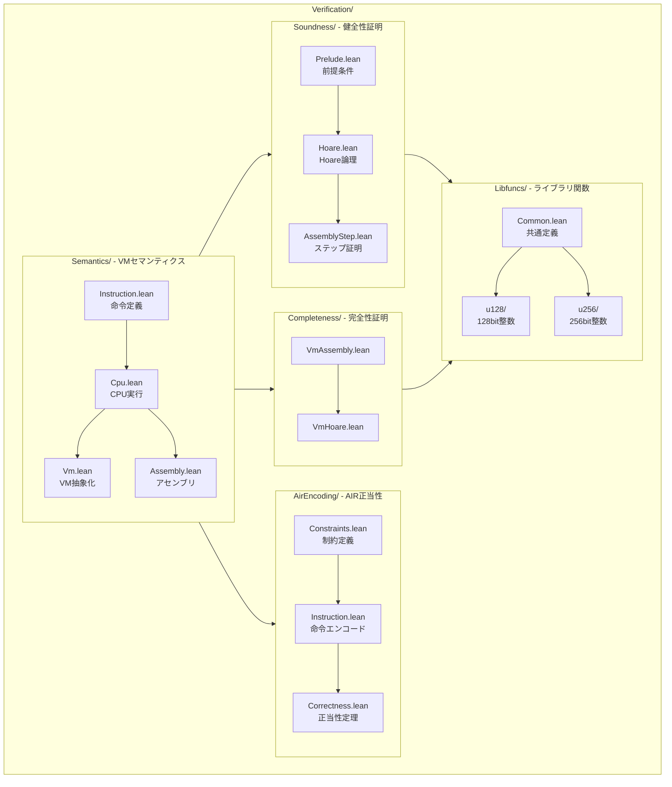
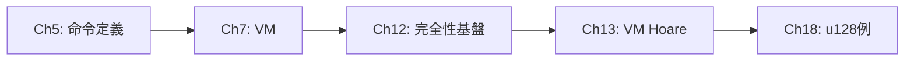
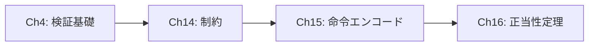

# Cairo形式検証プロジェクト Lean 4教科書

Lean 4とMathlibを使用したCairo仮想マシンの形式検証を学ぶための包括的な教科書です。

## 概要

本教科書は、`Verification/`ディレクトリに実装されているLean 4コードを詳細に解説し、以下の目標を達成することを目的としています：

1. **Cairo VMセマンティクスの理解** - 命令定義からCPU実行モデルまで
2. **Hoare論理に基づく証明技法の習得** - 健全性・完全性証明の方法論
3. **STARK証明システムとの接続** - AIRエンコーディングの正当性検証
4. **実践的なlibfunc検証スキル** - 新規ライブラリ関数の検証手順

## 対象読者

- Lean 4の基礎知識を持つプログラマ・研究者
- Cairo/STARKに興味がある形式検証の学習者
- ゼロ知識証明システムの実装に関心のあるエンジニア

## プロジェクトアーキテクチャ



## 目次

### 第I部: 基礎編（前提知識）

| 章 | タイトル | 内容 |
|:--:|:--|:--|
| [1](part1-foundations/ch01-mathematical-foundations.md) | 数学的基礎 | 有限体F_p、PRIME定数、ビットベクトル、Option型 |
| [2](part1-foundations/ch02-lean4-basics.md) | Lean 4基礎 | 基本構文、Structure、タクティック、Mathlib |
| [3](part1-foundations/ch03-cairo-vm-overview.md) | Cairo VM概要 | Cairo言語、VMアーキテクチャ、メモリモデル |
| [4](part1-foundations/ch04-program-verification.md) | プログラム検証基礎 | Hoare論理、健全性/完全性、AIR概念 |

### 第II部: Semanticsモジュール詳解

| 章 | タイトル | 対象ファイル | 行数 |
|:--:|:--|:--|:--:|
| [5](part2-semantics/ch05-instruction.md) | 命令定義 | `Instruction.lean` | 150行 |
| [6](part2-semantics/ch06-cpu.md) | CPU実行セマンティクス | `Cpu.lean` | 119行 |
| [7](part2-semantics/ch07-vm.md) | VM抽象セマンティクス | `Vm.lean` | 275行 |
| [8](part2-semantics/ch08-assembly.md) | アセンブリ言語 | `Assembly.lean` | 635行 |

### 第III部: 健全性証明インフラ

| 章 | タイトル | 対象ファイル |
|:--:|:--|:--|
| [9](part3-soundness/ch09-soundness-prelude.md) | 健全性基盤 | `Soundness/Prelude.lean` |
| [10](part3-soundness/ch10-hoare-logic.md) | Hoare論理実装 | `Soundness/Hoare.lean` |
| [11](part3-soundness/ch11-assembly-step.md) | アセンブリステップ | `Soundness/AssemblyStep.lean` |

### 第IV部: 完全性証明インフラ

| 章 | タイトル | 対象ファイル |
|:--:|:--|:--|
| [12](part4-completeness/ch12-completeness-basics.md) | 完全性基盤 | `Completeness/VmAssembly.lean` |
| [13](part4-completeness/ch13-vm-hoare.md) | VM Hoare論理 | `Completeness/VmHoare.lean` |

### 第V部: AIR Encodingの正当性

| 章 | タイトル | 対象ファイル |
|:--:|:--|:--|
| [14](part5-air-encoding/ch14-constraints.md) | 制約システム | `AirEncoding/Constraints.lean` |
| [15](part5-air-encoding/ch15-instruction-encoding.md) | 命令エンコーディング | `AirEncoding/Instruction.lean` |
| [16](part5-air-encoding/ch16-correctness.md) | 実行存在定理 | `AirEncoding/Correctness.lean` |

### 第VI部: Libfuncs検証

| 章 | タイトル | 対象ファイル |
|:--:|:--|:--|
| [17](part6-libfuncs/ch17-common-definitions.md) | 共通定義 | `Libfuncs/Common.lean` |
| [18](part6-libfuncs/ch18-u128-overflowing-add.md) | u128_overflowing_add | u128/u128_overflowing_add_*.lean |
| [19](part6-libfuncs/ch19-other-libfuncs.md) | 他のlibfunc検証パターン | u128, u256, bounded_int |

### 第VII部: 実践と応用

| 章 | タイトル |
|:--:|:--|
| [20](part7-practice/ch20-new-libfunc-verification.md) | 新規libfunc検証の手順 |
| [21](part7-practice/ch21-troubleshooting.md) | トラブルシューティング |

### 付録

| 付録 | タイトル |
|:--:|:--|
| [A](appendices/appendix-a-tactics.md) | タクティック一覧 |
| [B](appendices/appendix-b-index.md) | 主要定義・定理索引 |
| [C](appendices/appendix-c-references.md) | 参考文献 |

## 読み方のガイド

### 初学者向けルート


### 健全性証明を学びたい人向け


### 完全性証明を学びたい人向け



### AIRエンコーディングを学びたい人向け



## 環境構築

```bash
# リポジトリのクローン
git clone https://github.com/starkware-libs/formal-proofs.git
cd formal-proofs

# Mathlibのプリコンパイル済みファイルを取得
lake exe cache get

# ビルド（検証実行）
lake build
```

### 必要条件

- **Lean Version**: v4.13.0-rc3
- **依存ライブラリ**: Mathlib4
- **推奨エディタ**: VS Code + Lean 4拡張機能

## 記法について

本教科書では以下の記法を使用します：

| 記号 | 意味 |
|:--|:--|
| `F` | 有限体（Field） |
| `PRIME` | Cairoで使用される素数（約252ビット） |
| `RegisterState` | CPUレジスタ状態（pc, ap, fp） |
| `Mrel` | Maybe Relocatable値（VM用） |
| `Ensures` | 健全性の事後条件述語 |
| `Returns` | 完全性の戻り値述語 |

## 凡例

```lean
-- 定義の例
def example_definition : Type := ...

-- 定理の例
theorem example_theorem : P → Q := by
  intro h
  exact ...
```

コードブロック内の行番号は、対応するソースファイルの実際の行番号を示します。

## 進捗管理

本教科書の実装進捗は [TODO.md](./TODO.md) で管理しています。

**現在の進捗: 25/25ファイル (100%) ✅ 完了**

| パート | 進捗 |
|:--|:--:|
| Part 1: 基礎編 | 4/4 ✅ |
| Part 2: Semantics | 4/4 ✅ |
| Part 3: 健全性 | 3/3 ✅ |
| Part 4: 完全性 | 2/2 ✅ |
| Part 5: AIR Encoding | 3/3 ✅ |
| Part 6: Libfuncs | 3/3 ✅ |
| Part 7: 実践 | 2/2 ✅ |
| 付録 | 3/3 ✅ |

## ライセンス

本教科書のコンテンツは、元のプロジェクトのライセンスに従います。

## 更新履歴

- 2026-01-17: 全25ファイル完成（100%）- 付録A〜C追加
- 2026-01-17: Phase 4完了（AIR Encoding、アセンブリ、完全性基盤）
- 2026-01-17: Phase 1-3完了（コア構造、証明インフラ、実践例）
- 2024年: 初版作成
