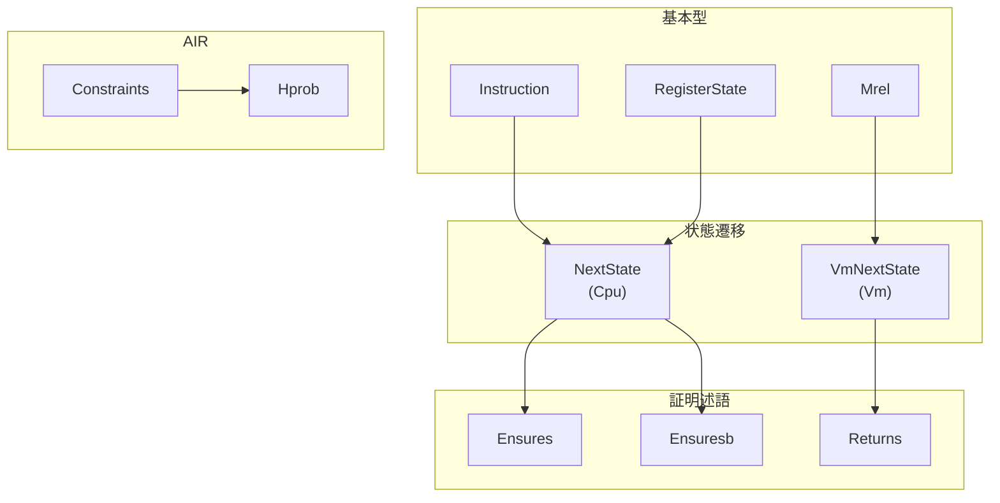
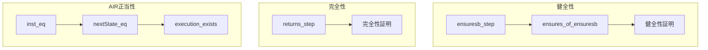

# 付録B: 主要定義・定理索引

本付録では、本プロジェクトで定義されている主要な型、構造体、定理を索引形式でまとめます。

---

## B.1 型・構造体索引

### Semantics/Instruction.lean

| 名前 | 種類 | 説明 | 参照章 |
|:--|:--|:--|:--:|
| `Instruction` | structure | Cairo命令（63ビット） | 5 |
| `Op0Spec` | inductive | op0オペランド指定 | 5 |
| `Op1Spec` | inductive | op1オペランド指定 | 5 |
| `ResSpec` | inductive | 結果計算方法 | 5 |
| `Instr` | structure | 命令の構造化表現 | 5 |

### Semantics/Cpu.lean

| 名前 | 種類 | 説明 | 参照章 |
|:--|:--|:--|:--:|
| `RegisterState` | structure | CPUレジスタ状態（pc, ap, fp） | 6 |
| `NextState` | def | 状態遷移述語 | 6 |

### Semantics/Vm.lean

| 名前 | 種類 | 説明 | 参照章 |
|:--|:--|:--|:--:|
| `Mrel` | inductive | Maybe Relocatable値 | 7 |
| `VmRegisterState` | structure | VMレジスタ状態 | 7 |
| `MemorySegment` | structure | メモリセグメント | 7 |
| `Mem` | def | VMメモリ型 | 7 |
| `Equiv` | def | 状態等価述語 | 7 |

### Semantics/Assembly.lean

| 名前 | 種類 | 説明 | 参照章 |
|:--|:--|:--|:--:|
| `Code` | def | アセンブリコード型 | 8 |
| `Casm` | structure | Casmコード情報 | 8 |

### Semantics/Soundness/Prelude.lean

| 名前 | 種類 | 説明 | 参照章 |
|:--|:--|:--|:--:|
| `PRIME` | def | Cairo素数 | 9 |
| `PreludeHyps` | structure | 前提条件集合 | 9 |

### Semantics/Soundness/Hoare.lean

| 名前 | 種類 | 説明 | 参照章 |
|:--|:--|:--|:--:|
| `jmpRelInstr` | def | 停止命令 | 10 |
| `IsHaltingState` | def | 停止状態判定 | 10 |
| `IsHaltingTrace` | def | 停止トレース判定 | 10 |
| `Ensures` | def | 健全性事後条件 | 10 |
| `EnsuresRet` | def | 関数戻り事後条件 | 10 |
| `Ensuresb` | def | 有界事後条件 | 10 |
| `EnsuresbRet` | def | 有界関数戻り事後条件 | 10 |

### Semantics/Completeness/VmAssembly.lean

| 名前 | 種類 | 説明 | 参照章 |
|:--|:--|:--|:--:|
| `VmSpec` | structure | VM仕様構造体 | 12 |
| `VmNextState` | def | VM状態遷移 | 12 |

### Semantics/Completeness/VmHoare.lean

| 名前 | 種類 | 説明 | 参照章 |
|:--|:--|:--|:--:|
| `Returns` | def | 完全性戻り述語 | 13 |
| `LocalAssignment` | structure | 局所代入 | 13 |
| `Assign` | def | 代入関数 | 13 |

### AirEncoding/Constraints.lean

| 名前 | 種類 | 説明 | 参照章 |
|:--|:--|:--|:--:|
| `InputDataAux` | structure | 入力データ補助 | 14 |
| `MemDom` | def | メモリドメイン | 14 |
| `TildeType` | def | チルダ値型 | 14 |
| `Constraints` | structure | 全制約集合 | 14 |
| `MemoryConstraints` | structure | メモリ制約 | 14 |
| `InstructionConstraints` | structure | 命令制約 | 14 |
| `StepConstraints` | structure | ステップ制約 | 14 |
| `RangeCheckConstraints` | structure | レンジチェック制約 | 14 |
| `RcBuiltinConstraints` | structure | RCビルトイン制約 | 14 |

### AirEncoding/Correctness.lean

| 名前 | 種類 | 説明 | 参照章 |
|:--|:--|:--|:--:|
| `Hprob` | structure | 確率的仮説 | 16 |

### Libfuncs/Common.lean

| 名前 | 種類 | 説明 | 参照章 |
|:--|:--|:--|:--:|
| `IsRangeChecked` | def | レンジチェック済み述語 | 17 |
| `Lookup` | def | メモリ参照述語 | 17 |
| `rcBound` | def | レンジチェック境界 | 17 |

---

## B.2 定理・補題索引

### 命令実行関連（Cpu.lean, Assembly.lean）

| 名前 | 説明 | 参照章 |
|:--|:--|:--:|
| `op0_eq` | op0計算の等価性 | 6 |
| `op1_agrees` | op1計算の整合性 | 6 |
| `res_agrees` | 結果計算の整合性 | 6 |
| `dst_eq` | 宛先計算の等価性 | 6 |
| `nextPc_agrees` | PC更新の整合性 | 6 |
| `nextAp_agrees` | AP更新の整合性 | 6 |
| `nextFp_agrees` | FP更新の整合性 | 6 |
| `asserts_hold` | アサーション成立 | 6 |
| `nextState_eq` | 状態遷移成立 | 6 |

### 健全性証明関連（Hoare.lean, AssemblyStep.lean）

| 名前 | 説明 | 参照章 |
|:--|:--|:--:|
| `ensures_of_ensuresb` | Ensuresb → Ensures | 10 |
| `ensuresb_step` | 基本ステップ定理 | 10 |
| `ensuresb_step_assert_eq` | assert_eqステップ | 10 |
| `ensuresb_step_jump` | jumpステップ | 10 |
| `ensuresb_step_jnz` | jnzステップ | 10 |
| `ensuresb_step_call` | callステップ | 10 |
| `ensuresb_step_ret` | retステップ | 10 |
| `ensuresb_step_advance_ap` | advance_apステップ | 10 |
| `ensuresb_id` | 恒等写像ステップ | 10 |
| `ensuresb_bind` | モナド的合成 | 10 |
| `assembly_step_assert_eq` | アセンブリassert_eq | 11 |
| `assembly_step_jump` | アセンブリjump | 11 |
| `assembly_step_jnz` | アセンブリjnz | 11 |
| `assembly_step_call` | アセンブリcall | 11 |
| `assembly_step_ret` | アセンブリret | 11 |

### 完全性証明関連（VmAssembly.lean, VmHoare.lean）

| 名前 | 説明 | 参照章 |
|:--|:--|:--:|
| `returns_step` | Returns基本ステップ | 13 |
| `returns_step_assert_eq` | Returns assert_eqステップ | 13 |
| `returns_step_jump` | Returns jumpステップ | 13 |
| `returns_step_jnz` | Returns jnzステップ | 13 |
| `returns_step_advance_ap` | Returns advance_apステップ | 13 |
| `returns_id` | Returns恒等写像 | 13 |
| `returns_bind` | Returnsモナド的合成 | 13 |
| `vm_equiv_step` | VM等価ステップ | 12 |

### AIRエンコーディング関連

| 名前 | 説明 | 参照章 |
|:--|:--|:--:|
| `execution_exists` | 実行存在定理（主定理） | 16 |
| `inst_eq` | 命令再構成 | 15 |
| `inst_unique` | 命令一意性 | 15 |
| `toNat_inj` | toNat単射性 | 15 |
| `tilde_spec` | チルダ展開定理 | 15 |
| `tilde_zero_eq` | チルダ初期値 | 15 |
| `flagVec_spec` | フラグベクトル仕様 | 15 |
| `real_permutation_prod_eq` | 順列積等式 | 14 |
| `mem_unique` | メモリ一意性 | 14 |
| `mem_extends` | メモリ拡張 | 14 |
| `rc_permutation` | レンジチェック順列 | 14 |
| `rc_val_checked` | レンジチェック値検証 | 14 |

### 数学的補題

| 名前 | 説明 | 参照章 |
|:--|:--|:--:|
| `prod_sub_eq_zero_iff` | 積がゼロになる条件 | 14 |
| `card_exceptionalSet_le` | 例外集合の濃度上界 | 14 |
| `monotone_a'NatOffset` | オフセット単調性 | 14 |
| `a'_succ_eq` | 隣接値の関係 | 14 |

---

## B.3 ファイル別索引

### Verification/Semantics/

```
├── Instruction.lean      # 命令定義
│   ├── Instruction       # 63ビット命令構造体
│   ├── Op0Spec          # op0オペランド種別
│   ├── Op1Spec          # op1オペランド種別
│   ├── ResSpec          # 結果計算種別
│   └── Instr            # 構造化命令表現
│
├── Cpu.lean             # CPU実行セマンティクス
│   ├── RegisterState    # レジスタ状態
│   ├── op0, op1, res    # オペランド計算関数
│   ├── dst              # 宛先計算関数
│   ├── nextPc/Ap/Fp     # 状態更新関数
│   └── NextState        # 状態遷移述語
│
├── Vm.lean              # VM抽象セマンティクス
│   ├── Mrel             # Maybe Relocatable
│   ├── VmRegisterState  # VMレジスタ状態
│   ├── MemorySegment    # メモリセグメント
│   ├── Mem              # VMメモリ型
│   └── Equiv            # 状態等価述語
│
├── Assembly.lean        # アセンブリ言語
│   ├── Code             # コード型
│   ├── Casm             # Casm情報
│   └── casm             # コード生成マクロ
│
├── Util.lean            # ユーティリティ
│   └── simp_int_casts   # 型変換タクティック
│
├── Soundness/
│   ├── Prelude.lean     # 前提条件
│   │   ├── PRIME        # Cairo素数
│   │   └── PreludeHyps  # 前提条件集合
│   │
│   ├── Hoare.lean       # Hoare論理
│   │   ├── Ensures      # 事後条件述語
│   │   ├── Ensuresb     # 有界事後条件
│   │   ├── ensuresb_step # ステップ定理
│   │   └── step_*       # 証明タクティック
│   │
│   └── AssemblyStep.lean # アセンブリステップ
│       └── assembly_step_* # アセンブリ定理
│
└── Completeness/
    ├── VmAssembly.lean  # VM-アセンブリ対応
    │   ├── VmSpec       # VM仕様
    │   └── VmNextState  # VM遷移
    │
    └── VmHoare.lean     # VM Hoare論理
        ├── Returns      # 戻り述語
        ├── LocalAssignment # 局所代入
        └── vm_step_*    # VMタクティック
```

### Verification/Semantics/AirEncoding/

```
├── Constraints.lean     # 制約定義
│   ├── InputDataAux     # 入力データ
│   ├── TildeType        # チルダ値型
│   └── Constraints      # 全制約
│
├── Instruction.lean     # 命令エンコーディング
│   ├── tilde            # ビットベクトル展開
│   ├── theInstruction   # 命令再構成
│   └── inst_eq          # 再構成定理
│
├── Memory.lean          # メモリ制約
│   ├── real_permutation_prod_eq # 順列定理
│   └── mem_unique       # 一意性定理
│
├── Step.lean            # ステップ制約
│   └── nextState_eq     # 状態遷移定理
│
├── RangeCheck.lean      # レンジチェック制約
│   └── rc_permutation   # 順列定理
│
├── RangeCheckBuiltin.lean # RCビルトイン
│   └── rc_val_checked   # 値検証定理
│
└── Correctness.lean     # 正当性証明
    ├── Hprob            # 確率的仮説
    └── execution_exists # 主定理
```

### Verification/Libfuncs/

```
├── Common.lean          # 共通定義
│   ├── IsRangeChecked   # RC述語
│   ├── Lookup           # 参照述語
│   └── rcBound          # RC境界
│
└── u128/                # u128ライブラリ
    ├── u128_overflowing_add_code.lean
    ├── u128_overflowing_add_soundness_spec.lean
    ├── u128_overflowing_add_soundness.lean
    ├── u128_overflowing_add_completeness_spec.lean
    └── u128_overflowing_add_completeness.lean
```

---

## B.4 概念別クロスリファレンス

### レジスタ関連

| 概念 | 定義場所 | 使用場所 |
|:--|:--|:--|
| pc（プログラムカウンタ） | Cpu.lean | 全モジュール |
| ap（割当ポインタ） | Cpu.lean | 全モジュール |
| fp（フレームポインタ） | Cpu.lean | 全モジュール |
| RegisterState | Cpu.lean | Soundness, AirEncoding |
| VmRegisterState | Vm.lean | Completeness |

### メモリ関連

| 概念 | 定義場所 | 使用場所 |
|:--|:--|:--|
| mem : F → F | Cpu.lean | Soundness, AirEncoding |
| Mrel | Vm.lean | Completeness |
| MemorySegment | Vm.lean | Completeness |
| MemDom | Constraints.lean | AirEncoding |

### 命令関連

| 概念 | 定義場所 | 使用場所 |
|:--|:--|:--|
| Instruction | Instruction.lean | 全モジュール |
| Instr | Instruction.lean | Assembly |
| toNat | Instruction.lean | AirEncoding |
| flags | Instruction.lean | AirEncoding |

### 証明関連

| 概念 | 定義場所 | 使用場所 |
|:--|:--|:--|
| Ensures | Hoare.lean | Soundness証明 |
| Ensuresb | Hoare.lean | Soundness証明 |
| Returns | VmHoare.lean | Completeness証明 |
| Constraints | Constraints.lean | AirEncoding |

### 定数

| 名前 | 値 | 定義場所 | 説明 |
|:--|:--|:--|:--|
| PRIME | 2^251 + 17 * 2^192 + 1 | Prelude.lean | Cairo素数 |
| rcBound | 2^128 | Common.lean | RC境界 |
| 2^16 | 65536 | - | オフセット範囲 |
| 2^63 | - | Instruction.lean | 命令サイズ上限 |

---

## B.5 アルファベット順索引

### A

| 名前 | 種類 | ファイル |
|:--|:--|:--|
| `Assign` | def | VmHoare.lean |
| `Asserts` | def | Cpu.lean |
| `assembly_step_*` | theorem | AssemblyStep.lean |

### C

| 名前 | 種類 | ファイル |
|:--|:--|:--|
| `Casm` | structure | Assembly.lean |
| `Code` | def | Assembly.lean |
| `Constraints` | structure | Constraints.lean |
| `CpuDecode` | structure | ConstraintsAutogen.lean |

### E

| 名前 | 種類 | ファイル |
|:--|:--|:--|
| `Ensures` | def | Hoare.lean |
| `Ensuresb` | def | Hoare.lean |
| `EnsuresRet` | def | Hoare.lean |
| `EnsuresbRet` | def | Hoare.lean |
| `Equiv` | def | Vm.lean |
| `execution_exists` | theorem | Correctness.lean |

### F

| 名前 | 種類 | ファイル |
|:--|:--|:--|
| `flagVec` | def | AirEncoding/Instruction.lean |
| `flagVec_spec` | theorem | AirEncoding/Instruction.lean |

### H

| 名前 | 種類 | ファイル |
|:--|:--|:--|
| `Hprob` | structure | Correctness.lean |

### I

| 名前 | 種類 | ファイル |
|:--|:--|:--|
| `InputDataAux` | structure | Constraints.lean |
| `Instruction` | structure | Instruction.lean |
| `InstructionConstraints` | structure | Constraints.lean |
| `Instr` | structure | Instruction.lean |
| `IsHaltingState` | def | Hoare.lean |
| `IsHaltingTrace` | def | Hoare.lean |
| `IsRangeChecked` | def | Common.lean |
| `inst_eq` | theorem | AirEncoding/Instruction.lean |
| `inst_unique` | theorem | AirEncoding/Instruction.lean |

### J

| 名前 | 種類 | ファイル |
|:--|:--|:--|
| `jmpRelInstr` | def | Hoare.lean |

### L

| 名前 | 種類 | ファイル |
|:--|:--|:--|
| `LocalAssignment` | structure | VmHoare.lean |
| `Lookup` | def | Common.lean |

### M

| 名前 | 種類 | ファイル |
|:--|:--|:--|
| `Mem` | def | Vm.lean |
| `MemDom` | def | Constraints.lean |
| `MemoryConstraints` | structure | Constraints.lean |
| `MemorySegment` | structure | Vm.lean |
| `Mrel` | inductive | Vm.lean |
| `mem_unique` | theorem | Memory.lean |
| `mem_extends` | theorem | Memory.lean |

### N

| 名前 | 種類 | ファイル |
|:--|:--|:--|
| `NextState` | def | Cpu.lean |
| `nextAp` | def | Cpu.lean |
| `nextFp` | def | Cpu.lean |
| `nextPc` | def | Cpu.lean |
| `nextState_eq` | theorem | Step.lean |

### O

| 名前 | 種類 | ファイル |
|:--|:--|:--|
| `Op0Spec` | inductive | Instruction.lean |
| `Op1Spec` | inductive | Instruction.lean |
| `op0` | def | Cpu.lean |
| `op1` | def | Cpu.lean |
| `op0_eq` | theorem | Step.lean |
| `op1_agrees` | theorem | Step.lean |

### P

| 名前 | 種類 | ファイル |
|:--|:--|:--|
| `PRIME` | def | Prelude.lean |
| `PreludeHyps` | structure | Prelude.lean |

### R

| 名前 | 種類 | ファイル |
|:--|:--|:--|
| `RangeCheckConstraints` | structure | Constraints.lean |
| `RcBuiltinConstraints` | structure | Constraints.lean |
| `RegisterState` | structure | Cpu.lean |
| `ResSpec` | inductive | Instruction.lean |
| `Returns` | def | VmHoare.lean |
| `rcBound` | def | Common.lean |
| `rc_permutation` | theorem | RangeCheck.lean |
| `rc_val_checked` | theorem | RangeCheckBuiltin.lean |
| `res` | def | Cpu.lean |
| `res_agrees` | theorem | Step.lean |
| `returns_step` | theorem | VmHoare.lean |

### S

| 名前 | 種類 | ファイル |
|:--|:--|:--|
| `StepConstraints` | structure | Constraints.lean |

### T

| 名前 | 種類 | ファイル |
|:--|:--|:--|
| `TildeType` | def | Constraints.lean |
| `theInstruction` | def | AirEncoding/Instruction.lean |
| `tilde` | def | AirEncoding/Instruction.lean |
| `tilde_spec` | theorem | AirEncoding/Instruction.lean |
| `toNat_inj` | theorem | AirEncoding/Instruction.lean |

### V

| 名前 | 種類 | ファイル |
|:--|:--|:--|
| `VmNextState` | def | VmAssembly.lean |
| `VmRegisterState` | structure | Vm.lean |
| `VmSpec` | structure | VmAssembly.lean |
| `vm_equiv_step` | theorem | VmAssembly.lean |

---

## B.6 参照図

### 定義の依存関係



### 主定理の依存関係


