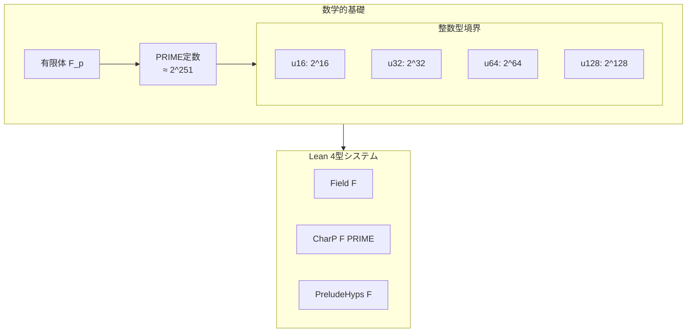
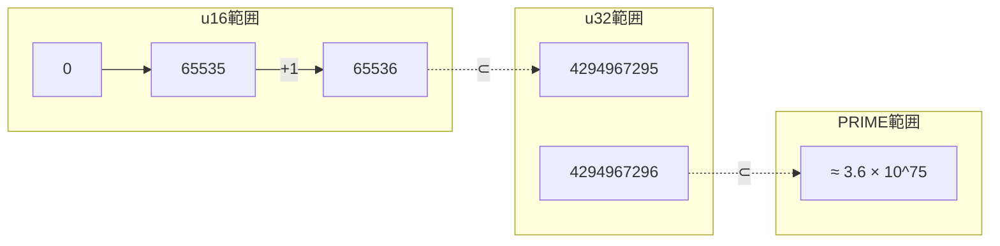

# 第1章: 数学的基礎

本章では、Cairo形式検証プロジェクトで使用される数学的概念について解説する。特に有限体とPRIME定数、整数型の境界値、およびLean 4での型表現について学ぶ。

## 1.1 概要

Cairo VMは有限体上で動作する仮想マシンである。形式検証を行うためには、以下の数学的概念を理解する必要がある：

1. **有限体（Finite Field）** - Cairo VMの計算基盤
2. **PRIME定数** - Cairoで使用される特定の素数
3. **整数型の境界値** - u16, u32, u64, u128, u256の範囲
4. **Option型** - 部分関数の表現



---

## 1.2 有限体（Finite Field）

### 1.2.1 有限体とは

有限体（ガロア体とも呼ばれる）は、有限個の要素からなる体である。素数 $p$ に対して、整数を $p$ で割った剰余のなす集合 $\mathbb{Z}/p\mathbb{Z}$ は有限体 $\mathbb{F}_p$ をなす。

**定義**: 体 $F$ は以下の性質を満たす代数構造である：
- 加法について可換群をなす
- 乗法について（0を除いて）可換群をなす
- 分配法則が成り立つ

### 1.2.2 Lean 4での有限体

Mathlib4では、`Field`型クラスで体を表現する：

```lean
-- Mathlib4での体の定義（抜粋）
class Field (F : Type*) extends CommRing F, DivisionRing F where
  ...
```

Cairoの形式検証では、体 `F` を型パラメータとして扱い、その標数（characteristic）がPRIMEであることを仮定する。

### 1.2.3 標数（Characteristic）

体の標数は、1を何回足すと0になるかを表す最小の正の整数である。素数 $p$ に対して、$\mathbb{F}_p$ の標数は $p$ である。

Lean 4では`CharP`型クラスで表現される：

```lean
-- 体Fの標数がpであることを表す
class CharP (F : Type*) [AddMonoidWithOne F] (p : ℕ) : Prop where
  cast_eq_zero : ∀ x : F, (p : F) = 0
```

---

## 1.3 PRIME定数

### 1.3.1 定義

Cairoで使用される素数PRIMEは、以下の値を持つ：

```lean
-- Verification/Semantics/Soundness/Prelude.lean:7-8
def PRIME :=
  3618502788666131213697322783095070105623107215331596699973092056135872020481
```

この値は $2^{251} + 17 \cdot 2^{192} + 1$ と表現でき、約252ビットの大きさを持つ。

### 1.3.2 PRIMEの性質

```lean
-- Verification/Semantics/Soundness/Prelude.lean:10-13
theorem PRIME_gt : PRIME > 2 ^ 251 := by simp [PRIME]
theorem PRIME_pos : 0 < PRIME := by rw [PRIME]; norm_num1
theorem PRIME_sub_one_lt : PRIME - 1 < PRIME := by rw [PRIME]; norm_num1
```

これらの定理は、PRIMEが十分大きな素数であることを示している。

### 1.3.3 なぜこの素数を選ぶのか

Cairo VMがこの特定の素数を使用する理由：

1. **効率性**: この形式の素数は、高速なモジュラ算術を可能にする
2. **セキュリティ**: 252ビットの素数は、暗号学的に十分な安全性を提供する
3. **STARK互換性**: STARKプロトコルで使用されるハッシュ関数と互換性がある

### 1.3.4 PreludeHyps型クラス

体 `F` がCairo VMの要件を満たすことを表す型クラス：

```lean
-- Verification/Semantics/Soundness/Prelude.lean:15-20
class PreludeHyps (F : Type _) [Field F] where
  [charF : CharP F PRIME]
  rcBound : Nat
  rcBound_hyp : rc_bound ≤ 2 ^ 128
```

| フィールド | 意味 |
|:--|:--|
| `charF` | 体Fの標数がPRIMEである |
| `rcBound` | レンジチェック境界値 |
| `rcBound_hyp` | 境界値が2^128以下である |

---

## 1.4 整数型の境界値

### 1.4.1 定数定義

Cairo libfuncsでは、様々なビット幅の整数型を扱う。`Common.lean`で定義される主要な定数：

```lean
-- Verification/Libfuncs/Common.lean:29-50
@[reducible, inline] def u16Max : ℕ := 65535
@[reducible, inline] def u16Limit : ℕ := 65536      -- 2^16

@[reducible, inline] def u32Max : ℕ := 4294967295
@[reducible, inline] def u32Limit : ℕ := 4294967296  -- 2^32

@[reducible, inline] def u64Max : ℕ := 18446744073709551615
@[reducible, inline] def u64Limit : ℕ := 18446744073709551616  -- 2^64

@[reducible, inline] def u128Max : ℕ := 340282366920938463463374607431768211455
@[reducible, inline] def u128Limit : ℕ := 340282366920938463463374607431768211456  -- 2^128
```

### 1.4.2 命名規則

| 名前 | 意味 | 値 |
|:--|:--|:--|
| `uNMax` | 最大値（2^N - 1） | 範囲内の最大整数 |
| `uNLimit` | 上限（2^N） | 範囲外となる最小整数 |

### 1.4.3 境界値の関係



### 1.4.4 PRIMEとの関係

全ての整数型はPRIMEより小さい値を持つため、有限体Fで正確に表現できる：

```lean
-- Verification/Libfuncs/Common.lean:58-73
theorem u16Max_lt_PRIME : u16Max < PRIME := by simp [PRIME, u16Max]
theorem u32Max_lt_PRIME : u32Max < PRIME := by simp [PRIME, u32Max]
theorem u64Max_lt_PRIME : u64Max < PRIME := by simp [PRIME, u64Max]
theorem u128Max_lt_PRIME : u128Max < PRIME := by simp [PRIME, u128Max]
theorem u128Limit_lt_PRIME : u128Limit < PRIME := by simp [PRIME, u128Limit]
```

これらの定理は、整数型の値が有限体Fに埋め込めることを保証する。

### 1.4.5 加算のオーバーフロー境界

複数の値を加算する際の境界も証明されている：

```lean
-- Verification/Libfuncs/Common.lean:180-188
theorem u128Limit_double_lt_PRIME : u128Limit + u128Limit < PRIME := by
  unfold u128Limit PRIME; norm_num1

theorem u128Limit_triple_lt_PRIME : u128Limit + u128Limit + u128Limit < PRIME := by
  unfold u128Limit PRIME; norm_num1

theorem u128Limit_quadruple_lt_PRIME :
    u128Limit + u128Limit + u128Limit + u128Limit < PRIME := by
  unfold u128Limit PRIME; norm_num1
```

これらは、u128値の加算結果がPRIME未満であることを保証し、オーバーフロー検出に使用される。

---

## 1.5 型付き整数表現

### 1.5.1 is_uN_of述語

フィールド要素が特定の範囲の自然数を表していることを示す述語：

```lean
-- Verification/Libfuncs/Common.lean:255-258
def is_u16_of (a : F) (na : ℕ) : Prop := na < u16Limit ∧ a = ↑na
def is_u32_of (a : F) (na : ℕ) : Prop := na < u32Limit ∧ a = ↑na
def is_u64_of (a : F) (na : ℕ) : Prop := na < u64Limit ∧ a = ↑na
def is_u128_of (a : F) (na : ℕ) : Prop := na < u128Limit ∧ a = ↑na
```

**意味**: `is_u128_of a na` は以下を意味する：
1. `na` はu128の範囲内（`na < 2^128`）
2. フィールド要素 `a` は自然数 `na` をキャストしたもの

### 1.5.2 複合型: u256とu512

より大きな整数は、複数のリム（limb）から構成される：

```lean
-- Verification/Libfuncs/Common.lean:262-265
def u256_from_limbs (na nb : ℕ) : ℕ := (u128Limit * na) + nb

def u512_from_limbs (na nb nc nd : ℕ) : ℕ :=
  (u128Limit^3 * na) + (u128Limit^2 * nb) + (u128Limit * nc) + nd
```

**u256の表現**:
- 上位128ビット: `na`
- 下位128ビット: `nb`
- 値: `na × 2^128 + nb`

---

## 1.6 有限体における等式判定

### 1.6.1 自然数からフィールドへのキャスト

PRIME未満の自然数は、フィールドで一意に識別できる：

```lean
-- Verification/Semantics/Soundness/Prelude.lean:48-49
theorem nat_coe_field_inj {a b : ℕ} (ha : a < PRIME) (hb : b < PRIME)
    (h : (a : F) = (b : F)) : a = b := by
  apply Nat.cast_inj_of_lt_char _ _ h <;> rwa [PRIME.char_eq]
```

**重要**: この定理により、PRIME未満の値についてフィールドでの等式判定が自然数の等式判定に帰着できる。

### 1.6.2 整数からフィールドへのキャスト

整数についても同様の判定が可能：

```lean
-- Verification/Semantics/Soundness/Prelude.lean:51-52
theorem int_coe_inj {i j : ℤ} (h : (i : F) = (j : F)) (h' : abs (j - i) < PRIME) :
    i = j :=
  Int.cast_inj_of_lt_char charF h h'
```

---

## 1.7 非ゼロ性の証明

### 1.7.1 自然数のゼロ判定

PRIME未満の自然数について、フィールドでゼロかどうか判定できる：

```lean
-- Verification/Semantics/Soundness/Prelude.lean:54-61
theorem nat_coe_field_zero {x : F} {n : ℕ} (h_lt : n < PRIME) (h_cast : x = ↑n) :
    x = 0 → n = 0 := by
  intro h_zero; rw [h_cast, ← Nat.cast_zero] at h_zero
  apply PRIME.nat_coe_field_inj h_lt _ h_zero; rw [PRIME]; norm_num1

theorem nat_coe_field_ne_zero {x : F} {n : ℕ} (h_lt : n < PRIME) (h_cast : x = ↑n) :
    n ≠ 0 → x ≠ 0 := by
  intro h_ne_zero h_x_eq
  exact h_ne_zero (nat_coe_field_zero h_lt h_cast h_x_eq)
```

### 1.7.2 重要な非ゼロ定理

2と4がフィールドでゼロでないことの証明（除算で使用）：

```lean
-- Verification/Semantics/Soundness/Prelude.lean:115-129
theorem two_ne_zero : (2 : F) ≠ 0 := by
  intro h
  suffices (2 : ℤ) = 0 by norm_num at this
  have : ((2 : ℤ) : F) = ((0 : ℤ) : F) := by simp [h]
  apply PRIME.int_coe_inj this
  rw [PRIME]
  norm_num

theorem four_ne_zero : (4 : F) ≠ 0 := by
  suffices ((4 : Nat) : F) ≠ ((0 : Nat) : F) by simpa
  intro h
  have ha : 4 < PRIME := by dsimp only [PRIME]; norm_num1
  have hb : 0 < PRIME := by dsimp only [PRIME]; norm_num1
  have := PRIME.nat_coe_field_inj ha hb h
  · norm_num at this
```

---

## 1.8 乗算とモジュラー算術

### 1.8.1 乗算結果の等式

モジュラー乗算の結果が1になることの証明：

```lean
-- Verification/Semantics/Soundness/Prelude.lean:72-86
theorem nat_cast_mul_eq_one {m n : ℕ} (h : m * n % PRIME = 1) :
    ↑m * ↑n = (1 : F) := by
  haveI : CharP F PRIME := charF
  have primeP : Nat.Prime PRIME := by
    apply Or.resolve_right (CharP.char_is_prime_or_zero F PRIME)
    rw [PRIME]; norm_num
  ...
```

### 1.8.2 除算の正当性

フィールドでの除算が正しいことの証明：

```lean
-- Verification/Semantics/Soundness/Prelude.lean:105-111
theorem div_eq_const {a b c : ℤ} (h_nz : (b : F) ≠ 0) :
    (c * b - a) % ↑PRIME = 0 → (a / b : F) = c := by
  intro h
  haveI : CharP F PRIME := charF
  symm; apply eq_div_of_mul_eq h_nz
  rw [← Int.cast_mul, ← sub_eq_zero, ← Int.cast_sub]
  rw [CharP.intCast_eq_zero_iff F PRIME]
  apply Int.dvd_of_emod_eq_zero; exact h
```

---

## 1.9 平方根と不等式

### 1.9.1 平方根の境界

自然数の平方根に関する補題：

```lean
-- Verification/Libfuncs/Common.lean:300-316
theorem sqrt_lt_of_lt_square {a b : ℕ} : a < b * b → sqrt a < b := by
  intro h
  have := sqrt_le_sqrt (le_of_lt h)
  rw [sqrt_eq b] at this
  ...

theorem le_sqrt_of_square_le {a b : ℕ} : a * a ≤ b → a ≤ sqrt b := by
  intro h
  have := sqrt_le_sqrt h
  rw [sqrt_eq a] at this
  exact this
```

これらは`u*_sqrt`関数の検証で使用される。

### 1.9.2 加減算の不等式

境界チェックで使用される不等式定理：

```lean
-- Verification/Libfuncs/Common.lean:322-331
theorem add_sub_lt {a b c : ℕ} (hb : 0 < b) (hac : a < c) :
    a + b - c < b := by
  by_cases h : a + b ≤ c
  · rwa [Nat.sub_eq_zero_of_le h]
  rw [← Nat.succ_le_iff]
  rw [← Nat.succ_sub (le_of_lt (lt_of_not_le h))]
  ...
```

---

## 1.10 まとめ

本章で学んだ主要概念：

| 概念 | Lean 4表現 | 役割 |
|:--|:--|:--|
| 有限体 | `Field F` | Cairo VMの計算基盤 |
| 標数 | `CharP F PRIME` | フィールドの特性 |
| PRIME定数 | `def PRIME := ...` | 約252ビットの素数 |
| 前提条件 | `PreludeHyps F` | Cairo固有の仮定 |
| 境界定数 | `u128Limit`, `u64Limit`, ... | 整数型の範囲 |
| 型付き整数 | `is_u128_of a na` | 値の型情報 |

### 次章への橋渡し

第2章では、Lean 4の基本構文とタクティックについて学ぶ。本章で導入した型（`Field`、`CharP`、`PreludeHyps`など）を実際にどのように使用するかを理解することが目標となる。

---

## 演習問題

1. なぜ`u128Limit + u128Limit < PRIME`が成り立つか説明せよ。
2. `is_u128_of a na`と`is_u64_of a na`の違いは何か？
3. フィールドFで`(2 : F) ≠ 0`が成り立つ理由を説明せよ。

---

## 参考

- ソースファイル: `Verification/Semantics/Soundness/Prelude.lean`
- ソースファイル: `Verification/Libfuncs/Common.lean`
- Mathlib4 Field定義: `Mathlib/Algebra/Field/Defs.lean`
