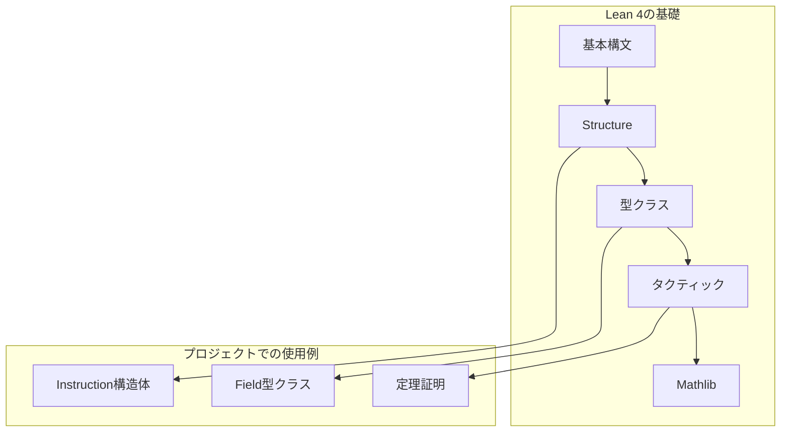

# 第2章: Lean 4基礎

本章では、Cairo形式検証プロジェクトで使用されるLean 4の基本構文とパターンについて解説する。本プロジェクトのコードを読み書きするために必要な知識を身につけることが目標である。

## 2.1 概要

本章で扱う内容：

1. **基本構文** - 定義、関数、型
2. **Structure** - レコード型の定義
3. **型クラス** - インターフェースと多相性
4. **タクティック** - 証明の記述方法
5. **Mathlib** - 数学ライブラリの活用



---

## 2.2 基本構文

### 2.2.1 定義（def）

値や関数を定義する：

```lean
-- 単純な定数定義
def PRIME :=
  3618502788666131213697322783095070105623107215331596699973092056135872020481

-- 型注釈付きの定義
def u128Max : ℕ := 340282366920938463463374607431768211455

-- 関数定義
def double (n : ℕ) : ℕ := n * 2

-- 複数引数の関数
def add (a b : ℕ) : ℕ := a + b
```

### 2.2.2 属性（Attribute）

定義に追加情報を付与する：

```lean
-- @[reducible] - 定義を自動展開可能にする
@[reducible, inline] def u16Max : ℕ := 65535

-- @[ext] - 拡張性補題を自動生成
@[ext]
structure Instruction where
  ...

-- @[simp] - simpタクティックで使用される補題
@[simp] theorem zero_add (n : ℕ) : 0 + n = n := ...
```

### 2.2.3 名前空間（Namespace）

関連する定義をグループ化する：

```lean
namespace Instruction

variable (i : Instruction)

def flags (inst : Instruction) : BitVec 15 := ...

def toNat (inst : Instruction) : ℕ := ...

end Instruction

-- 使用時: Instruction.flags, Instruction.toNat
```

### 2.2.4 変数宣言（Variable）

スコープ内で共通の変数を宣言：

```lean
-- 型変数Fを宣言
variable {F : Type _} [Field F]

-- 以降の定義でFを暗黙的に使用可能
theorem two_ne_zero : (2 : F) ≠ 0 := ...
```

---

## 2.3 Structure

### 2.3.1 基本的なStructure

複数のフィールドを持つ型を定義：

```lean
-- Verification/Semantics/Instruction.lean:7-27
@[ext]
structure Instruction where
  offDst : BitVec 16
  offOp0 : BitVec 16
  offOp1 : BitVec 16
  -- flags
  dstReg : Bool
  op0Reg : Bool
  op1Imm : Bool
  op1Fp : Bool
  op1Ap : Bool
  resAdd : Bool
  resMul : Bool
  pcJumpAbs : Bool
  pcJumpRel : Bool
  pcJnz : Bool
  apAdd : Bool
  apAdd1 : Bool
  opcodeCall : Bool
  opcodeRet : Bool
  opcodeAssertEq : Bool
  deriving DecidableEq
```

### 2.3.2 フィールドアクセス

ドット記法でフィールドにアクセス：

```lean
-- Instructionのインスタンスiに対して
i.offDst    -- BitVec 16
i.dstReg    -- Bool
i.flags     -- 名前空間内の関数も同様にアクセス可能
```

### 2.3.3 @[ext]属性

`@[ext]`属性は、2つの構造体が全フィールドで等しければ等しいという補題を自動生成：

```lean
-- 自動生成される定理
theorem Instruction.ext {i1 i2 : Instruction}
    (h1 : i1.offDst = i2.offDst)
    (h2 : i1.offOp0 = i2.offOp0)
    ...
    : i1 = i2 := ...
```

### 2.3.4 deriving句

型クラスインスタンスを自動導出：

```lean
structure Instruction where
  ...
  deriving DecidableEq  -- 等値判定を自動実装
```

---

## 2.4 型クラス

### 2.4.1 型クラスの定義

型クラスはインターフェースを定義する：

```lean
-- Mathlibでの体の定義（簡略化）
class Field (F : Type*) extends CommRing F, DivisionRing F where
  ...

-- CharPは標数を表す型クラス
class CharP (F : Type*) [AddMonoidWithOne F] (p : ℕ) : Prop where
  cast_eq_zero : (p : F) = 0
```

### 2.4.2 型クラスインスタンス

型が型クラスを満たすことを宣言：

```lean
-- Verification/Semantics/Soundness/Prelude.lean:25-29
instance char_ge [ph : PreludeHyps F] : CharGe263 F := by
  have : ringChar F ≥ 2 ^ 63 := by
    rw [@ringChar.eq F _ PRIME ph.charF, PRIME]
    norm_num1
  exact ⟨this⟩
```

### 2.4.3 暗黙の引数と型クラス

角括弧`[]`は型クラス制約を表す：

```lean
-- {F : Type _}   - 暗黙の型引数
-- [Field F]      - Fが体であることの制約
-- [PreludeHyps F] - Cairo前提条件

theorem two_ne_zero {F : Type _} [Field F] [PreludeHyps F] :
    (2 : F) ≠ 0 := ...
```

### 2.4.4 本プロジェクトの主要型クラス

| 型クラス | 役割 | 使用箇所 |
|:--|:--|:--|
| `Field F` | 体の演算 | 全体 |
| `CharP F PRIME` | 標数がPRIME | Prelude |
| `PreludeHyps F` | Cairo前提条件 | Soundness |
| `CharGe263 F` | 標数が2^63以上 | Assembly |

---

## 2.5 Prop型と証明

### 2.5.1 命題（Prop）

論理的な命題を表す型：

```lean
-- 命題の例
def is_u128_of (a : F) (na : ℕ) : Prop := na < u128Limit ∧ a = ↑na

-- ∧ (and), ∨ (or), → (implies), ¬ (not), ↔ (iff)
```

### 2.5.2 定理（Theorem）

命題の証明を定義：

```lean
-- Verification/Libfuncs/Common.lean:72
theorem u128Max_lt_PRIME : u128Max < PRIME := by simp [PRIME, u128Max]

-- Verification/Semantics/Soundness/Prelude.lean:10
theorem PRIME_gt : PRIME > 2 ^ 251 := by simp [PRIME]
```

### 2.5.3 存在量化と全称量化

```lean
-- ∀ (forall) - 全称量化
theorem nat_coe_field_inj {a b : ℕ} (ha : a < PRIME) (hb : b < PRIME)
    (h : (a : F) = (b : F)) : a = b := ...

-- ∃ (exists) - 存在量化
def u128_mul_guarantee (a b upper lower : F) : Prop :=
  ∀ ⦃na⦄, is_u128_of a na →
  ∀ ⦃nb⦄, is_u128_of b nb →
  ∃ nh : ℕ, is_u128_of upper nh ∧
  ∃ nl : ℕ, is_u128_of lower nl ∧ ...
```

---

## 2.6 タクティック

### 2.6.1 基本タクティック

| タクティック | 説明 | 使用例 |
|:--|:--|:--|
| `intro` | 仮定を導入 | `intro h` |
| `apply` | 定理を適用 | `apply theorem_name` |
| `exact` | 完全一致する証明を与える | `exact h` |
| `rfl` | 反射律で等式を証明 | `rfl` |
| `rw` | 書き換え | `rw [theorem_name]` |
| `simp` | 単純化 | `simp [def_name]` |

### 2.6.2 実際のコード例

```lean
-- Verification/Semantics/Instruction.lean:59-63
theorem dstReg_eq_of_flags_eq {i1 i2 : Instruction} (h : i1.flags = i2.flags) :
    i1.dstReg = i2.dstReg := by
    rw [flags, flags] at h           -- flagsの定義を展開
    have h' := congrArg (fun fs => BitVec.getLsbD fs 0) h  -- 関数適用
    simp at h'; exact h'             -- 単純化して結論

-- Verification/Semantics/Soundness/Prelude.lean:37-38
theorem two_mul_rcBound_lt_PRIME (F : Type _) [Field F] [PreludeHyps F] :
    2 * rcBound F < PRIME :=
  by apply lt_of_le_of_lt (Nat.mul_le_mul_left 2 (rcBound_hyp F)); rw [PRIME]; norm_num1
```

### 2.6.3 証明モード

`by`キーワードでタクティックモードに入る：

```lean
-- ターム証明（項を直接書く）
theorem example1 : 1 + 1 = 2 := rfl

-- タクティック証明
theorem example2 : 1 + 1 = 2 := by
  rfl

-- 複数ステップのタクティック証明
theorem example3 {a b : ℕ} (h : a = b) : b = a := by
  rw [h]  -- aをbで置き換え
  -- 目標: b = b、これは rfl で解ける
```

### 2.6.4 本プロジェクトで頻出のタクティック

```lean
-- norm_num1 - 数値計算を自動化
theorem PRIME_pos : 0 < PRIME := by rw [PRIME]; norm_num1

-- decide - 決定可能な命題を判定
theorem u32Max_pos : u32Max > 0 := by decide

-- cases / rcases - 場合分け
theorem eq_zero_or_eq_one_of_mul_eq_self {R : Type _} [Ring R] [NoZeroDivisors R]
    {x : R} (h : x * x = x) : x = 0 ∨ x = 1 := by
  have : x * (x - 1) = 0 := by rw [mul_sub, mul_one, h, sub_self]
  rcases eq_zero_or_eq_zero_of_mul_eq_zero this with h | h
  . left; exact h
  . right; rw [eq_of_sub_eq_zero h]
```

---

## 2.7 Mathlib活用

### 2.7.1 インポート

Mathlibの機能をインポート：

```lean
import Mathlib.Algebra.Field.Basic
import Mathlib.Data.Nat.Basic
import Mathlib.Tactic
```

### 2.7.2 よく使う型と関数

| 型/関数 | 説明 | 例 |
|:--|:--|:--|
| `ℕ` | 自然数 | `0, 1, 2, ...` |
| `ℤ` | 整数 | `-1, 0, 1, ...` |
| `BitVec n` | nビットベクトル | `BitVec 16` |
| `↑` (Coe) | 型強制 | `(n : F)` |
| `Nat.sqrt` | 平方根 | `Nat.sqrt 16 = 4` |

### 2.7.3 型強制（Coercion）

異なる型間の自動変換：

```lean
-- 自然数から体への強制
variable (n : ℕ) (F : Type _) [Field F]
#check (n : F)  -- nをFの要素として扱う

-- 整数を経由した強制
theorem coe_eq_int_coe_coe (n : ℕ) : (↑n : F) = ↑(↑n : ℤ) :=
  Int.cast_natCast _ |>.symm
```

### 2.7.4 ringChar

体の標数を取得：

```lean
-- Verification/Semantics/Soundness/Prelude.lean:44
theorem char_eq : ringChar F = PRIME := ringChar.eq F PRIME
```

---

## 2.8 Option型

### 2.8.1 定義

値が存在するかもしれないことを表す型：

```lean
-- 標準ライブラリの定義
inductive Option (α : Type _)
  | none : Option α
  | some : α → Option α
```

### 2.8.2 本プロジェクトでの使用

部分関数（失敗しうる演算）を表現：

```lean
-- Cpu.leanでの例（概念）
def op1 (i : Instruction) (mem : F → F) (s : RegisterState F) : Option F :=
  if i.op1Imm then some (mem (s.pc + 1))
  else if i.op1Fp then some (mem (s.fp + i.offOp1))
  else if i.op1Ap then some (mem (s.ap + i.offOp1))
  else none  -- op1ソースが指定されていない場合
```

### 2.8.3 Option操作

```lean
-- パターンマッチ
match opt with
| none => ...
| some x => ...

-- bind (>>=)
def res (i : Instruction) : Option F :=
  if i.pcJnz then none
  else do
    let op0 ← op0 i mem s
    let op1 ← op1 i mem s
    resAux i op0 op1
```

---

## 2.9 記法（Notation）

### 2.9.1 カスタム記法

本プロジェクトでは命令フラグ用の記法を定義：

```lean
-- Verification/Semantics/Instruction.lean:29-44
notation "DST_REG" => 0
notation "OP0_REG" => 1
notation "OP1_IMM" => 2
notation "OP1_FP" => 3
notation "OP1_AP" => 4
notation "RES_ADD" => 5
notation "RES_MUL" => 6
notation "PC_JUMP_ABS" => 7
notation "PC_JUMP_REL" => 8
notation "PC_JNZ" => 9
notation "AP_ADD" => 10
notation "AP_ADD1" => 11
notation "OPCODE_CALL" => 12
notation "OPCODE_RET" => 13
notation "OPCODE_ASSERT_EQ" => 14
```

### 2.9.2 使用例

```lean
-- フラグビット位置を名前で参照
BitVec.getLsbD inst.flags DST_REG
-- は以下と同等
BitVec.getLsbD inst.flags 0
```

---

## 2.10 マクロとタクティック定義

### 2.10.1 カスタムマクロ

繰り返しパターンを抽象化：

```lean
-- Verification/Libfuncs/Common.lean:10-11
macro (name := simp_int_nat_offset) "simp_int_nat_offset" : tactic => `(tactic|
  simp only [int_nat_offset_simps] )
```

### 2.10.2 属性によるsimp補題グループ化

```lean
-- simp用の属性を定義
attribute [int_nat_offset_simps] Int.natAbs_zero Int.natAbs_one
  add_tsub_cancel_left sub_self tsub_self zero_le_one

-- 使用
simp only [int_nat_offset_simps]
-- または
simp_int_nat_offset
```

---

## 2.11 まとめ

本章で学んだLean 4の主要概念：

| カテゴリ | 項目 | プロジェクトでの役割 |
|:--|:--|:--|
| 構文 | `def`, `theorem`, `namespace` | 定義の組織化 |
| 型 | `Structure`, 型クラス | データ構造と抽象化 |
| 証明 | タクティック | 定理の証明 |
| ライブラリ | Mathlib | 数学的基盤 |

### 次章への橋渡し

第3章では、Cairo VMのアーキテクチャについて学ぶ。本章で習得したLean 4の知識を使って、CPUレジスタ状態やメモリモデルの定義を読み解いていく。

---

## 演習問題

1. 以下のコードで`@[reducible, inline]`属性が付いている理由を説明せよ：
   ```lean
   @[reducible, inline] def u128Limit : ℕ := 340282366920938463463374607431768211456
   ```

2. `deriving DecidableEq`は何を可能にするか？

3. 以下のタクティック証明を読み解き、各行の役割を説明せよ：
   ```lean
   theorem dstReg_eq_of_flags_eq {i1 i2 : Instruction} (h : i1.flags = i2.flags) :
       i1.dstReg = i2.dstReg := by
       rw [flags, flags] at h
       have h' := congrArg (fun fs => BitVec.getLsbD fs 0) h
       simp at h'; exact h'
   ```

---

## 参考

- Lean 4公式ドキュメント: https://lean-lang.org/lean4/doc/
- Mathlib4ドキュメント: https://leanprover-community.github.io/mathlib4_docs/
- ソースファイル: `Verification/Semantics/Instruction.lean`
- ソースファイル: `Verification/Libfuncs/Common.lean`
