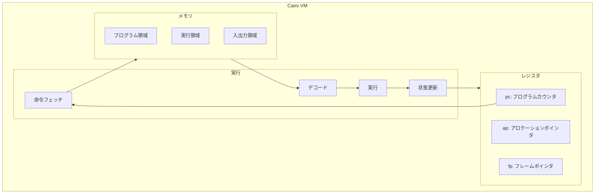
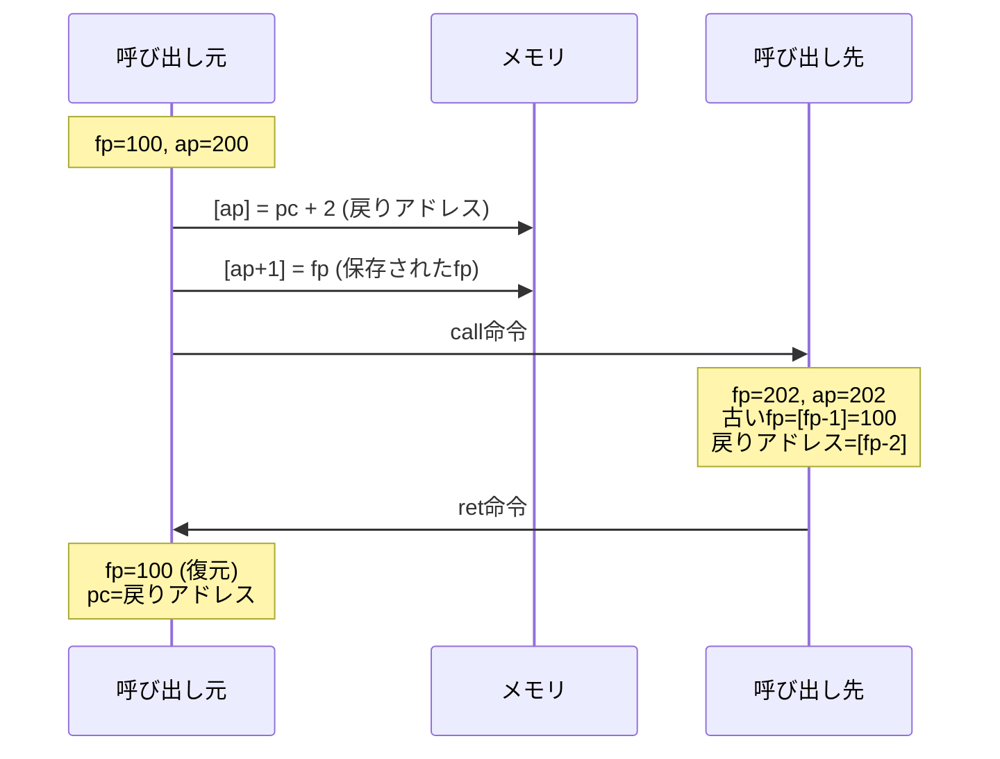
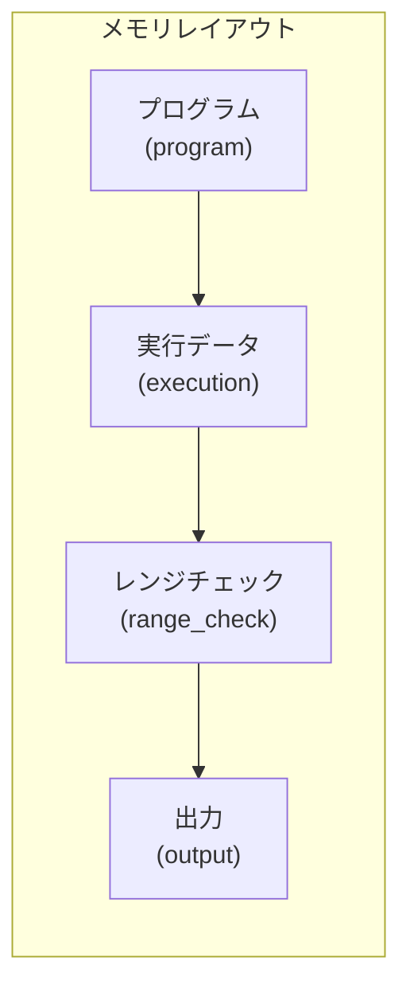
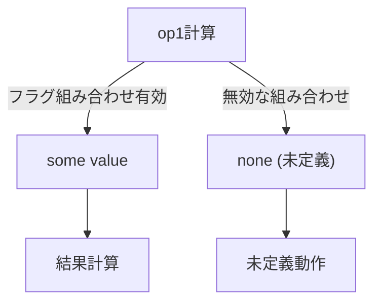

# 第3章: Cairo VM概要

本章では、Cairo仮想マシン（Cairo VM）のアーキテクチャについて概説する。形式検証の対象となるVMの構造を理解することで、後続の章で扱うセマンティクス定義の意味が明確になる。

## 3.1 概要

Cairo VMは、STARK証明システム用に設計された仮想マシンである。以下の特徴を持つ：

1. **有限体上の演算** - 全ての計算は有限体F上で行われる
2. **非決定性** - 一部の操作で複数の遷移が許容される
3. **メモリ不変性** - 一度書き込まれたメモリは変更不可
4. **STARK互換** - 実行トレースがSTARK証明に変換可能



---

## 3.2 レジスタ状態

### 3.2.1 RegisterState構造体

Cairo VMは3つのレジスタを持つ：

```lean
-- Verification/Semantics/Cpu.lean:12-15
@[ext] structure RegisterState (F : Type _) where
  pc : F  -- プログラムカウンタ
  ap : F  -- アロケーションポインタ
  fp : F  -- フレームポインタ
```

### 3.2.2 各レジスタの役割

| レジスタ | 名前 | 役割 |
|:--|:--|:--|
| `pc` | Program Counter | 次に実行する命令のアドレス |
| `ap` | Allocation Pointer | 新しいメモリ割り当て位置 |
| `fp` | Frame Pointer | 現在の関数フレームのベース |

### 3.2.3 レジスタと関数呼び出し



---

## 3.3 メモリモデル

### 3.3.1 メモリの型

Cairo VMのメモリは、フィールド要素からフィールド要素への関数として抽象化される：

```lean
-- メモリの型シグネチャ
mem : F → F
```

**意味**: アドレス `a : F` に対して、`mem a` がその位置の値を返す。

### 3.3.2 メモリの特性

1. **イミュータブル（不変）**: 一度書き込まれた値は変更されない
2. **非決定的初期化**: 未初期化メモリの読み取りは任意の値を返しうる
3. **連続アドレス空間**: アドレスは有限体の要素

### 3.3.3 メモリセグメント

実際のCairo実行では、メモリは論理的にセグメント化される：



---

## 3.4 命令セット

### 3.4.1 命令の種類

Cairo VMは以下の基本操作をサポートする：

| カテゴリ | 操作 | 説明 |
|:--|:--|:--|
| **算術** | add, mul | 加算、乗算 |
| **メモリ** | load, store | メモリ読み書き |
| **制御** | jmp, jnz, call, ret | フロー制御 |
| **アサーション** | assert_eq | 等式チェック |

### 3.4.2 命令エンコーディング

命令は63ビットの整数としてエンコードされる：

```
| offDst (16) | offOp0 (16) | offOp1 (16) | flags (15) |
```

```lean
-- Verification/Semantics/Instruction.lean:55-57
def toNat (inst : Instruction) : ℕ :=
  inst.offDst.toNat + 2 ^ 16 * inst.offOp0.toNat + 2 ^ 32 * inst.offOp1.toNat +
    2 ^ 48 * inst.flags.toNat
```

### 3.4.3 オフセットとバイアス

オフセットは16ビットのバイアス付き整数（-2^15 ～ 2^15-1）：

```lean
-- toBiased16: 16ビット値を符号付きオフセットに変換
-- 例: 0x8000 → 0, 0x0000 → -32768, 0xFFFF → 32767
```

---

## 3.5 命令実行

### 3.5.1 オペランドの取得

**op0（第1オペランド）**:

```lean
-- Verification/Semantics/Cpu.lean:23
def op0 := cond i.op0Reg
  (mem (s.fp + i.offOp0.toBiased16))  -- fp相対
  (mem (s.ap + i.offOp0.toBiased16))  -- ap相対
```

**op1（第2オペランド）**:

```lean
-- Verification/Semantics/Cpu.lean:25-31
def op1 : Option F :=
  match i.op1Imm, i.op1Fp, i.op1Ap with
    | false, false, false => some (mem (i.op0 mem s + i.offOp1.toBiased16))  -- [op0 + off]
    | true,  false, false => some (mem (s.pc + i.offOp1.toBiased16))         -- 即値
    | false, true,  false => some (mem (s.fp + i.offOp1.toBiased16))         -- fp相対
    | false, false, true  => some (mem (s.ap + i.offOp1.toBiased16))         -- ap相対
    | _,     _,     _     => none  -- 未定義
```

### 3.5.2 結果の計算

```lean
-- Verification/Semantics/Cpu.lean:33-38
def resAux : Option F :=
  match i.op1 mem s, i.resAdd, i.resMul with
    | some op1, false, false => some op1            -- res = op1
    | some op1, true,  false => some (i.op0 mem s + op1)  -- res = op0 + op1
    | some op1, false, true  => some (i.op0 mem s * op1)  -- res = op0 * op1
    | _,        _,     _     => none
```

### 3.5.3 Option型と未定義動作

`Option F`型は、操作が成功する（`some`）か未定義（`none`）かを表現：



---

## 3.6 状態遷移

### 3.6.1 プログラムカウンタ更新

```lean
-- Verification/Semantics/Cpu.lean:50-65
def nextPc [DecidableEq F] : Option F :=
  match i.pcJumpAbs, i.pcJumpRel, i.pcJnz with
    | false, false, false => some (s.pc + i.size)  -- 順次実行
    | true,  false, false => i.res mem s           -- 絶対ジャンプ
    | false, true,  false =>
        match i.res mem s with                     -- 相対ジャンプ
          | some res => some (s.pc + res)
          | none     => none
    | false, false, true  =>                       -- 条件分岐
        if i.dst mem s = 0 then
          some (s.pc + i.size)
        else
          match i.op1 mem s with
            | some op1 => some (s.pc + op1)
            | none     => none
    | _,     _,     _     => none
```

### 3.6.2 アロケーションポインタ更新

```lean
-- Verification/Semantics/Cpu.lean:77-86
def nextAp : Option F :=
  match i.opcodeCall, i.opcodeRet, i.opcodeAssertEq with
    | false, false, false => i.nextApAux mem s
    | true,  false, false =>                    -- call命令
        match i.apAdd, i.apAdd1 with
          | false, false => some (s.ap + 2)     -- 戻りアドレスとfpを保存
          | _,     _     => none
    | false, true,  false => i.nextApAux mem s  -- ret命令
    | false, false, true  => i.nextApAux mem s  -- assert_eq命令
    | _, _, _ => none
```

### 3.6.3 フレームポインタ更新

```lean
-- Verification/Semantics/Cpu.lean:88-95
def nextFp : Option F :=
  match i.opcodeCall, i.opcodeRet, i.opcodeAssertEq with
    | false, false, false => some s.fp
    | true,  false, false => some (s.ap + 2)    -- call: 新フレーム
    | false, true,  false => some (i.dst mem s) -- ret: フレーム復元
    | false, false, true  => some s.fp          -- assert_eq: 変更なし
    | _,     _,     _     => none
```

---

## 3.7 アサーション

### 3.7.1 Asserts述語

命令実行時に満たすべき条件：

```lean
-- Verification/Semantics/Cpu.lean:97-105
def Asserts : Prop :=
  match i.opcodeCall, i.opcodeRet, i.opcodeAssertEq with
  | false, false, false => True
  | true,  false, false =>                      -- call命令
      i.op0 mem s = s.pc + i.size ∧ i.dst mem s = s.fp
  | false, true,  false => True                 -- ret命令
  | false, false, true  =>                      -- assert_eq命令
      (i.res mem s).Agrees (i.dst mem s)
  | _,     _,     _     => True
```

### 3.7.2 call命令のアサーション

call命令は以下を保証する必要がある：
- `op0 = pc + size`（戻りアドレスが正しい）
- `dst = fp`（現在のfpが保存される）

---

## 3.8 NextState述語

### 3.8.1 命令レベルのNextState

特定の命令による状態遷移：

```lean
-- Verification/Semantics/Cpu.lean:109-112
protected def NextState : Prop :=
  (i.nextPc mem s).Agrees t.pc ∧
    (i.nextAp mem s).Agrees t.ap ∧
    (i.nextFp mem s).Agrees t.fp ∧
    i.Asserts mem s
```

### 3.8.2 グローバルNextState

任意の命令による状態遷移：

```lean
-- Verification/Semantics/Cpu.lean:116-118
def NextState {F : Type _} [Field F] [DecidableEq F]
    (mem : F → F) (s t : RegisterState F) : Prop :=
  ∃ i : Instruction, mem s.pc = ↑i.toNat ∧ i.NextState mem s t
```

**意味**: 状態`s`から状態`t`への遷移が可能 ⟺ ある命令`i`が存在して：
1. メモリの`s.pc`位置に命令`i`がエンコードされている
2. 命令`i`が`s`から`t`への遷移を許容する

---

## 3.9 STARK証明との関係

### 3.9.1 実行トレース

Cairo VMの実行は、状態の列（トレース）として記録される：

```
s₀ → s₁ → s₂ → ... → sₙ
```

各遷移 `sᵢ → sᵢ₊₁` は `NextState mem sᵢ sᵢ₊₁` を満たす。

### 3.9.2 AIRへの変換

実行トレースは代数的中間表現（AIR: Algebraic Intermediate Representation）に変換される：


### 3.9.3 形式検証の役割

本プロジェクトは以下を証明する：
1. **健全性**: AIR制約を満たすトレースは有効な実行である
2. **完全性**: 有効な実行はAIR制約を満たすトレースを持つ

---

## 3.10 まとめ

本章で学んだCairo VMの主要概念：

| 概念 | Lean表現 | 役割 |
|:--|:--|:--|
| レジスタ状態 | `RegisterState F` | pc, ap, fpを保持 |
| メモリ | `F → F` | アドレスから値へのマップ |
| 命令 | `Instruction` | 15フラグ+3オフセット |
| 状態遷移 | `NextState mem s t` | 1ステップの実行 |
| アサーション | `Asserts` | 命令の事前条件 |

### 次章への橋渡し

第4章では、プログラム検証の基礎としてHoare論理とAIRの概念を学ぶ。本章で理解したNextState述語が、健全性・完全性証明の基盤となる。

---

## 演習問題

1. `op1`関数が`Option F`を返す理由を説明せよ。どのような場合に`none`を返すか？

2. call命令実行後、`ap`と`fp`はそれぞれどのように更新されるか？

3. 以下のケースでNextStateが成立するための条件を述べよ：
   - 条件分岐（jnz）で分岐する場合
   - 条件分岐（jnz）でフォールスルーする場合

---

## 参考

- ソースファイル: `Verification/Semantics/Cpu.lean`
- ソースファイル: `Verification/Semantics/Instruction.lean`
- Cairo公式ドキュメント: https://www.cairo-lang.org/docs/
