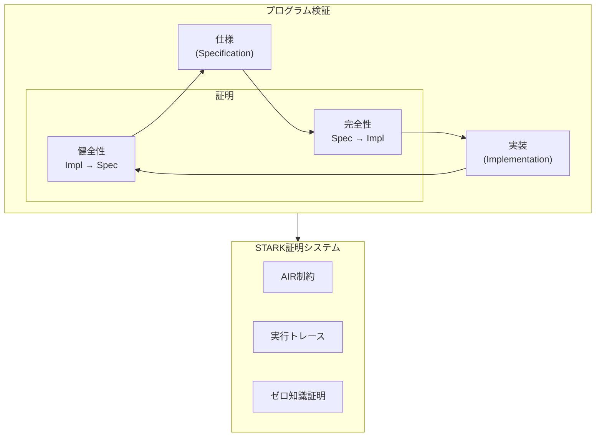
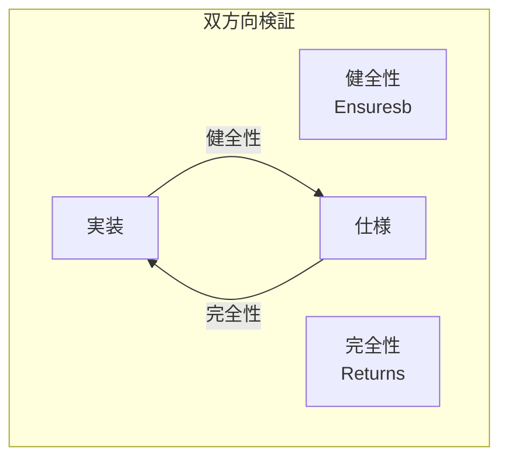
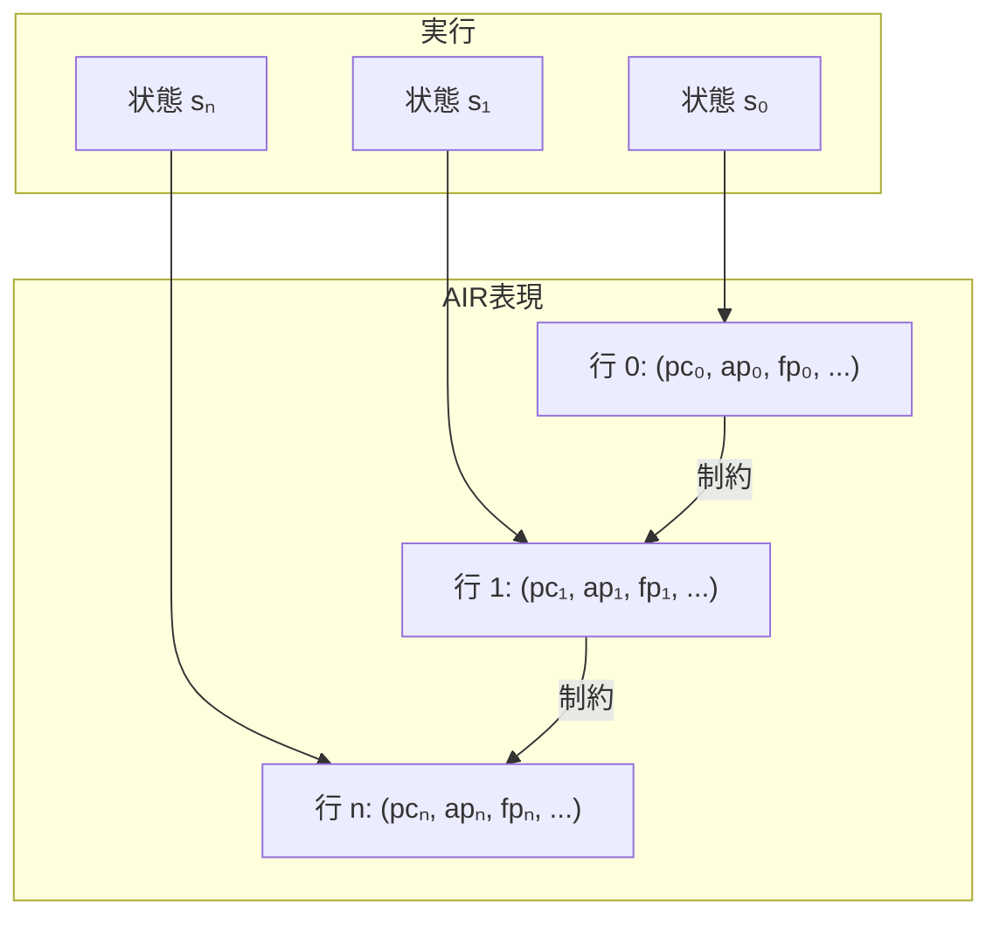
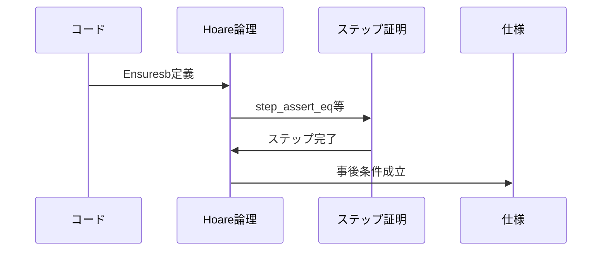
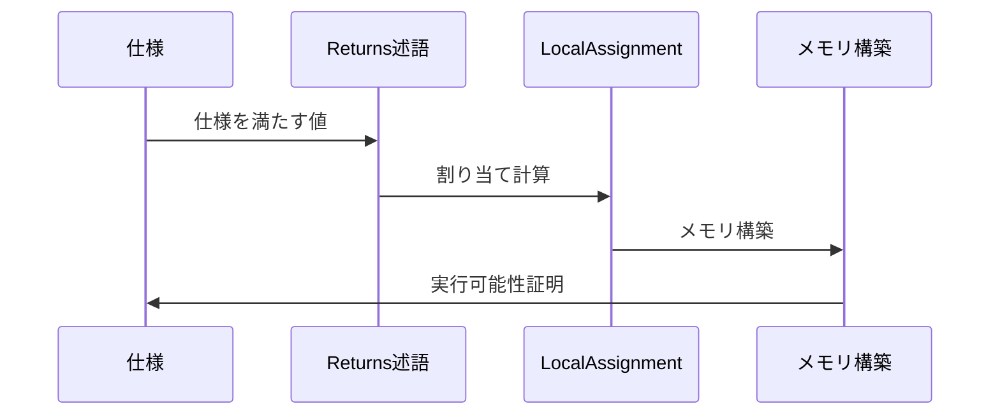
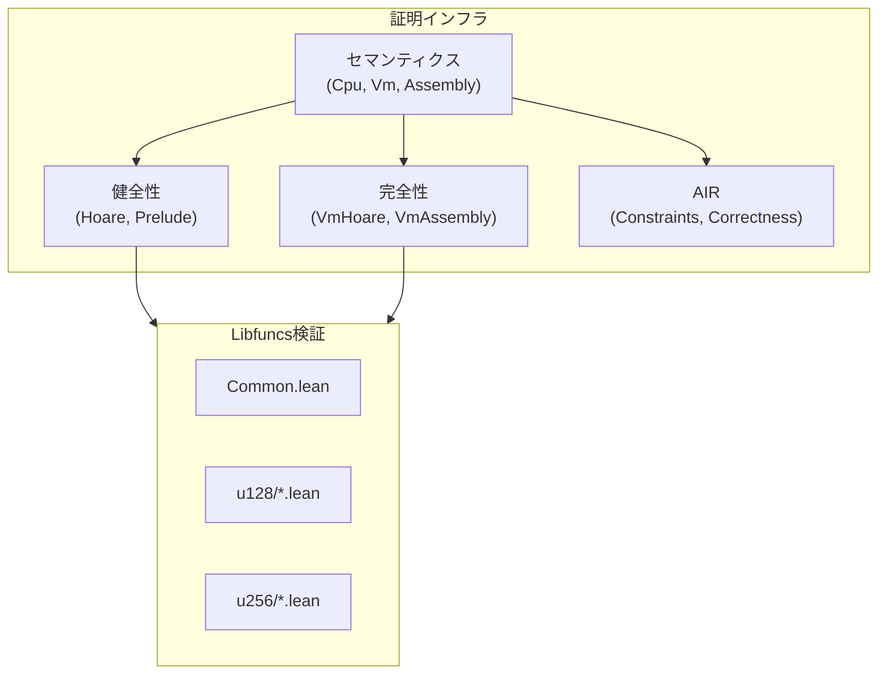

# 第4章: プログラム検証基礎

本章では、形式検証の基礎概念であるHoare論理と、Cairo特有のAIR（Algebraic Intermediate Representation）について解説する。

## 4.1 概要

プログラム検証とは、プログラムが仕様を満たすことを数学的に証明することである。本プロジェクトでは以下のアプローチを取る：

1. **Hoare論理** - 事前条件と事後条件による仕様記述
2. **健全性（Soundness）** - プログラムが仕様を満たすことの証明
3. **完全性（Completeness）** - 仕様を満たす全ての実行が表現可能であることの証明
4. **AIR正当性** - STARK証明との対応の検証



---

## 4.2 Hoare論理

### 4.2.1 Hoare三つ組

Hoare論理は、プログラムの正しさを以下の形式で記述する：

```
{P} C {Q}
```

| 記号 | 名前 | 意味 |
|:--|:--|:--|
| P | 事前条件（Precondition） | プログラム実行前に成り立つ条件 |
| C | コマンド（Command） | 実行するプログラム |
| Q | 事後条件（Postcondition） | プログラム実行後に成り立つ条件 |

**解釈**: 事前条件Pが成り立つ状態でプログラムCを実行すると、終了時には事後条件Qが成り立つ。

### 4.2.2 部分正当性と全正当性

- **部分正当性（Partial Correctness）**: プログラムが*終了すれば*事後条件を満たす
- **全正当性（Total Correctness）**: プログラムが*必ず終了し*事後条件を満たす

本プロジェクトでは**部分正当性**を扱う。これはSTARKが実行の終了を別途保証するためである。

### 4.2.3 本プロジェクトでの表現

Cairo VMの文脈では、Hoare三つ組は次のように解釈される：

```lean
-- 概念的な表現
∀ 終了する実行トレース exec,
  exec の初期状態が 事前条件 を満たす →
  ∃ 状態 s ∈ exec, s が 事後条件 を満たす
```

---

## 4.3 Ensures述語

### 4.3.1 定義

`Ensures`は、実行が特定の事後条件に到達することを表す：

```lean
-- Verification/Semantics/Soundness/Hoare.lean:123-125
def Ensures (mem : F → F) (s : RegisterState F)
    (P : ℕ → RegisterState F → Prop) : Prop :=
  ∀ n : ℕ, ∀ exec : Fin (n + 1) → RegisterState F,
      IsHaltingTrace mem exec → exec 0 = s → ∃ i : Fin (n + 1), ∃ k ≤ i, P k (exec i)
```

### 4.3.2 構成要素の解説

| 要素 | 型 | 意味 |
|:--|:--|:--|
| `mem` | `F → F` | メモリ内容 |
| `s` | `RegisterState F` | 開始状態 |
| `P` | `ℕ → RegisterState F → Prop` | 事後条件（ステップ数と状態に依存） |
| `exec` | `Fin (n + 1) → RegisterState F` | 実行トレース |
| `n` | `ℕ` | トレースの長さ - 1 |
| `k` | `ℕ` | 事後条件到達までのステップ数 |

### 4.3.3 停止状態

実行トレースは「停止状態」で終了する：

```lean
-- Verification/Semantics/Soundness/Hoare.lean:76-77
def IsHaltingState := mem s.pc = jmpRelInstr.toNat ∧ mem (s.pc + 1) = 0
```

停止状態は、自分自身への相対ジャンプ（無限ループ）として定義される。

### 4.3.4 EnsuresRet - 関数戻り用

関数からの戻りを表現する特化版：

```lean
-- Verification/Semantics/Soundness/Hoare.lean:128-130
@[reducible]
def EnsuresRet (mem : F → F) (s : RegisterState F)
    (P : ℕ → RegisterState F → Prop) : Prop :=
  Ensures mem s fun k t => t.pc = mem (s.fp - 1) ∧ t.fp = mem (s.fp - 2) ∧ P k t
```

**意味**: 実行終了時に、保存された戻りアドレスとフレームポインタが復元される。

---

## 4.4 Ensuresb - 有界版

### 4.4.1 定義

`Ensuresb`は、実行ステップ数に上界を設ける：

```lean
-- Verification/Semantics/Soundness/Hoare.lean:132-134
def Ensuresb (bound : ℕ) (mem : F → F) (s : RegisterState F)
    (P : ℕ → RegisterState F → Prop) : Prop :=
  ∀ n : ℕ, n < bound → ∀ exec : Fin (n + 1) → RegisterState F,
        IsHaltingTrace mem exec → exec 0 = s → ∃ i : Fin (n + 1), ∃ k ≤ i, P k (exec i)
```

### 4.4.2 使用目的

有界版を使う理由：

1. **帰納法の適用** - 有界なケースで証明し、任意のboundに拡張
2. **レンジチェック境界** - boundパラメータでレンジチェック回数を追跡

### 4.4.3 Ensures と Ensuresbの関係

```lean
-- Verification/Semantics/Soundness/Hoare.lean:136-138
theorem ensures_of_ensuresb {mem : F → F} {s : RegisterState F}
    {P : ℕ → RegisterState F → Prop}
    (h : ∀ bound, Ensuresb bound mem s P) : Ensures mem s P := fun n =>
  h (n + 1) _ (Nat.lt_succ_self n)
```

全てのboundに対してEnsuresbが成り立てば、Ensuresが成り立つ。

---

## 4.5 健全性と完全性

### 4.5.1 健全性（Soundness）

**定義**: プログラムの実行が仕様を満たすことの証明。


**本プロジェクトでの意味**:
- コードが実行されると、指定された事後条件が成立する
- 例: `u128_overflowing_add`を実行すると、結果は正しい加算結果

```lean
-- 健全性証明の形式（概念）
theorem auto_spec_u128_overflowing_add :
    Ensuresb bound mem s (u128_overflowing_add_spec a b) := by
  ...
```

### 4.5.2 完全性（Completeness）

**定義**: 仕様を満たす全ての入出力が、コードによって実現可能であることの証明。


**本プロジェクトでの意味**:
- 仕様を満たす入出力に対して、対応するメモリ割り当てが存在する
- 例: 正しい加算結果に対して、それを生成するメモリ状態が構築できる

### 4.5.3 両方向の証明



---

## 4.6 AIR（Algebraic Intermediate Representation）

### 4.6.1 概念

AIRは、計算を多項式制約として表現する形式である：

```
制約(現在行, 次行) = 0
```

### 4.6.2 実行トレースとAIR



### 4.6.3 AIR制約の役割

1. **遷移制約**: 連続する行間の関係を規定
2. **境界制約**: 初期状態と終了状態を規定
3. **メモリ制約**: メモリアクセスの一貫性を保証

### 4.6.4 本プロジェクトでのAIR

`Verification/Semantics/AirEncoding/`ディレクトリで、AIR制約と実行セマンティクスの対応を証明：

```lean
-- 主定理（概念）
theorem execution_exists :
    AIR制約を満たすトレース →
    ∃ 有効な実行, トレースと対応する
```

---

## 4.7 証明の構造

### 4.7.1 健全性証明の流れ



### 4.7.2 完全性証明の流れ



---

## 4.8 本プロジェクトのアーキテクチャ

### 4.8.1 証明インフラの階層



### 4.8.2 ファイルパターン

各libfuncは5つのファイルで構成される：

| ファイル | 役割 | 内容 |
|:--|:--|:--|
| `*_code.lean` | 実装 | アセンブリコード定義 |
| `*_soundness_spec.lean` | 健全性仕様 | 事後条件の定義 |
| `*_soundness.lean` | 健全性証明 | Ensuresbの証明 |
| `*_completeness_spec.lean` | 完全性仕様 | Returnsの定義 |
| `*_completeness.lean` | 完全性証明 | 完全性の証明 |

---

## 4.9 まとめ

本章で学んだ主要概念：

| 概念 | Lean表現 | 役割 |
|:--|:--|:--|
| Hoare論理 | `Ensures`, `Ensuresb` | プログラム正しさの形式化 |
| 健全性 | `Ensuresb bound mem s P` | 実装→仕様 |
| 完全性 | `Returns` | 仕様→実装 |
| AIR | `AirEncoding/*.lean` | STARK証明との対応 |

### 次章への橋渡し

第5章からは、具体的なソースコードの詳細解説に入る。本章で学んだ理論的枠組みが、実際のLean 4コードでどのように実装されているかを見ていく。

---

## 演習問題

1. `Ensures`と`Ensuresb`の違いを説明せよ。なぜ両方が必要か？

2. 健全性証明と完全性証明が両方必要な理由を説明せよ。

3. AIR制約が多項式で表現される利点は何か？（ヒント: STARK証明の効率性）

---

## 参考

- ソースファイル: `Verification/Semantics/Soundness/Hoare.lean`
- ソースファイル: `Verification/Semantics/Completeness/VmHoare.lean`
- ソースファイル: `Verification/Semantics/AirEncoding/Correctness.lean`
- Hoare論理の原論文: C.A.R. Hoare, "An Axiomatic Basis for Computer Programming" (1969)
