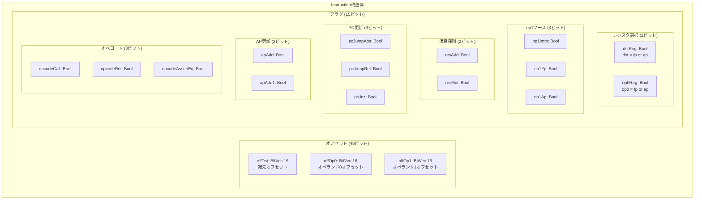

# 第5章: 命令定義 (Instruction.lean)

## 5.1 概要

本章では、Cairo VMの命令フォーマットを定義する`Instruction.lean`ファイルを詳細に解説します。このファイルはCairo VMセマンティクスの基盤であり、全ての命令がどのようにエンコードされるかを規定しています。

### 本章の目標

- `Instruction`構造体の各フィールドの意味を理解する
- 15個のフラグビットがどのように命令の動作を決定するかを学ぶ
- 命令の数値エンコーディング方式を理解する

### 前提知識

- Lean 4の基本構文（structure、def、theorem）
- ビットベクトル（`BitVec`）の概念
- 論理演算（Bool型）

### ソースファイル

```
Verification/Semantics/Instruction.lean
```

## 5.2 Instruction構造体の全体像

### 5.2.1 構造体定義

```lean
-- Instruction.lean:7-27
@[ext]
structure Instruction where
  offDst : BitVec 16
  offOp0 : BitVec 16
  offOp1 : BitVec 16
  -- flags
  dstReg : Bool
  op0Reg : Bool
  op1Imm : Bool
  op1Fp : Bool
  op1Ap : Bool
  resAdd : Bool
  resMul : Bool
  pcJumpAbs : Bool
  pcJumpRel : Bool
  pcJnz : Bool
  apAdd : Bool
  apAdd1 : Bool
  opcodeCall : Bool
  opcodeRet : Bool
  opcodeAssertEq : Bool
  deriving DecidableEq
```

### 5.2.2 構造図



## 5.3 オフセットフィールドの詳細

### 5.3.1 offDst（宛先オフセット）

```lean
offDst : BitVec 16
```

**役割**: 命令の宛先アドレスを計算するためのオフセット値

**計算方法**:
- `dstReg = true`の場合: `mem[fp + offDst.toBiased16]`
- `dstReg = false`の場合: `mem[ap + offDst.toBiased16]`

**toBiased16について**:
16ビット値を符号付きオフセット（-2^15 から 2^15-1）として解釈します。これは`Util.lean`で定義されています。

```lean
-- 概念的な定義（実際の実装はUtil.leanにある）
def toBiased16 (bv : BitVec 16) : Int := bv.toNat - 2^15
```

### 5.3.2 offOp0（オペランド0オフセット）

```lean
offOp0 : BitVec 16
```

**役割**: 最初のオペランド（op0）のアドレスを計算するためのオフセット

**計算方法**:
- `op0Reg = true`の場合: `mem[fp + offOp0.toBiased16]`
- `op0Reg = false`の場合: `mem[ap + offOp0.toBiased16]`

### 5.3.3 offOp1（オペランド1オフセット）

```lean
offOp1 : BitVec 16
```

**役割**: 2番目のオペランド（op1）のアドレスを計算するためのオフセット

**計算方法**（4つのモードがある）:
| op1Imm | op1Fp | op1Ap | ベースアドレス |
|:--:|:--:|:--:|:--|
| true | false | false | pc（即値モード） |
| false | true | false | fp |
| false | false | true | ap |
| false | false | false | op0 |

## 5.4 フラグビットの詳細

### 5.4.1 フラグビットの位置定義

```lean
-- Instruction.lean:29-44
-- flag bits
notation "DST_REG" => 0
notation "OP0_REG" => 1
notation "OP1_IMM" => 2
notation "OP1_FP" => 3
notation "OP1_AP" => 4
notation "RES_ADD" => 5
notation "RES_MUL" => 6
notation "PC_JUMP_ABS" => 7
notation "PC_JUMP_REL" => 8
notation "PC_JNZ" => 9
notation "AP_ADD" => 10
notation "AP_ADD1" => 11
notation "OPCODE_CALL" => 12
notation "OPCODE_RET" => 13
notation "OPCODE_ASSERT_EQ" => 14
```

これらの`notation`定義により、フラグビットの位置を分かりやすい名前で参照できます。

### 5.4.2 ビット配置図

```
命令エンコーディング（63ビット）:
┌─────────────────┬─────────────────┬─────────────────┬─────────────────┐
│  offDst (16b)   │  offOp0 (16b)   │  offOp1 (16b)   │   flags (15b)   │
│   bits 0-15     │   bits 16-31    │   bits 32-47    │   bits 48-62    │
└─────────────────┴─────────────────┴─────────────────┴─────────────────┘

フラグビット詳細（15ビット）:
┌───┬───┬───┬───┬───┬───┬───┬───┬───┬───┬───┬───┬───┬───┬───┐
│ 0 │ 1 │ 2 │ 3 │ 4 │ 5 │ 6 │ 7 │ 8 │ 9 │10 │11 │12 │13 │14 │
├───┼───┼───┼───┼───┼───┼───┼───┼───┼───┼───┼───┼───┼───┼───┤
│dst│op0│op1│op1│op1│res│res│ pc│ pc│ pc│ ap│ ap│opc│opc│opc│
│Reg│Reg│Imm│Fp │Ap │Add│Mul│Abs│Rel│Jnz│Add│+1 │Cal│Ret│Aeq│
└───┴───┴───┴───┴───┴───┴───┴───┴───┴───┴───┴───┴───┴───┴───┘
```

### 5.4.3 レジスタ選択フラグ（ビット0-1）

**dstReg（ビット0）**
- `false`: 宛先アドレスのベースはAP
- `true`: 宛先アドレスのベースはFP

**op0Reg（ビット1）**
- `false`: op0アドレスのベースはAP
- `true`: op0アドレスのベースはFP

### 5.4.4 op1ソースフラグ（ビット2-4）

これら3ビットは相互排他的に使用されます：

| op1Imm | op1Fp | op1Ap | 動作 |
|:--:|:--:|:--:|:--|
| false | false | false | op1 = mem[op0 + offOp1] |
| true | false | false | op1 = mem[pc + offOp1]（即値） |
| false | true | false | op1 = mem[fp + offOp1] |
| false | false | true | op1 = mem[ap + offOp1] |
| その他 | - | - | 未定義動作 |

### 5.4.5 演算種別フラグ（ビット5-6）

**resAdd（ビット5）** と **resMul（ビット6）**:

| resAdd | resMul | res（結果） |
|:--:|:--:|:--|
| false | false | op1 |
| true | false | op0 + op1 |
| false | true | op0 * op1 |
| true | true | 未定義 |

### 5.4.6 PC更新フラグ（ビット7-9）

**pcJumpAbs（ビット7）**, **pcJumpRel（ビット8）**, **pcJnz（ビット9）**:

| pcJumpAbs | pcJumpRel | pcJnz | 次のPC |
|:--:|:--:|:--:|:--|
| false | false | false | pc + instruction_size |
| true | false | false | res（絶対ジャンプ） |
| false | true | false | pc + res（相対ジャンプ） |
| false | false | true | dst≠0 ? pc+op1 : pc+size（条件分岐） |

### 5.4.7 AP更新フラグ（ビット10-11）

**apAdd（ビット10）** と **apAdd1（ビット11）**:

| apAdd | apAdd1 | 次のAP |
|:--:|:--:|:--|
| false | false | ap（変更なし） |
| true | false | ap + res |
| false | true | ap + 1 |
| true | true | 未定義 |

### 5.4.8 オペコードフラグ（ビット12-14）

**opcodeCall（ビット12）**, **opcodeRet（ビット13）**, **opcodeAssertEq（ビット14）**:

| opcodeCall | opcodeRet | opcodeAssertEq | 動作 |
|:--:|:--:|:--:|:--|
| false | false | false | 通常命令 |
| true | false | false | call（fp←ap+2, ap←ap+2） |
| false | true | false | ret（fp←dst） |
| false | false | true | assert_eq（dst = res を検証） |

## 5.5 flags関数とtoNat関数

### 5.5.1 flags関数

```lean
-- Instruction.lean:50-53
def flags (inst : Instruction) : BitVec 15 :=
  BitVec.ofBoolListLE [inst.dstReg, inst.op0Reg, inst.op1Imm,
      inst.op1Fp, inst.op1Ap, inst.resAdd, inst.resMul, inst.pcJumpAbs,
      inst.pcJumpRel, inst.pcJnz, inst.apAdd, inst.apAdd1, inst.opcodeCall,
      inst.opcodeRet, inst.opcodeAssertEq]
```

**役割**: 15個のBoolフラグを15ビットのビットベクトルにパックします。

**BitVec.ofBoolListLE**:
- `LE`は"Little Endian"を意味します
- リストの最初の要素がビット0になります
- 例: `[true, false, true, ...]` → `0b...101`

### 5.5.2 toNat関数

```lean
-- Instruction.lean:55-57
def toNat (inst : Instruction) : ℕ :=
  inst.offDst.toNat + 2 ^ 16 * inst.offOp0.toNat + 2 ^ 32 * inst.offOp1.toNat +
    2 ^ 48 * inst.flags.toNat
```

**役割**: 命令全体を自然数にエンコードします。

**エンコーディング構造**:
```
toNat = offDst + 2^16 * offOp0 + 2^32 * offOp1 + 2^48 * flags
```

この値がCairo VMのメモリに格納される命令の数値表現です。

## 5.6 フラグ等価性定理

`Instruction.lean`には、フラグが等しければ各フラグフィールドも等しいことを示す定理群があります：

```lean
-- Instruction.lean:59-147
theorem dstReg_eq_of_flags_eq {i1 i2 : Instruction} (h : i1.flags = i2.flags) :
    i1.dstReg = i2.dstReg := by
    rw [flags, flags] at h
    have h' := congrArg (fun fs => BitVec.getLsbD fs 0) h
    simp at h'; exact h'

-- 同様に op0Reg, op1Imm, ... についても定理が存在
```

### 証明パターンの解説

1. `flags`定義を展開（`rw [flags, flags] at h`）
2. 特定ビット位置の値を取り出す（`congrArg (fun fs => BitVec.getLsbD fs n) h`）
3. 簡略化して結論を得る（`simp at h'; exact h'`）

これらの定理は、命令の一意性を証明する際に使用されます。

## 5.7 命令の例

### 5.7.1 assert_eq命令の例

```
[ap] = [fp + -3];  -- ap番地にfp-3番地の値を代入
```

この命令のフィールド値：
- `offDst = 0 + 2^15`（ap + 0）
- `offOp0 = -1 + 2^15`（fp + -1、ダミー）
- `offOp1 = -3 + 2^15`（fp + -3）
- `dstReg = false`（ap）
- `op0Reg = true`（fp）
- `op1Fp = true`（fp）
- `opcodeAssertEq = true`

### 5.7.2 jmp rel命令の例

```
jmp rel [pc + 1];  -- pc + [pc+1] へジャンプ
```

この命令のフィールド値：
- `offOp1 = 1 + 2^15`（即値オフセット）
- `op1Imm = true`（即値モード）
- `pcJumpRel = true`（相対ジャンプ）

## 5.8 まとめ

### 重要なポイント

1. **Instruction構造体**は、Cairo VMの全命令を表現できる統一的なフォーマット
2. **3つのオフセット**（offDst, offOp0, offOp1）でメモリアクセスを指定
3. **15個のフラグ**で命令の動作を細かく制御
4. **toNat関数**で命令を63ビット整数にエンコード

### 次章との関連

第6章「CPU実行セマンティクス」では、この`Instruction`構造体を使って実際の命令実行がどのように定義されるかを学びます。特に：

- `op0`, `op1`, `res`, `dst`の計算方法
- `nextPc`, `nextAp`, `nextFp`の更新規則
- `NextState`述語による状態遷移の定義

これらは全て`Instruction`のフィールド値に基づいて決定されます。

## 5.9 演習問題

### 問題1
`ret`命令のフラグ値を全て列挙してください。

<details>
<summary>解答</summary>

```lean
-- retInstr の定義（Assembly.lean より）
def retInstr : Instr where
  offDst := -2
  offOp0 := -1
  offOp1 := -1
  dstReg := true       -- fp
  op0Reg := true       -- fp
  op1Src := (false, true, false)  -- fp
  resLogic := (false, false)      -- op1
  pcUpdate := (true, false, false) -- absolute jump
  apUpdate := (false, false)      -- no change
  opcode := (false, true, false)  -- ret
```

フラグビット: `dstReg=1, op0Reg=1, op1Fp=1, pcJumpAbs=1, opcodeRet=1`

</details>

### 問題2
`flags`関数が返すビットベクトルで、ビット5が1になるのはどのような場合ですか？

<details>
<summary>解答</summary>

ビット5は`resAdd`フラグです。これが1（true）になるのは、演算結果が`op0 + op1`の場合です。

</details>

### 問題3
以下の命令をInstructionのフィールド値で表現してください：
```
[ap + 1] = [fp + -4] + [fp + -3];
```

<details>
<summary>解答</summary>

- `offDst = 1 + 2^15 = 32769`
- `offOp0 = -4 + 2^15 = 32764`
- `offOp1 = -3 + 2^15 = 32765`
- `dstReg = false`（ap）
- `op0Reg = true`（fp）
- `op1Fp = true`（fp）
- `resAdd = true`（加算）
- `opcodeAssertEq = true`（代入）

</details>
