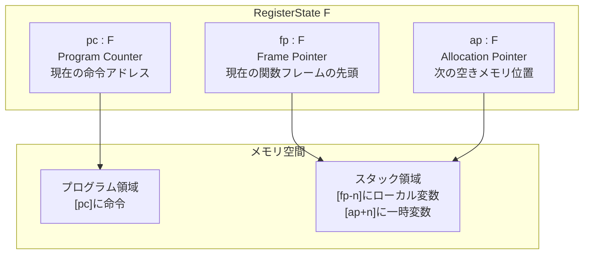
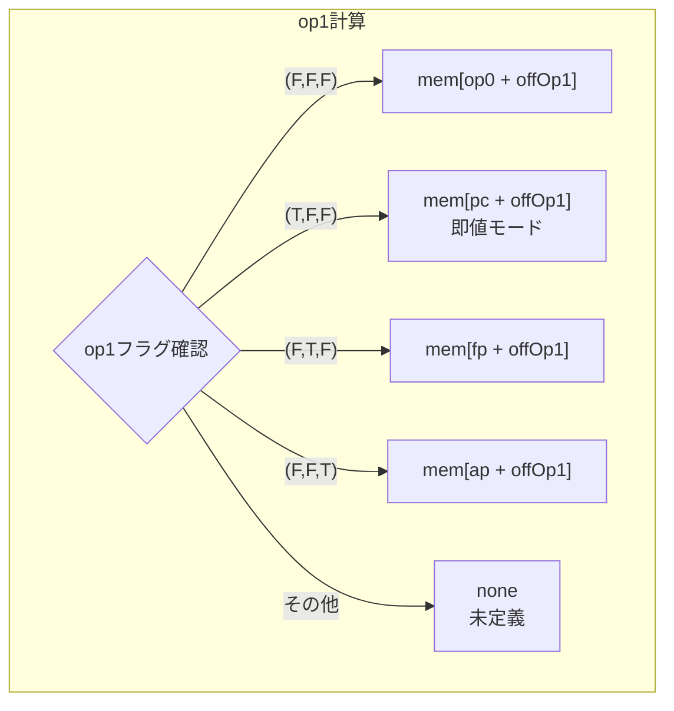
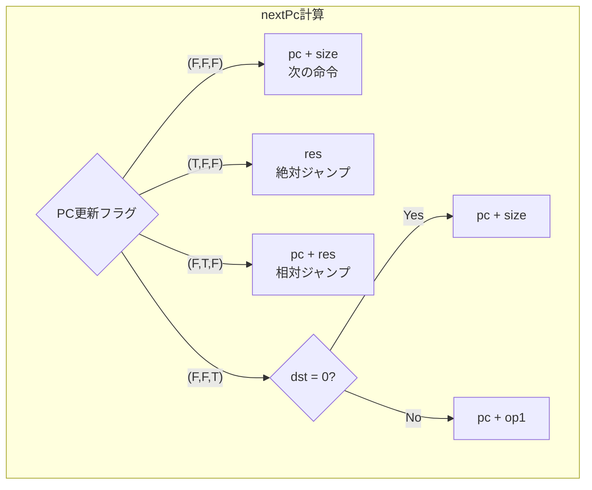
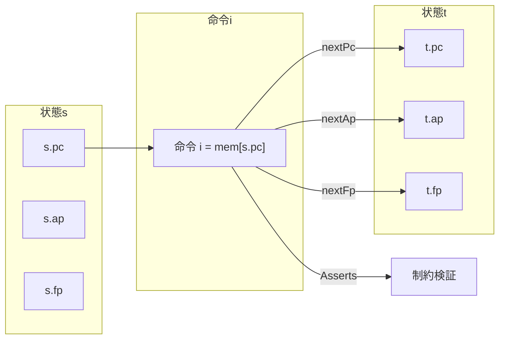
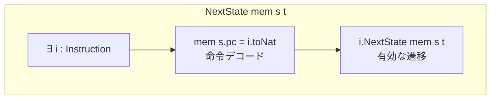

# 第6章: CPU実行セマンティクス (Cpu.lean)

## 6.1 概要

本章では、Cairo CPUの実行セマンティクスを定義する`Cpu.lean`ファイルを詳細に解説します。このファイルは、第5章で学んだ`Instruction`構造体を使って、CPUの状態遷移がどのように定義されるかを規定しています。

### 本章の目標

- `RegisterState`構造体でCPUの状態を理解する
- オペランド計算関数（`op0`, `op1`, `res`, `dst`）を理解する
- 状態遷移関数（`nextPc`, `nextAp`, `nextFp`）を理解する
- `NextState`述語で「有効な状態遷移」の定義を学ぶ

### 前提知識

- 第5章「命令定義」の内容
- Lean 4の`Option`型
- 有限体（Field）の基本

### ソースファイル

```
Verification/Semantics/Cpu.lean
```

## 6.2 RegisterState構造体

### 6.2.1 定義

```lean
-- Cpu.lean:12-15
@[ext] structure RegisterState (F : Type _) where
  pc : F
  ap : F
  fp : F
```

### 6.2.2 フィールドの意味



| フィールド | 役割 | 典型的な使用 |
|:--|:--|:--|
| `pc` | プログラムカウンタ | 次に実行する命令のアドレス |
| `ap` | アロケーションポインタ | 一時変数の割り当て |
| `fp` | フレームポインタ | 関数引数・ローカル変数へのアクセス |

### 6.2.3 型パラメータ F

`RegisterState`は型パラメータ`F`を取ります。実際の使用では：
- 健全性証明: `F`は有限体（`Field F`かつ`CharP F PRIME`）
- 完全性証明: `F`は整数（`VmRegisterState`では`Int`を使用）

## 6.3 命令実行関数

### 6.3.1 命令サイズ（size）

```lean
-- Cpu.lean:21
def size : F := i.op1Imm.toNat + 1
```

**計算規則**:
- `op1Imm = false`の場合: `size = 1`（命令のみ）
- `op1Imm = true`の場合: `size = 2`（命令 + 即値）

### 6.3.2 op0関数（第1オペランド）

```lean
-- Cpu.lean:23
def op0 := cond i.op0Reg (mem (s.fp + i.offOp0.toBiased16))
                         (mem (s.ap + i.offOp0.toBiased16))
```

**動作**:
- `op0Reg = true`: `mem[fp + offOp0]`
- `op0Reg = false`: `mem[ap + offOp0]`

### 6.3.3 op1関数（第2オペランド）

```lean
-- Cpu.lean:25-31
def op1 : Option F :=
  match i.op1Imm, i.op1Fp, i.op1Ap with  -- op1 src
    | false, false, false => some (mem (i.op0 mem s + i.offOp1.toBiased16))
    | true,  false, false => some (mem (s.pc + i.offOp1.toBiased16))
    | false, true,  false => some (mem (s.fp + i.offOp1.toBiased16))
    | false, false, true  => some (mem (s.ap + i.offOp1.toBiased16))
    | _,     _,     _     => none
```

**戻り値が`Option F`である理由**:
フラグの不正な組み合わせ（複数のビットが同時にtrue）の場合、動作が未定義となります。`none`はこの未定義動作を表現します。



### 6.3.4 resAux関数（演算結果の補助関数）

```lean
-- Cpu.lean:33-38
def resAux : Option F :=
  match i.op1 mem s, i.resAdd, i.resMul with  -- res logic
    | some op1, false, false => some op1
    | some op1, true,  false => some (i.op0 mem s + op1)
    | some op1, false, true  => some (i.op0 mem s * op1)
    | _,        _,     _     => none
```

**計算規則**:

| resAdd | resMul | 結果 |
|:--:|:--:|:--|
| false | false | op1 |
| true | false | op0 + op1 |
| false | true | op0 * op1 |
| true | true | none（未定義） |

### 6.3.5 res関数（最終的な演算結果）

```lean
-- Cpu.lean:40-46
def res : Option F :=
  match i.pcJumpAbs, i.pcJumpRel, i.pcJnz with  -- pc update
    | false, false, false => i.resAux mem s
    | true,  false, false => i.resAux mem s
    | false, true,  false => i.resAux mem s
    | _,     _,     _     => none  -- undefined behavior
```

**重要**: `pcJnz = true`（条件分岐）の場合、`res`は未定義となります。これは条件分岐では`res`が使用されないためです。

### 6.3.6 dst関数（宛先アドレスの値）

```lean
-- Cpu.lean:48
def dst := cond i.dstReg (mem (s.fp + i.offDst.toBiased16))
                         (mem (s.ap + i.offDst.toBiased16))
```

**動作**:
- `dstReg = true`: `mem[fp + offDst]`
- `dstReg = false`: `mem[ap + offDst]`

## 6.4 状態遷移関数

### 6.4.1 nextPc関数

```lean
-- Cpu.lean:50-65
def nextPc [DecidableEq F] : Option F :=
  match i.pcJumpAbs, i.pcJumpRel, i.pcJnz with     -- pc update
    | false, false, false => some (s.pc + i.size)  -- next instruction
    | true,  false, false => i.res mem s           -- absolute jump
    | false, true,  false =>
        match i.res mem s with                     -- relative jump
          | some res => some (s.pc + res)
          | none     => none
    | false, false, true  =>
        if i.dst mem s = 0 then                    -- conditional jump
          some (s.pc + i.size)
        else
          match i.op1 mem s with
            | some op1 => some (s.pc + op1)
            | none     => none
    | _,     _,     _     => none
```



### 6.4.2 nextAp関数

```lean
-- Cpu.lean:67-86
def nextApAux : Option F :=
  match i.apAdd, i.apAdd1 with  -- ap update
    | false, false => some s.ap
    | true,  false =>
        match i.res mem s with
          | some res => some (s.ap + res)
          | none     => none
    | false, true  => some (s.ap + 1)
    | _,     _     => none

def nextAp : Option F :=
  match i.opcodeCall, i.opcodeRet, i.opcodeAssertEq with  -- opcode
    | false, false, false => i.nextApAux mem s
    | true,  false, false =>
        match i.apAdd, i.apAdd1 with                -- call instruction
          | false, false => some (s.ap + 2)
          | _,     _     => none
    | false, true,  false => i.nextApAux mem s      -- ret instruction
    | false, false, true  => i.nextApAux mem s      -- assert equal instruction
    | _, _, _ => none
```

**call命令の特別処理**:
- `ap += 2`（戻りアドレスと旧fpを保存するため）
- `apAdd`, `apAdd1`は両方`false`でなければならない

### 6.4.3 nextFp関数

```lean
-- Cpu.lean:88-95
def nextFp : Option F :=
  -- opcode
  match i.opcodeCall, i.opcodeRet, i.opcodeAssertEq with
    | false, false, false => some s.fp
    | true,  false, false => some (s.ap + 2)       -- call instruction
    | false, true,  false => some (i.dst mem s)    -- ret instruction
    | false, false, true  => some s.fp             -- assert equal instruction
    | _,     _,     _     => none
```

**オペコード別の動作**:

| オペコード | nextFp |
|:--|:--|
| 通常命令 | fp（変更なし） |
| call | ap + 2（新しいフレーム） |
| ret | dst（保存されていた旧fp） |
| assert_eq | fp（変更なし） |

## 6.5 Asserts述語

### 6.5.1 定義

```lean
-- Cpu.lean:97-105
def Asserts : Prop :=
  match i.opcodeCall, i.opcodeRet, i.opcodeAssertEq with  -- opcode
  | false, false, false => True
  | true,  false, false =>         -- call instruction
      i.op0 mem s = s.pc + i.size ∧ i.dst mem s = s.fp
  | false, true,  false => True    -- ret instruction
  | false, false, true  =>         -- assert equal instruction
      (i.res mem s).Agrees (i.dst mem s)
  | _,     _,     _     => True
```

### 6.5.2 各オペコードの制約

**call命令の制約**:
```lean
i.op0 mem s = s.pc + i.size ∧ i.dst mem s = s.fp
```
- `op0`（= `mem[ap+1]`）に戻りアドレス（次の命令のpc）を保存
- `dst`（= `mem[ap]`）に現在のfpを保存

**assert_eq命令の制約**:
```lean
(i.res mem s).Agrees (i.dst mem s)
```
- `res`と`dst`が一致することを検証
- `Agrees`は`Option`型に対する等価性判定

### 6.5.3 Agrees関数

```lean
-- 概念的な定義（実際はUtil.leanにある）
def Option.Agrees : Option F → F → Prop
  | some a, b => a = b
  | none, _ => True  -- noneは何にでも一致（未定義なので）
```

## 6.6 Instruction.NextState述語

### 6.6.1 定義

```lean
-- Cpu.lean:109-112
protected def NextState : Prop :=
  (i.nextPc mem s).Agrees t.pc ∧
    (i.nextAp mem s).Agrees t.ap ∧ (i.nextFp mem s).Agrees t.fp ∧ i.Asserts mem s
```

**構成要素**:
1. `nextPc`の結果が`t.pc`と一致
2. `nextAp`の結果が`t.ap`と一致
3. `nextFp`の結果が`t.fp`と一致
4. `Asserts`制約が満たされる

### 6.6.2 状態遷移図



## 6.7 グローバルNextState述語

### 6.7.1 定義

```lean
-- Cpu.lean:116-118
def NextState {F : Type _} [Field F] [DecidableEq F]
    (mem : F → F) (s t : RegisterState F) : Prop :=
  ∃ i : Instruction, mem s.pc = ↑i.toNat ∧ i.NextState mem s t
```

### 6.7.2 存在量化の意味



**ポイント**:
1. **存在量化**: 「ある命令`i`が存在して」という形式
2. **デコード条件**: `mem s.pc = i.toNat`（メモリの内容が命令に対応）
3. **遷移条件**: その命令による状態遷移が有効

## 6.8 未定義動作の扱い

### 6.8.1 Option型による表現

`none`を返す関数は、以下の場合に未定義動作を示します：

| 関数 | 未定義となる条件 |
|:--|:--|
| `op1` | op1フラグの不正な組み合わせ |
| `resAux` | op1がnone、または両方のresフラグがtrue |
| `res` | pcJnzがtrue |
| `nextPc` | pcフラグの不正な組み合わせ |
| `nextAp` | apフラグの不正な組み合わせ、opcodeフラグの不正な組み合わせ |
| `nextFp` | opcodeフラグの不正な組み合わせ |

### 6.8.2 Agreesによる緩和

`Agrees`関数により、`none`は任意の値と一致するとみなされます。これは：
- 未定義動作の場合、任意の次状態が「有効」とみなされる
- 非決定性を許容する設計

## 6.9 実行トレースの例

### 6.9.1 assert_eq命令の実行

```
命令: [ap] = [fp + -3];
状態s: pc=100, ap=200, fp=210
メモリ: mem[210-3] = 42
```

**実行**:
1. 命令デコード: `mem[100] = assert_eq命令のtoNat`
2. オペランド計算:
   - `dst = mem[ap + 0] = mem[200]`
   - `res = mem[fp + -3] = mem[207] = 42`
3. Asserts: `res.Agrees dst` → `dst = 42`が要求される
4. 次状態:
   - `nextPc = 100 + 1 = 101`
   - `nextAp = 200`（変更なし）
   - `nextFp = 210`（変更なし）

### 6.9.2 call命令の実行

```
命令: call rel 5;
状態s: pc=100, ap=200, fp=210
```

**実行**:
1. Asserts:
   - `mem[201] = 102`（戻りアドレス）
   - `mem[200] = 210`（旧fp）
2. 次状態:
   - `nextPc = 100 + 5 = 105`
   - `nextAp = 200 + 2 = 202`
   - `nextFp = 200 + 2 = 202`

## 6.10 まとめ

### 重要なポイント

1. **RegisterState**: 3つのレジスタ（pc, ap, fp）でCPU状態を表現
2. **オペランド計算**: フラグに基づいて`op0`, `op1`, `res`, `dst`を計算
3. **状態遷移**: `nextPc`, `nextAp`, `nextFp`で次状態を計算
4. **制約検証**: `Asserts`で命令固有の制約を検証
5. **NextState述語**: 有効な状態遷移を定義

### 次章との関連

第7章「VM抽象セマンティクス」では、`Cpu.lean`の概念をより抽象的な仮想マシンモデルに拡張します。特に：
- `Mrel`型によるリロケータブルアドレスの表現
- `VmRegisterState`による整数ベースの状態表現
- 完全性証明に必要な追加の構造

## 6.11 演習問題

### 問題1
以下の状態とメモリで、`jmp rel [pc + 1];`命令を実行した後の状態を求めてください。

```
状態s: pc=50, ap=100, fp=100
メモリ: mem[50]=jmp命令, mem[51]=10
```

<details>
<summary>解答</summary>

- `nextPc = pc + res = pc + mem[pc+1] = 50 + 10 = 60`
- `nextAp = 100`（変更なし）
- `nextFp = 100`（変更なし）

状態t: pc=60, ap=100, fp=100

</details>

### 問題2
`ret`命令で`nextFp = dst`となる理由を説明してください。

<details>
<summary>解答</summary>

`ret`命令は関数から戻る命令です。`call`命令実行時に：
- `mem[ap]`（= dst位置）に呼び出し元のfpが保存されている

したがって、`ret`時に`dst`の値を新しいfpとすることで、呼び出し元のフレームに戻ります。

</details>

### 問題3
なぜ`pcJnz = true`のとき`res`は`none`を返すのですか？

<details>
<summary>解答</summary>

条件分岐（jnz）では：
- `dst ≠ 0`の場合: `nextPc = pc + op1`
- `dst = 0`の場合: `nextPc = pc + size`

いずれの場合も`res`は使用されません。そのため、`res`を計算する必要がなく、`none`として未定義とマークしています。これにより、条件分岐と他のPC更新モードを同時に使用する不正なフラグ組み合わせを検出できます。

</details>
