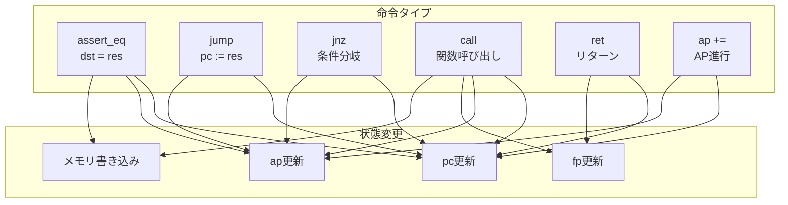

# 第8章: アセンブリ言語 (Assembly.lean)

## 8.1 概要

本章では、Cairo VMのアセンブリ言語レベルの仕様を解説する。`Assembly.lean`は、人間が読みやすいアセンブリ構文と、内部表現である`Instruction`構造体を橋渡しする役割を持つ。

### 本章の目的

- `Instr`構造体と`Instruction`構造体の関係を理解する
- アセンブリ構文のDSL（ドメイン固有言語）を学ぶ
- 各種命令の構築方法を理解する

### 対象ファイル

- `Verification/Semantics/Assembly.lean` (634行)

### 前提知識

- 命令定義（第5章）
- CPU実行セマンティクス（第6章）

---

## 8.2 Instr構造体

### 8.2.1 定義

`Instr`は、人間が扱いやすい形式での命令表現を提供する：

```lean
structure Instr where
  offDst : Int       -- デスティネーションオフセット（符号付き）
  offOp0 : Int       -- オペランド0オフセット（符号付き）
  offOp1 : Int       -- オペランド1オフセット（符号付き）
  dstReg : Bool      -- デスティネーションレジスタ（false=ap, true=fp）
  op0Reg : Bool      -- オペランド0レジスタ（false=ap, true=fp）
  op1Src : Bool × Bool × Bool    -- オペランド1ソース（imm, fp, ap）
  resLogic : Bool × Bool         -- 結果論理（add, mul）
  pcUpdate : Bool × Bool × Bool  -- PC更新（jump_abs, jump_rel, jnz）
  apUpdate : Bool × Bool         -- AP更新（add, add1）
  opcode : Bool × Bool × Bool    -- オペコード（call, ret, assert_eq）
```

### 8.2.2 Instructionへの変換

```lean
def toInstruction : Instruction where
  offDst := BitVec.ofNat 16 (i.offDst + 2 ^ 15).toNat
  offOp0 := BitVec.ofNat 16 (i.offOp0 + 2 ^ 15).toNat
  offOp1 := BitVec.ofNat 16 (i.offOp1 + 2 ^ 15).toNat
  -- フラグ
  dstReg := i.dstReg
  op0Reg := i.op0Reg
  op1Imm := i.op1Src.1
  op1Fp := i.op1Src.2.1
  op1Ap := i.op1Src.2.2
  resAdd := i.resLogic.1
  resMul := i.resLogic.2
  pcJumpAbs := i.pcUpdate.1
  pcJumpRel := i.pcUpdate.2.1
  pcJnz := i.pcUpdate.2.2
  apAdd := i.apUpdate.1
  apAdd1 := i.apUpdate.2
  opcodeCall := i.opcode.1
  opcodeRet := i.opcode.2.1
  opcodeAssertEq := i.opcode.2.2
```

**重要**: オフセット値は符号付き整数からバイアス付き16ビット値に変換される：

```
biased_offset = offset + 2^15
```

これにより、`[-2^15, 2^15)`の範囲が`[0, 2^16)`にマッピングされる。

### 8.2.3 変換の正当性（simp補題）

```lean
@[simp] theorem dstReg_toInstruction : i.toInstruction.dstReg = i.dstReg := by
  simp [Instr.toInstruction, Instruction.dstReg]

@[simp] theorem op0Reg_toInstruction : i.toInstruction.op0Reg = i.op0Reg := by
  simp [Instr.toInstruction, Instruction.op0Reg]

-- ... 他のフィールドも同様

@[simp] theorem offDst_toInstruction : i.toInstruction.offDst.toNat = natClip i.offDst := by
  simp [Instr.toInstruction, natClip]
```

---

## 8.3 オペランド仕様

### 8.3.1 Op0Spec（オペランド0の仕様）

```lean
inductive Op0Spec
  | ap_plus : Int → Op0Spec   -- [ap + offset]
  | fp_plus : Int → Op0Spec   -- [fp + offset]

@[simp]
def Op0Spec.op0Reg : Op0Spec → Bool
  | Op0Spec.ap_plus _ => false  -- apベース
  | Op0Spec.fp_plus _ => true   -- fpベース

@[simp]
def Op0Spec.offOp0 : Op0Spec → Int
  | Op0Spec.ap_plus i => i
  | Op0Spec.fp_plus i => i
```

### 8.3.2 Op1Spec（オペランド1の仕様）

```lean
inductive Op1Spec
  | mem_op0_plus : Int → Op1Spec  -- [[op0] + offset]
  | mem_pc_plus : Int → Op1Spec   -- [pc + offset]（即値含む）
  | mem_fp_plus : Int → Op1Spec   -- [fp + offset]
  | mem_ap_plus : Int → Op1Spec   -- [ap + offset]

@[simp]
def Op1Spec.op1Imm : Op1Spec → Bool
  | Op1Spec.mem_pc_plus _ => true  -- PCベース = 即値
  | _ => false

@[simp]
def Op1Spec.op1Fp : Op1Spec → Bool
  | Op1Spec.mem_fp_plus _ => true
  | _ => false

@[simp]
def Op1Spec.op1Ap : Op1Spec → Bool
  | Op1Spec.mem_ap_plus _ => true
  | _ => false
```

### 8.3.3 ResSpec（結果の仕様）

```lean
inductive ResSpec
  | op1 : Op1Spec → ResSpec            -- res = op1
  | op0_plus_op1 : Op1Spec → ResSpec   -- res = op0 + op1
  | op0_times_op1 : Op1Spec → ResSpec  -- res = op0 * op1

@[simp]
def ResSpec.resAdd : ResSpec → Bool
  | ResSpec.op0_plus_op1 _ => true
  | _ => false

@[simp]
def ResSpec.resMul : ResSpec → Bool
  | ResSpec.op0_times_op1 _ => true
  | _ => false
```

### 8.3.4 DstSpec（デスティネーションの仕様）

```lean
inductive DstSpec
  | mem_ap_plus : Int → DstSpec   -- [ap + offset]
  | mem_fp_plus : Int → DstSpec   -- [fp + offset]

@[simp]
def DstSpec.dstReg : DstSpec → Bool
  | DstSpec.mem_ap_plus _ => false  -- apベース
  | DstSpec.mem_fp_plus _ => true   -- fpベース
```

---

## 8.4 命令構築関数

### 8.4.1 assertEqInstr（アサーション命令）

```lean
def assertEqInstr (op0 : Op0Spec) (res : ResSpec) (dst : DstSpec) (ap_update : Bool) : Instr where
  offDst := dst.offDst
  offOp0 := op0.offOp0
  offOp1 := res.toOp1.op1
  dstReg := dst.dstReg
  op0Reg := op0.op0Reg
  op1Src := (res.toOp1.op1Imm, res.toOp1.op1Fp, res.toOp1.op1Ap)
  resLogic := (res.resAdd, res.resMul)
  pcUpdate := (false, false, false)   -- PCは単純にインクリメント
  apUpdate := (false, ap_update)      -- ap++オプション
  opcode := (false, false, true)      -- assert_eq
```

**動作**: `dst = res`をアサートし、次の命令に進む。

### 8.4.2 jumpInstr（ジャンプ命令）

```lean
def jumpInstr (jump_abs : Bool) (op0 : Op0Spec) (res : ResSpec) (ap_update : Bool) : Instr where
  offDst := -1
  offOp0 := op0.offOp0
  offOp1 := res.toOp1.op1
  dstReg := true
  op0Reg := op0.op0Reg
  op1Src := (res.toOp1.op1Imm, res.toOp1.op1Fp, res.toOp1.op1Ap)
  resLogic := (res.resAdd, res.resMul)
  pcUpdate := (jump_abs, not jump_abs, false)  -- abs or rel
  apUpdate := (false, ap_update)
  opcode := (false, false, false)
```

**動作**:
- `jump_abs = true`: `pc := res`（絶対ジャンプ）
- `jump_abs = false`: `pc := pc + res`（相対ジャンプ）

### 8.4.3 jnzInstr（条件分岐命令）

```lean
def jnzInstr (op0 : Op0Spec) (op1 : Op1Spec) (dst : DstSpec) (ap_update : Bool) : Instr where
  offDst := dst.offDst
  offOp0 := op0.offOp0
  offOp1 := op1.op1
  dstReg := dst.dstReg
  op0Reg := op0.op0Reg
  op1Src := (op1.op1Imm, op1.op1Fp, op1.op1Ap)
  resLogic := (false, false)   -- res未使用
  pcUpdate := (false, false, true)  -- jnz
  apUpdate := (false, ap_update)
  opcode := (false, false, false)
```

**動作**: `dst ≠ 0`なら`pc := pc + op1`、そうでなければ次の命令。

### 8.4.4 callInstr（関数呼び出し命令）

```lean
def callInstr (call_abs : Bool) (res : ResSpec) : Instr where
  offDst := 0
  offOp0 := 1
  offOp1 := res.toOp1.op1
  dstReg := false
  op0Reg := false
  op1Src := (res.toOp1.op1Imm, res.toOp1.op1Fp, res.toOp1.op1Ap)
  resLogic := (res.resAdd, res.resMul)
  pcUpdate := (call_abs, not call_abs, false)
  apUpdate := (false, false)
  opcode := (true, false, false)  -- call
```

**動作**:
1. `[ap] := fp`（フレームポインタを保存）
2. `[ap + 1] := pc + instruction_size`（戻りアドレスを保存）
3. `fp := ap + 2`（新しいフレームを設定）
4. `ap := ap + 2`
5. `pc := res`（呼び出し先へジャンプ）

### 8.4.5 retInstr（リターン命令）

```lean
def retInstr : Instr where
  offDst := -2
  offOp0 := -1
  offOp1 := -1
  dstReg := true
  op0Reg := true
  op1Src := (false, true, false)  -- [fp + offset]
  resLogic := (false, false)
  pcUpdate := (true, false, false)  -- jump_abs
  apUpdate := (false, false)
  opcode := (false, true, false)   -- ret
```

**動作**:
1. `pc := [fp - 1]`（戻りアドレスを復元）
2. `fp := [fp - 2]`（呼び出し元のフレームを復元）

### 8.4.6 advanceApInstr（AP進行命令）

```lean
def advanceApInstr (op0 : Op0Spec) (res : ResSpec) : Instr where
  offDst := -1
  offOp0 := op0.offOp0
  offOp1 := res.toOp1.op1
  dstReg := true
  op0Reg := op0.op0Reg
  op1Src := (res.toOp1.op1Imm, res.toOp1.op1Fp, res.toOp1.op1Ap)
  resLogic := (res.resAdd, res.resMul)
  pcUpdate := (false, false, false)
  apUpdate := (true, false)   -- ap += res
  opcode := (false, false, false)
```

**動作**: `ap := ap + res`

---

## 8.5 命令フローの図解



---

## 8.6 アセンブリDSL

### 8.6.1 構文カテゴリの定義

```lean
namespace Casm

declare_syntax_cat casm_instr    -- 命令
declare_syntax_cat casm_dst      -- デスティネーション
declare_syntax_cat casm_res      -- 結果
declare_syntax_cat casm_op0      -- オペランド0
declare_syntax_cat casm_op1      -- オペランド1
```

### 8.6.2 オペランド0の構文

```lean
scoped syntax "[ap]"                 : casm_op0
scoped syntax "[fp]"                 : casm_op0
scoped syntax "[ap" " + " num "]"    : casm_op0
scoped syntax "[fp" " + " num "]"    : casm_op0
scoped syntax "[ap" " + " "-"num "]" : casm_op0
scoped syntax "[fp" " + " "-"num "]" : casm_op0
```

### 8.6.3 オペランド1の構文

```lean
scoped syntax "[ap]"                         : casm_op1
scoped syntax "[fp]"                         : casm_op1
scoped syntax "[pc]"                         : casm_op1
scoped syntax "[" casm_op0 "]"               : casm_op1
scoped syntax "[ap" " + " num "]"            : casm_op1
scoped syntax "[fp" " + " num "]"            : casm_op1
scoped syntax "[pc" " + " num "]"            : casm_op1
scoped syntax num                            : casm_op1   -- 即値
scoped syntax "-" num                        : casm_op1   -- 負の即値
```

### 8.6.4 命令の構文

```lean
-- アサーション
scoped syntax:50 casm_dst:51 " = " casm_res:50 ";"             : casm_instr
scoped syntax:50 casm_dst:51 " = " casm_res:50 "," "ap++" ";"  : casm_instr

-- ジャンプ
scoped syntax "jmp" "abs" casm_res ";"                         : casm_instr
scoped syntax "jmp" "rel" casm_res ";"                         : casm_instr
scoped syntax "jmp" "rel" casm_op1 "if" casm_dst "!= 0" ";"    : casm_instr

-- 関数呼び出し/リターン
scoped syntax "call" "abs" casm_op1 ";"                        : casm_instr
scoped syntax "call" "rel" casm_op1 ";"                        : casm_instr
scoped syntax "ret" ";"                                        : casm_instr

-- AP更新
scoped syntax "ap" "+=" casm_res ";"                           : casm_instr
```

### 8.6.5 使用マクロ

```lean
scoped syntax "casm_instr!{" casm_instr "}" : term      -- 単一命令
scoped syntax "casm_code!{" casm_instr* "}" : term      -- コード列
```

---

## 8.7 使用例

### 8.7.1 単一命令の例

```lean
-- [ap] = [fp + 1];
casm_instr!{ [ap] = [fp + 1]; }
-- => assertEqInstr (Op0Spec.fp_plus (-1)) (ResSpec.op1 (Op1Spec.mem_fp_plus 1))
--                  (DstSpec.mem_ap_plus 0) false |>.toNat

-- call rel 5;
casm_instr!{ call rel 5; }
-- => (callInstr false (ResSpec.op1 (Op1Spec.mem_pc_plus 1)) |>.toNat, 5)
```

### 8.7.2 コード列の例

```lean
def simple_program {F : Type*} [Field F] : List F := casm_code!{
  [ap] = [fp + 1];
  [ap + 1] = [ap] + 5;
  ret;
}
```

### 8.7.3 casm_code_defマクロ

```lean
casm_code_def my_code := {
  [ap] = [fp + 1];
  [ap + 1] = [ap] * [fp + 2];
  call rel 3;
  ret;
}
-- 自動的に以下が生成される：
-- - my_code : List F（コードリスト）
-- - my_code.hmem0, my_code.hmem1, ... （各命令のメモリ補題）
```

---

## 8.8 MemAt述語

### 8.8.1 定義

```lean
def MemAt {F : Type*} [Field F] (mem : F → F) : List F → F → Prop
  | [], _ => True
  | v::l, pc => mem pc = v ∧ MemAt mem l (pc + 1)
```

**意味**: `MemAt mem code pc`は、アドレス`pc`から始まるメモリに`code`が格納されていることを表す。

### 8.8.2 使用例

```lean
-- メモリにコードが配置されていることの仮定
variable (hmem : MemAt mem simple_program pc)

-- hmemから各命令のメモリ値を取り出せる
-- hmem.1 : mem pc = simple_program[0]
-- hmem.2.1 : mem (pc + 1) = simple_program[1]
-- ...
```

---

## 8.9 checked関数とnatClip

### 8.9.1 checked関数

```lean
def checked (x : Int) {_ : -2 ^ 15 ≤ x} {_ : x < 2 ^ 15} : Int := x
```

オフセット値が有効範囲`[-2^15, 2^15)`内にあることをコンパイル時に検証する。

### 8.9.2 natClip関数

```lean
def natClip (x : Int) : Nat := ((x + 2 ^ 15).toNat % 2 ^ 16 : Nat)
```

符号付き整数をバイアス付き16ビット自然数に変換する。

### 8.9.3 checkedIntNz関数

```lean
def checkedIntNz (x : ℤ) (_ : abs x ≠ 0) (_ : abs x < 2 ^ 63) := x
```

ゼロでない即値（相対ジャンプのオフセットなど）を検証する。

---

## 8.10 命令エンコーディングの関係


---

## 8.11 まとめ

### 本章で学んだこと

1. **Instr構造体**: 人間が扱いやすい命令表現
2. **オペランド仕様**: Op0Spec, Op1Spec, ResSpec, DstSpec
3. **命令構築関数**: assertEqInstr, jumpInstr, callInstr, retInstrなど
4. **アセンブリDSL**: Lean 4のマクロによるカスタム構文
5. **MemAt述語**: メモリ上のコード配置を表現

### 重要な変換

| 変換 | 説明 |
|:--|:--|
| `Instr.toInstruction` | Instr → Instruction |
| `Instr.toNat` | Instr → Nat |
| `natClip` | 符号付きオフセット → バイアス付き16ビット |
| `parseInstr` | Casm構文 → Instr |

### 次章との関連

- 第9章以降では、これらの命令定義を使用して健全性・完全性の証明を行う
- `MemAt`述語は証明において頻繁に使用される

---

## 8.12 練習問題

1. **問題1**: 以下のCairo操作を表すCasm構文を書け：
   - `[fp + 3]`に`[fp + 1] * [fp + 2]`を格納
   - 条件`[ap] != 0`でアドレス`pc + 5`にジャンプ

2. **問題2**: `callInstr`で`offDst = 0`、`offOp0 = 1`となっている理由を説明せよ。

3. **問題3**: `retInstr`のオフセット値`-2`、`-1`、`-1`の意味を、呼び出し規約と関連付けて説明せよ。
