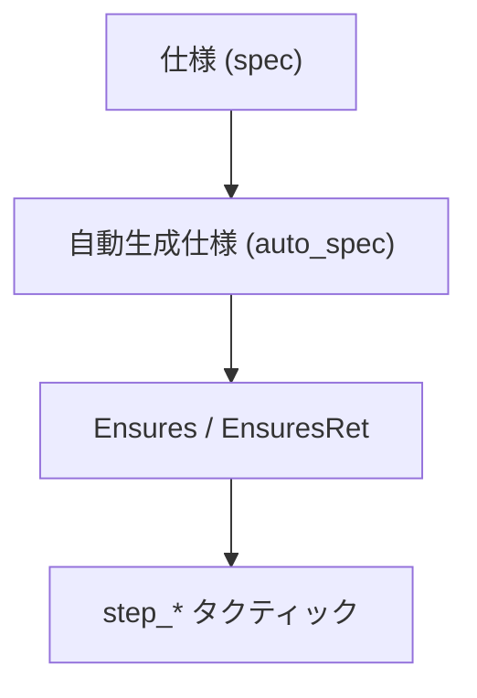
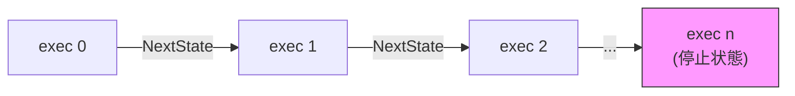
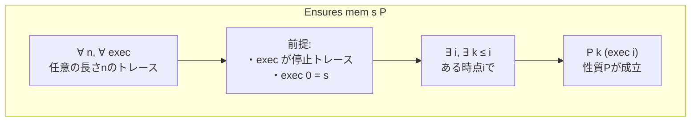
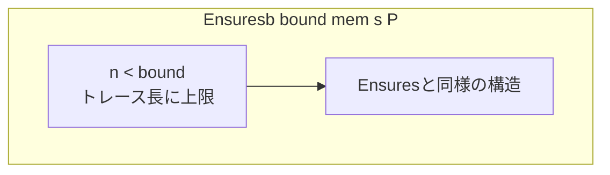
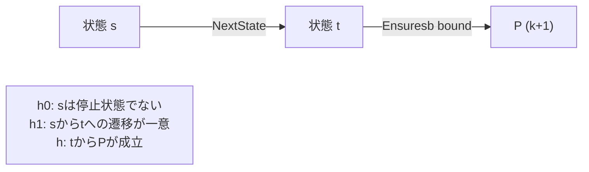
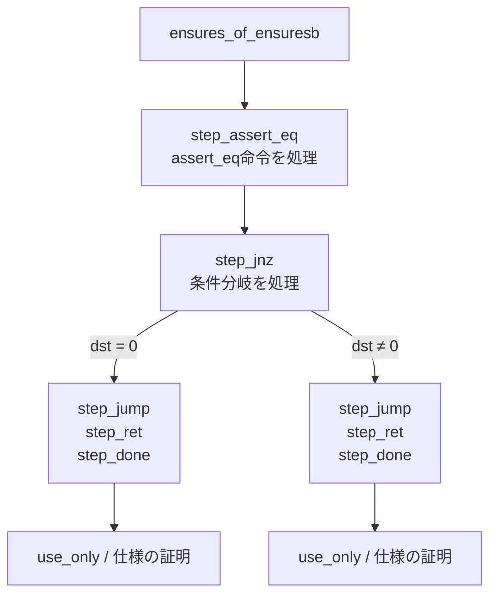

# 第10章: Hoare論理実装 (Hoare.lean)

## 10.1 概要

本章では、健全性証明のためのHoare論理実装を定義する`Hoare.lean`ファイルを詳細に解説します。このファイルは、Cairo VMプログラムの正しさを証明するための中核的なインフラストラクチャを提供します。

### 本章の目標

- `Ensures`/`Ensuresb`述語の理解
- 停止状態（IsHaltingState）の定義を学ぶ
- 命令ごとのステップ証明定理を理解する
- タクティックを使った証明手法を習得する

### 前提知識

- 第5章「命令定義」、第6章「CPU実行セマンティクス」の内容
- Hoare論理の基本概念（事前条件、事後条件）
- Lean 4のタクティックの基礎

### ソースファイル

```
Verification/Semantics/Soundness/Hoare.lean
```

## 10.2 健全性証明の全体構造

### 10.2.1 証明の目標


**健全性（Soundness）の意味**:
「プログラムが停止した場合、その結果は仕様を満たす」

### 10.2.2 証明構造の階層



## 10.3 停止状態の定義

### 10.3.1 jmpRelInstr（停止命令）

```lean
-- Hoare.lean:26-27
def jmpRelInstr : Instr :=
  jumpInstr false (Op0Spec.fp_plus (-1)) (ResSpec.op1 (Op1Spec.mem_pc_plus 1)) false
```

**停止命令**: `jmp rel [pc + 1]` で`[pc + 1] = 0`の場合
- 同じ場所への無限ループ = 停止

### 10.3.2 IsHaltingState述語

```lean
-- Hoare.lean:76
def IsHaltingState := mem s.pc = jmpRelInstr.toNat ∧ mem (s.pc + 1) = 0
```

**停止状態の条件**:
1. 現在の命令が`jmpRelInstr`
2. 即値（オフセット）が0

### 10.3.3 IsHaltingTrace述語

```lean
-- Hoare.lean:83-85
def IsHaltingTrace {n : ℕ} (exec : Fin (n + 1) → RegisterState F) : Prop :=
  (∀ i : Fin n, NextState mem (exec (Fin.castSucc i)) (exec i.succ)) ∧
    IsHaltingState mem (exec (Fin.last n))
```

**停止トレースの条件**:
1. 各ステップで有効な状態遷移
2. 最終状態が停止状態



## 10.4 Ensures述語

### 10.4.1 基本定義

```lean
-- Hoare.lean:123-125
def Ensures (mem : F → F) (s : RegisterState F) (P : ℕ → RegisterState F → Prop) : Prop :=
  ∀ n : ℕ, ∀ exec : Fin (n + 1) → RegisterState F,
      IsHaltingTrace mem exec → exec 0 = s → ∃ i : Fin (n + 1), ∃ k ≤ i, P k (exec i)
```

### 10.4.2 Ensuresの意味



**直感的な解釈**:
「状態sから始まる任意の停止トレースにおいて、いずれかの時点で性質Pが成り立つ」

### 10.4.3 kパラメータの役割

`P : ℕ → RegisterState F → Prop`の第1引数`k`は：
- レンジチェックの回数を追跡
- `k ≤ i`の制約により、経過ステップ数と整合

### 10.4.4 EnsuresRet（関数戻り用）

```lean
-- Hoare.lean:128-130
@[reducible]
def EnsuresRet (mem : F → F) (s : RegisterState F) (P : ℕ → RegisterState F → Prop) : Prop :=
  Ensures mem s fun k t => t.pc = mem (s.fp - 1) ∧ t.fp = mem (s.fp - 2) ∧ P k t
```

**追加条件**:
- `t.pc = mem (s.fp - 1)`: 戻りアドレスに到達
- `t.fp = mem (s.fp - 2)`: 旧fpが復元

## 10.5 Ensuresb述語（有界版）

### 10.5.1 定義

```lean
-- Hoare.lean:132-134
def Ensuresb (bound : ℕ) (mem : F → F) (s : RegisterState F)
    (P : ℕ → RegisterState F → Prop) : Prop :=
  ∀ n : ℕ, n < bound → ∀ exec : Fin (n + 1) → RegisterState F,
        IsHaltingTrace mem exec → exec 0 = s → ∃ i : Fin (n + 1), ∃ k ≤ i, P k (exec i)
```

### 10.5.2 有界性の意味



**用途**:
- 帰納法による証明で使用
- `bound`を増やしながら証明を構築

### 10.5.3 Ensures と Ensuresb の関係

```lean
-- Hoare.lean:136-138
theorem ensures_of_ensuresb {mem : F → F} {s : RegisterState F}
    {P : ℕ → RegisterState F → Prop}
    (h : ∀ bound, Ensuresb bound mem s P) : Ensures mem s P := fun n =>
  h (n + 1) _ (Nat.lt_succ_self n)
```

**定理**: 任意のboundでEnsurebsが成り立てば、Ensuresが成り立つ

## 10.6 ステップ証明定理

### 10.6.1 ensuresb_step定理

```lean
-- Hoare.lean:157-168
theorem ensuresb_step {bound : ℕ} {mem : F → F} {s t : RegisterState F}
    {P : ℕ → RegisterState F → Prop} {Q : Prop}
    (h0 : ¬IsHaltingState mem s)
    (h1 : ∀ t', NextState mem s t' → t' = t ∧ Q)
    (h : Q → Ensuresb bound mem t fun k t' => P (k + 1) t') :
  Ensuresb (bound + 1) mem s P := by ...
```

**この定理の意味**:



### 10.6.2 証明のパターン

```
1. 状態sが停止状態でないことを示す (h0)
2. sからの遷移先がtに一意であることを示す (h1)
3. tからPが成立することを示す (h)
→ sからP (k+1)が成立
```

## 10.7 命令別のステップ定理

### 10.7.1 assert_eq命令

```lean
-- Hoare.lean:273-296
theorem assert_eq_ensuresb' [char_ge : CharGe263 F] {bound : ℕ}
    {op0 : Op0Spec} {res : ResSpec} {dst : DstSpec} {ap_update : Bool}
    (h : mem s.pc = (assertEqInstr op0 res dst ap_update).toNat)
    (h' : computeDst mem s dst = computeRes mem s op0 res →
        Ensuresb bound mem ⟨bumpPc s res.toOp1.op1Imm, bumpAp s ap_update, s.fp⟩
          fun k t => P (k + 1) t) :
    Ensuresb (bound + 1) mem s P := by ...
```

**assert_eq命令のステップ**:
1. `computeDst = computeRes`が成立すると仮定
2. 次状態: `pc'=bumpPc`, `ap'=bumpAp`, `fp'=fp`
3. その状態からP (k+1)が成立

### 10.7.2 jump命令

```lean
-- Hoare.lean:298-315
theorem jump_ensuresb [char_ge : CharGe263 F] {bound} {op0 : Op0Spec}
    {res : ResSpec} {ap_update : Bool} {jump_abs : Bool}
    (h : mem s.pc = (jumpInstr jump_abs op0 res ap_update).toNat)
    (h_aux : res.toOp1.op1Imm = false)
    (h' : Ensuresb bound mem
        ⟨jumpPc s jump_abs (computeRes mem s op0 res), bumpAp s ap_update, s.fp⟩
        fun k t => P (k + 1) t) :
    Ensuresb (bound + 1) mem s P := by ...
```

### 10.7.3 jnz命令（条件分岐）

```lean
-- Hoare.lean:340-369
theorem jnz_ensuresb [char_ge : CharGe263 F] {bound : ℕ}
    {op0 : Op0Spec} {op1 : Op1Spec} {dst : DstSpec} {ap_update : Bool}
    (h : mem s.pc = (jnzInstr op0 op1 dst ap_update).toNat)
    (h₀ : computeDst mem s dst = 0 →
        Ensuresb bound mem ⟨bumpPc s op1.op1Imm, bumpAp s ap_update, s.fp⟩
          fun k t => P (k + 1) t)
    (h₁ : computeDst mem s dst ≠ 0 →
        Ensuresb bound mem ⟨s.pc + computeOp1 mem s op0 op1, bumpAp s ap_update, s.fp⟩
          fun k t => P (k + 1) t) :
    Ensuresb (bound + 1) mem s P := by ...
```

**分岐の処理**:
- `h₀`: dst = 0 の場合（分岐しない）
- `h₁`: dst ≠ 0 の場合（分岐する）

### 10.7.4 call命令

```lean
-- Hoare.lean:371-393
theorem call_ensuresb [char_ge : CharGe263 F] {bound : ℕ}
    {res : ResSpec} {call_abs : Bool}
    (h : mem s.pc = (callInstr call_abs res).toNat)
    (h' : mem s.ap = s.fp →
        mem (s.ap + 1) = bumpPc s res.toOp1.op1Imm →
          Ensuresb bound mem
            ⟨jumpPc s call_abs (computeRes mem s (Op0Spec.ap_plus 1) res),
             s.ap + 2, s.ap + 2⟩
            fun k t => P (k + 1) t) :
    Ensuresb (bound + 1) mem s P := by ...
```

**call命令の前提**:
- `mem s.ap = s.fp`: 旧fpの保存
- `mem (s.ap + 1) = bumpPc`: 戻りアドレスの保存

### 10.7.5 ret命令

```lean
-- Hoare.lean:395-408
theorem ret_ensuresb [char_ge : CharGe263 F] {bound : ℕ}
    (h : mem s.pc = retInstr.toNat)
    (h' : Ensuresb bound mem ⟨mem (s.fp + -1), s.ap, mem (s.fp - 2)⟩
        fun k t => P (k + 1) t) :
    Ensuresb (bound + 1) mem s P := by ...
```

## 10.8 レンジチェック関連

### 10.8.1 IsRangeChecked述語

```lean
-- Hoare.lean:466-467
def IsRangeChecked (rc_bound : ℕ) (a : F) : Prop :=
  ∃ n : ℕ, n < rc_bound ∧ a = ↑n
```

**意味**: 値`a`が`rc_bound`未満の自然数として表現可能

### 10.8.2 RangeChecked述語

```lean
-- Hoare.lean:469-470
def RangeChecked (mem : F → F) (rc_start : F) (k rc_bound : ℕ) : Prop :=
  ∀ i < k, IsRangeChecked rc_bound (mem (rc_start + i))
```

**意味**: メモリ範囲`[rc_start, rc_start + k)`の全ての値がレンジチェック済み

### 10.8.3 RcEnsures述語

```lean
-- Hoare.lean:497-498
def RcEnsures (mem : F → F) (rc_bound k : ℕ) (a0 a1 : F) (P : Prop) :=
  a1 = a0 + k ∧ (RangeChecked mem a0 k rc_bound → P)
```

**意味**: レンジチェックポインタが`a0`から`a1`に進み、その間の値がレンジチェック済みならPが成立

## 10.9 タクティック

### 10.9.1 step_assert_eq

```lean
-- Hoare.lean:590-596
macro (name := step_assert_eq₁) "step_assert_eq" h:term " with " hw:ident : tactic =>
  `(tactic|
  ( ensuresb_make_succ
    arith_simps
    apply assert_eq_ensuresb'
    apply $h
    ensures_simps
    intro ($hw) ) )
```

**使用例**:
```lean
step_assert_eq hmem0 with h_eq
-- h_eq : computeDst = computeRes が導入される
```

### 10.9.2 step_jump

```lean
-- Hoare.lean:607-612
macro (name := step_jump) "step_jump" h:term : tactic =>
  `(tactic|
  ( ensuresb_make_succ
    apply jump_ensuresb
    apply $h
    rfl
    ensures_simps ))
```

### 10.9.3 step_jnz

```lean
-- Hoare.lean:624-633
macro (name := step_jnz₁) "step_jnz" h:term " with " hw:ident hw':ident : tactic =>
  `(tactic|
  ( ensuresb_make_succ
    apply jnz_ensuresb
    apply $h
    ensures_simps
    intro ($hw)
    swap
    ensures_simps
    intro ($hw')
    swap ))
```

**使用例**:
```lean
step_jnz hmem1 with h_zero h_nonzero
-- 2つの分岐が生成される
-- h_zero : dst = 0
-- h_nonzero : dst ≠ 0
```

### 10.9.4 step_call / step_ret

```lean
-- Hoare.lean:648-652
macro (name := step_call') "step_call" h:term : tactic => ...

-- Hoare.lean:654-658
macro (name := step_ret') "step_ret" h:term : tactic => ...
```

### 10.9.5 step_done

```lean
-- Hoare.lean:674-675
macro (name := step_done) "step_done" : tactic =>
  `(tactic| ( ensuresb_make_succ; apply ensuresb_id ))
```

**意味**: 現在の状態で性質Pが成立することを示す（これ以上ステップ不要）

## 10.10 証明の流れ

### 10.10.1 典型的な証明構造

```lean
theorem auto_sound_example
    (hmem : MemAt mem code σ.pc)
    ... : EnsuresRet mem σ (...) := by
  apply ensures_of_ensuresb; intro νbound

  -- ステップ1: assert_eq
  step_assert_eq hmem0 with h_eq

  -- ステップ2: jnz (分岐)
  step_jnz hmem1 with h_zero h_nonzero
  · -- 分岐1: h_zero
    step_jump hmem2
    step_ret hmem3
    step_done
    ...
  · -- 分岐2: h_nonzero
    step_jump hmem4
    step_ret hmem5
    step_done
    ...
```

### 10.10.2 証明フロー図



## 10.11 補助関数

### 10.11.1 computeXxx関数

`Hoare.lean`および`AssemblyStep.lean`で定義される補助関数:

```lean
def computeDst mem s dst := ...  -- 宛先の値を計算
def computeOp0 mem s op0 := ...  -- op0の値を計算
def computeOp1 mem s op0 op1 := ...  -- op1の値を計算
def computeRes mem s op0 res := ...  -- 演算結果を計算

def bumpPc s imm := ...  -- pcの更新
def bumpAp s ap_update := ...  -- apの更新
def jumpPc s abs res := ...  -- ジャンプ先の計算
```

### 10.11.2 ddiv関数（安全な除算）

```lean
-- Hoare.lean:752-753
def ddiv [DecidableEq F] (a b c : F) : F := if b ≠ 0 then a / b else c
```

**用途**: ゼロ除算時にデフォルト値`c`を返す

## 10.12 まとめ

### 重要なポイント

1. **Ensures述語**: 「停止したら性質Pが成立」を表現
2. **Ensuresb述語**: 有界版、帰納法で使用
3. **ステップ定理**: 各命令に対応した証明規則
4. **タクティック**: step_*マクロで証明を自動化
5. **レンジチェック**: RcEnsuresで追跡

### 次章との関連

第11章「アセンブリステップ」では、`AssemblyStep.lean`で定義される補助関数と定理を学びます。これらは`Hoare.lean`のステップ定理をより具体的な命令に適用する際に使用されます。

## 10.13 演習問題

### 問題1
`Ensures`と`Ensuresb`の違いを説明してください。

<details>
<summary>解答</summary>

- `Ensures`: 任意の長さのトレースに対して性質が成立
- `Ensuresb bound`: 長さがbound未満のトレースに対してのみ性質が成立

`Ensuresb`は帰納法による証明に使用され、`bound`を増やしながら証明を構築します。最終的に`ensures_of_ensuresb`で`Ensures`に変換されます。

</details>

### 問題2
`step_jnz`タクティックが2つの分岐を生成する理由を説明してください。

<details>
<summary>解答</summary>

jnz（条件分岐）命令は：
- `dst = 0`の場合: 次の命令に進む
- `dst ≠ 0`の場合: ジャンプする

両方の場合について性質Pが成立することを示す必要があるため、2つの分岐が生成されます。

</details>

### 問題3
`EnsuresRet`の追加条件`t.pc = mem (s.fp - 1)`が必要な理由を説明してください。

<details>
<summary>解答</summary>

関数呼び出し時、call命令は：
- `mem[ap]`に旧fp
- `mem[ap+1]`に戻りアドレス（次の命令のpc）

を保存します。ret命令は`mem[fp-1]`（= 保存された戻りアドレス）にジャンプします。

`EnsuresRet`では、関数が正しく戻ることを保証するため、戻り先のpcが保存された戻りアドレスと一致することを条件に含めています。

</details>
