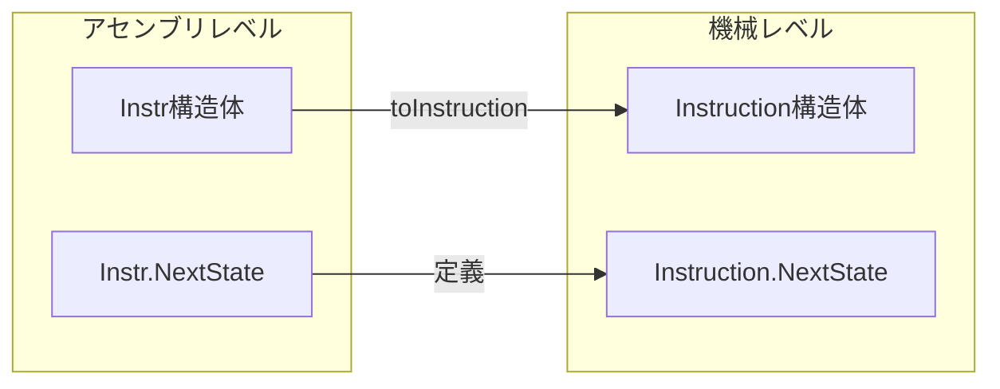
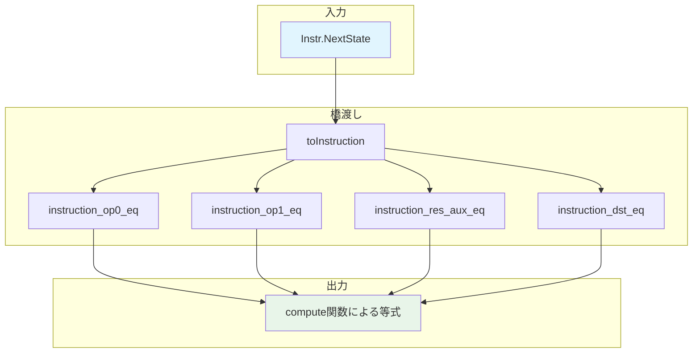

# 第11章: アセンブリステップ (Soundness/AssemblyStep.lean)

## 11.1 概要

本章では、アセンブリ言語レベルの命令が機械命令レベルの`NextState`述語とどのように対応するかを解説する。これは健全性証明の基礎となる重要な橋渡しである。

### 本章の目的

- アセンブリ命令と機械命令の関係を理解する
- 各命令タイプの`nextState`定理を学ぶ
- 計算関数（computeOp0, computeRes等）の役割を理解する

### 対象ファイル

- `Verification/Semantics/Soundness/AssemblyStep.lean` (279行)

### 前提知識

- 命令定義（第5章）
- CPU実行セマンティクス（第6章）
- アセンブリ言語（第8章）

---

## 11.2 Instr.NextState述語

### 11.2.1 定義

```lean
def Instr.NextState {F : Type _} [Field F] [DecidableEq F] (i : Instr) (mem : F → F)
    (s t : RegisterState F) :=
  i.toInstruction.NextState mem s t
```

この定義は、`Instr`（アセンブリレベル）の`NextState`を`Instruction`（機械レベル）の`NextState`に委譲している。

### 11.2.2 意味



---

## 11.3 クリッピング関数

### 11.3.1 intClip関数

```lean
def intClip (x : Int) : F := natClip x - 2 ^ 15
```

符号付き整数を体の要素に変換する。`natClip`でバイアスを加えた後、2^15を引いて元の値を復元。

### 11.3.2 intClip_eq定理

```lean
theorem intClip_eq {x : Int} (h₁ : -2 ^ 15 ≤ x) (h₂ : x < 2 ^ 15) :
    (intClip x : F) = x := by
  -- 範囲内の整数に対して、intClipは恒等変換
  ...
```

### 11.3.3 便利な補題

```lean
@[simp] theorem Int.zero_clip : intClip 0 = (0 : F) := by
  rw [intClip_eq] <;> norm_num

@[simp] theorem clip_checked (x : Int) (h₁ : -2 ^ 15 ≤ x) (h₂ : x < 2 ^ 15) :
    (intClip (@checked x h₁ h₂) : F) = ↑x :=
  intClip_eq h₁ h₂
```

---

## 11.4 計算関数

### 11.4.1 オペランド0の計算

```lean
@[simp] def computeOp0 : Op0Spec → F
  | Op0Spec.ap_plus i => mem (s.ap + intClip i)
  | Op0Spec.fp_plus i => mem (s.fp + intClip i)
```

**動作**: レジスタ（apまたはfp）にオフセットを加えたアドレスのメモリ値を返す。

### 11.4.2 オペランド1の計算

```lean
@[simp] def computeOp1 : Op1Spec → F
  | Op1Spec.mem_op0_plus i => mem (computeOp0 mem s op0 + intClip i)
  | Op1Spec.mem_pc_plus i  => mem (s.pc + intClip i)
  | Op1Spec.mem_fp_plus i  => mem (s.fp + intClip i)
  | Op1Spec.mem_ap_plus i  => mem (s.ap + intClip i)
```

**動作**: ソース（op0, pc, fp, ap）にオフセットを加えたアドレスのメモリ値を返す。

### 11.4.3 デスティネーションの計算

```lean
@[simp] def computeDst : DstSpec → F
  | DstSpec.mem_ap_plus i => mem (s.ap + intClip i)
  | DstSpec.mem_fp_plus i => mem (s.fp + intClip i)
```

### 11.4.4 結果の計算

```lean
@[simp] def computeRes : ResSpec → F
  | ResSpec.op1 o1         => computeOp1 mem s op0 o1
  | ResSpec.op0_plus_op1 o1 => computeOp0 mem s op0 + computeOp1 mem s op0 o1
  | ResSpec.op0_times_op1 o1 => computeOp0 mem s op0 * computeOp1 mem s op0 o1
```

---

## 11.5 補助関数

### 11.5.1 AP更新

```lean
@[simp] def bumpAp : Bool → F
  | true  => s.ap + 1
  | false => s.ap
```

### 11.5.2 PC更新（通常進行）

```lean
@[simp] def bumpPc : Bool → F
  | false => s.pc + 1    -- 命令サイズ1
  | true  => s.pc + 2    -- 命令サイズ2（即値あり）
```

### 11.5.3 PC更新（ジャンプ）

```lean
@[simp] def jumpPc : Bool → F → F
  | false, i => s.pc + i    -- 相対ジャンプ
  | true, i  => i           -- 絶対ジャンプ
```

---

## 11.6 命令と計算関数の対応定理

### 11.6.1 instruction_op0_eq

```lean
theorem instruction_op0_eq (i : Instruction) (op0 : Op0Spec)
    (h : i.op0Reg = op0.op0Reg)
    (h' : i.offOp0.toNat = natClip op0.offOp0) :
    i.op0 mem s = computeOp0 mem s op0 := by
  cases op0 <;> simp [Instruction.op0, h, h', BitVec.toBiased16, intClip] <;> norm_num
```

**意味**: 機械命令の`op0`関数とアセンブリレベルの`computeOp0`が一致する。

### 11.6.2 instruction_op1_eq

```lean
theorem instruction_op1_eq (i : Instruction) (op0 : Op0Spec) (op1 : Op1Spec)
    (h : i.op0 mem s = computeOp0 mem s op0)
    (h' : i.offOp1.toNat = natClip op1.op1) :
    (match op1.op1Imm, op1.op1Fp, op1.op1Ap with
      | false, false, false => some (mem (i.op0 mem s + i.offOp1.toBiased16))
      |  true, false, false => some (mem (s.pc + i.offOp1.toBiased16))
      | false,  true, false => some (mem (s.fp + i.offOp1.toBiased16))
      | false, false,  true => some (mem (s.ap + i.offOp1.toBiased16))
      | _, _, _ => none)
    = some (computeOp1 mem s op0 op1) := by
  ...
```

### 11.6.3 instruction_res_aux_eq

```lean
theorem instruction_res_aux_eq (i : Instruction) (op0 : Op0Spec) (res : ResSpec)
    (hop0 : i.op0 mem s = computeOp0 mem s op0)
    (hop1 : i.op1 mem s = some (computeOp1 mem s op0 (res.toOp1))) :
    (match i.op1 mem s, res.resAdd, res.resMul with
      | some op1, false, false => some op1
      | some op1, true, false  => some (i.op0 mem s + op1)
      | some op1, false, true  => some (i.op0 mem s * op1)
      | _, _, _ => none)
    = some (computeRes mem s op0 res) := by
  rw [hop1]; cases res <;> simp [hop0]
```

---

## 11.7 主要定理：各命令のnextState

### 11.7.1 nextState_assert_eq

```lean
theorem nextState_assert_eq :
    (assertEqInstr op0 res dst ap_update).NextState mem s t ↔
      t.pc = bumpPc s res.toOp1.op1Imm ∧
      t.ap = bumpAp s ap_update ∧
      t.fp = s.fp ∧
      computeDst mem s dst = computeRes mem s op0 res := by
  ...
```

**意味**: `assert_eq`命令の実行は以下と同値：
- PCは命令サイズ分進む
- APはap_updateに応じて更新
- FPは変化なし
- dst = resがアサートされる

### 11.7.2 nextState_jump

```lean
theorem nextState_jump (jump_abs : Bool) :
    (jumpInstr jump_abs op0 res ap_update).NextState mem s t ↔
      t.pc = jumpPc s jump_abs (computeRes mem s op0 res) ∧
      t.ap = bumpAp s ap_update ∧
      t.fp = s.fp := by
  ...
```

**意味**: `jump`命令の実行は以下と同値：
- PCはresの値にジャンプ（絶対/相対）
- APはap_updateに応じて更新
- FPは変化なし

### 11.7.3 nextState_jnz

```lean
theorem nextState_jnz (op1 : Op1Spec) :
    (jnzInstr op0 op1 dst ap_update).NextState mem s t ↔
      (t.pc = if computeDst mem s dst = 0 then bumpPc s op1.op1Imm
              else s.pc + computeOp1 mem s op0 op1) ∧
      t.ap = bumpAp s ap_update ∧
      t.fp = s.fp := by
  ...
```

**意味**: `jnz`命令の実行は以下と同値：
- dst = 0ならPCは通常進行、そうでなければop1分進む
- APはap_updateに応じて更新
- FPは変化なし

### 11.7.4 nextState_call

```lean
theorem nextState_call (call_abs : Bool) :
    (callInstr call_abs res).NextState mem s t ↔
      t.pc = jumpPc s call_abs (computeRes mem s (Op0Spec.ap_plus 1) res) ∧
      t.ap = s.ap + 2 ∧
      t.fp = s.ap + 2 ∧
      mem (s.ap + 1) = bumpPc s res.toOp1.op1Imm ∧
      mem s.ap = s.fp := by
  ...
```

**意味**: `call`命令の実行は以下と同値：
- PCは呼び出し先にジャンプ
- APは2増加
- FPは新しいap（旧ap + 2）
- メモリに戻りアドレスと旧fpを保存

### 11.7.5 nextState_ret

```lean
theorem nextState_ret :
    retInstr.NextState mem s t ↔
      t.pc = mem (s.fp + -1) ∧
      t.ap = s.ap ∧
      t.fp = mem (s.fp - 2) := by
  ...
```

**意味**: `ret`命令の実行は以下と同値：
- PCは`[fp - 1]`（戻りアドレス）に復元
- APは変化なし
- FPは`[fp - 2]`（呼び出し元のfp）に復元

### 11.7.6 nextState_advance_ap

```lean
theorem nextState_advance_ap :
    (advanceApInstr op0 res).NextState mem s t ↔
      t.pc = bumpPc s res.toOp1.op1Imm ∧
      t.ap = s.ap + computeRes mem s op0 res ∧
      t.fp = s.fp := by
  ...
```

**意味**: `ap +=`命令の実行は以下と同値：
- PCは通常進行
- APはres分増加
- FPは変化なし

---

## 11.8 定理の構造

### 11.8.1 共通パターン

各`nextState_*`定理は同じパターンに従う：

```lean
theorem nextState_xxx :
    (xxxInstr ...).NextState mem s t ↔
      t.pc = ... ∧
      t.ap = ... ∧
      t.fp = ... ∧
      (追加条件) := by
  -- 1. 補助命令を構築
  let instr := (xxxInstr ...).toInstruction
  -- 2. op0, op1, res, dstの等式を証明
  have hop0 : instr.op0 mem s = computeOp0 mem s op0 := ...
  have hop1 : instr.op1 mem s = computeOp1 mem s op0 op1 := ...
  have hres : instr.res mem s = some (computeRes mem s op0 res) := ...
  have hdst : instr.dst mem s = computeDst mem s dst := ...
  -- 3. 各フィールドの等価性を示す
  apply and_congr; ...
```

### 11.8.2 証明の流れ図



---

## 11.9 健全性証明での使用

### 11.9.1 Hoare論理との関係

これらの定理は、Hoare論理の`step_*`タクティックで使用される。例えば、`step_assert_eq`タクティックは内部で`nextState_assert_eq`を適用する。

### 11.9.2 使用例

```lean
-- 健全性証明での典型的な使用
-- goal: (assertEqInstr op0 res dst false).NextState mem s t
rw [nextState_assert_eq]
-- goal: t.pc = bumpPc s res.toOp1.op1Imm ∧ t.ap = s.ap ∧ t.fp = s.fp ∧
--       computeDst mem s dst = computeRes mem s op0 res
constructor
· -- t.pcの証明
· constructor
  · -- t.apの証明
  · constructor
    · -- t.fpの証明
    · -- アサーション条件の証明
```

---

## 11.10 まとめ

### 本章で学んだこと

1. **Instr.NextState**: アセンブリレベルの状態遷移述語
2. **計算関数**: computeOp0, computeOp1, computeDst, computeRes
3. **nextState定理**: 各命令タイプの状態遷移を等価な条件に変換
4. **橋渡し定理**: instruction_op0_eq, instruction_op1_eqなど

### 重要な定理一覧

| 定理 | 対象命令 | 主な条件 |
|:--|:--|:--|
| `nextState_assert_eq` | assert_eq | dst = res |
| `nextState_jump` | jmp | pc := res |
| `nextState_jnz` | jnz if | 条件分岐 |
| `nextState_call` | call | fp/戻りアドレス保存 |
| `nextState_ret` | ret | fp/pc復元 |
| `nextState_advance_ap` | ap += | ap += res |

### 次章との関連

これらの定理は第10章のHoare論理タクティックで使用され、libfuncs検証（第17-19章）の基礎となる。

---

## 11.11 練習問題

1. **問題1**: `nextState_call`でなぜ`Op0Spec.ap_plus 1`が使用されているか説明せよ。

2. **問題2**: `nextState_jnz`の条件分岐の両ケースが相互排他的であることを確認せよ。

3. **問題3**: `computeRes`の3つのケース（op1, op0_plus_op1, op0_times_op1）がどのようなアセンブリ構文に対応するか、具体例を挙げよ。
