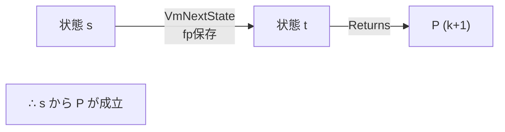
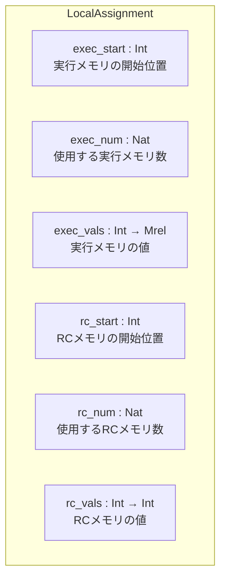
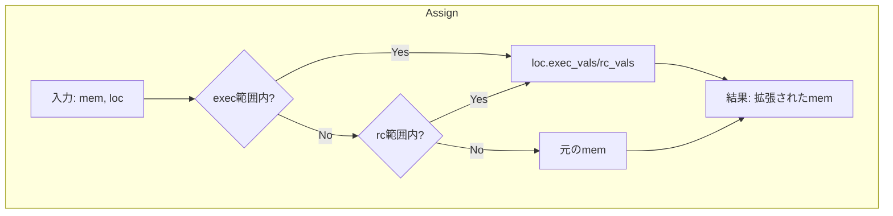
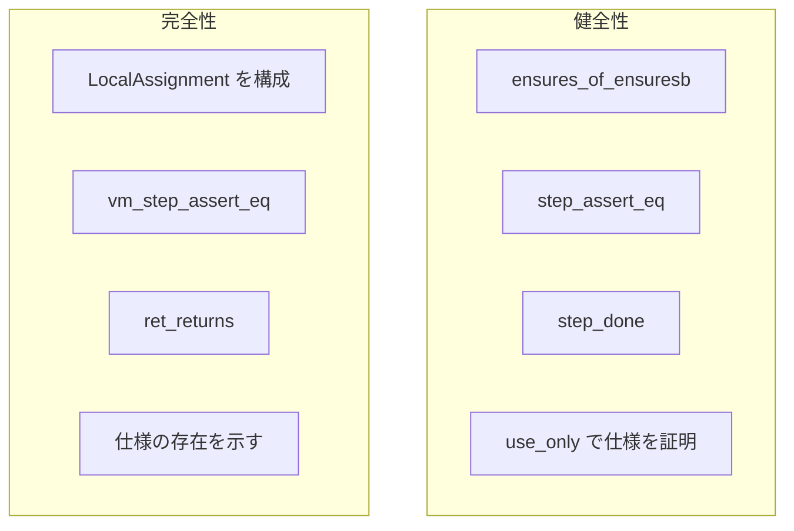
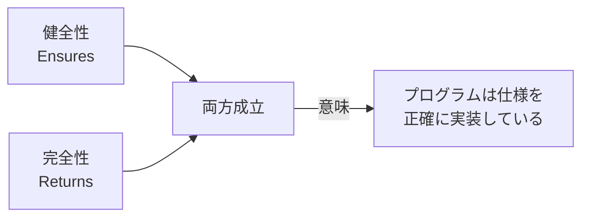

# 第13章: VM Hoare論理 (VmHoare.lean)

## 13.1 概要

本章では、完全性証明のためのHoare論理実装を定義する`VmHoare.lean`ファイルを詳細に解説します。このファイルは、VM（仮想マシン）セマンティクスに基づいて、プログラムの実行可能性を証明するための基盤を提供します。

### 本章の目標

- `Returns`述語と`IsReturningTrace`の理解
- `LocalAssignment`によるメモリ割り当ての表現を学ぶ
- 完全性証明のステップ定理を理解する
- VM版タクティックを使った証明手法を習得する

### 健全性証明との違い

| 項目 | 健全性 (Hoare.lean) | 完全性 (VmHoare.lean) |
|:--|:--|:--|
| 目標 | 停止したら仕様を満たす | 仕様を満たす実行が存在する |
| メモリ | `F → F` | `Mrel → Mrel` |
| レジスタ | `RegisterState F` | `VmRegisterState` |
| 述語 | `Ensures` | `Returns` |
| 方向 | 任意の実行に対して | ある実行を構成 |

### ソースファイル

```
Verification/Semantics/Completeness/VmHoare.lean
```

## 13.2 IsReturningTrace述語

### 13.2.1 定義

```lean
-- VmHoare.lean:40-45
def IsReturningTrace (PRIME : Int) {n : ℕ} (mem : Mrel → Mrel) (s : VmRegisterState)
    (exec : Fin (n + 1) → VmRegisterState) : Prop :=
  exec 0 = s ∧
    (∀ i : Fin n, VmNextState PRIME mem (exec i.castSucc) (exec i.succ)) ∧
      mem (prog (exec (Fin.last n)).pc) = val retInstr.toNat ∧
    (exec (Fin.last n)).fp = s.fp
```

### 13.2.2 条件の意味


1. **開始条件**: `exec 0 = s`
2. **遷移条件**: 各ステップで`VmNextState`
3. **終了条件**: 最終状態でret命令
4. **フレーム保存**: `fp`が開始時と同じ

### 13.2.3 健全性のIsHaltingTraceとの比較

| IsHaltingTrace | IsReturningTrace |
|:--|:--|
| 停止命令で終了 | ret命令で終了 |
| 任意の停止 | 関数からの正常リターン |
| fpの制約なし | fp = 開始時のfp |

## 13.3 Returns述語

### 13.3.1 定義

```lean
-- VmHoare.lean:78-82
def Returns (PRIME : Int) (mem : Mrel → Mrel) (s : VmRegisterState)
    (P : ℕ → VmRegisterState → Prop) : Prop :=
  ∃ n : ℕ, ∃ exec : Fin (n+1) → VmRegisterState,
    IsReturningTrace PRIME mem s exec ∧
      ∃ k ≤ n, P k (exec (Fin.last n))
```

### 13.3.2 意味の解説


**直感的な解釈**:
「状態sから始めて、ある実行トレースが存在し、ret命令で終了した時点で性質Pが成り立つ」

### 13.3.3 Ensuresとの比較

| Ensures | Returns |
|:--|:--|
| `∀ exec, 停止 → P` | `∃ exec, 戻り ∧ P` |
| 任意の実行が条件を満たす | ある実行が存在する |
| 健全性に使用 | 完全性に使用 |

## 13.4 returns_step定理

### 13.4.1 定義

```lean
-- VmHoare.lean:84-93
theorem returns_step {PRIME : Int} {mem : Mrel → Mrel} {s t : VmRegisterState}
      {P : ℕ → VmRegisterState → Prop}
    (h0 : VmNextState PRIME mem s t ∧ s.fp = t.fp)
    (h1 : Returns PRIME mem t (fun k t' => P (k + 1) t')) :
  Returns PRIME mem s P := by
  rcases h1 with ⟨n, e, he0, ⟨k, hkle, hk0⟩⟩
  rcases h0 with ⟨ht, hsfp⟩
  use n+1, TraceStep s e, is_returning_traceStep PRIME he0 ht hsfp, k+1, Nat.succ_le_succ hkle
  rw [←Fin.succ_last, traceStep_succ]
  exact hk0
```

### 13.4.2 証明パターン



**定理の意味**: sからtへの有効な遷移があり、tからP(k+1)が成立するReturnsトレースがあれば、sからPが成立するReturnsトレースが存在する

## 13.5 命令別のreturns定理

### 13.5.1 assert_eq_returns

```lean
-- VmHoare.lean:109-121
theorem assert_eq_returns {PRIME : Int}
    {op0 : Op0Spec} {res : ResSpec} {dst : DstSpec} {ap_update : Bool}
    (h  : mem (prog s.pc) = val (assertEqInstr op0 res dst ap_update).toNat)
    (h' : (vmComputeDst mem s dst).Equiv PRIME (vmComputeRes mem s op0 res) ∧
      Returns PRIME mem ⟨vmBumpPc s res.toOp1.op1Imm, vmBumpAp s ap_update, s.fp⟩
        (fun k t => P (k + 1) t)) :
  Returns PRIME mem s P := by ...
```

### 13.5.2 jump_returns

```lean
-- VmHoare.lean:123-134
theorem jump_returns {PRIME : Int}
    {op0 : Op0Spec} {res : ResSpec} {ap_update : Bool} {jump_abs : Bool}
    (h : mem (prog s.pc) = val (jumpInstr jump_abs op0 res ap_update).toNat)
    (h' : Returns PRIME mem ⟨vmJumpPc s jump_abs (vmComputeRes mem s op0 res),
      vmBumpAp s ap_update, s.fp⟩ (fun k t => P (k + 1) t)) :
  Returns PRIME mem s P := by ...
```

### 13.5.3 jnz_returns

```lean
-- VmHoare.lean:136-158
theorem jnz_returns {PRIME : Int}
    {op0 : Op0Spec} {op1 : Op1Spec} {dst : DstSpec} {ap_update : Bool}
    (h  : mem (prog s.pc) = val (jnzInstr op0 op1 dst ap_update).toNat)
    (h₀ : vmComputeDst mem s dst = 0 →
      Returns PRIME mem ⟨vmBumpPc s op1.op1Imm, vmBumpAp s ap_update, s.fp⟩
        (fun k t => P (k + 1) t))
    (h₁ : vmComputeDst mem s dst ≠ 0 →
      Returns PRIME mem ⟨s.pc + (vmComputeOp1 mem s op0 op1).toInt, vmBumpAp s ap_update, s.fp⟩
        (fun k t => P (k + 1) t)) :
  Returns PRIME mem s P := by ...
```

### 13.5.4 ret_returns

```lean
-- VmHoare.lean:172-179
theorem ret_returns {PRIME : Int}
    (h  : mem (prog s.pc) = val (retInstr.toNat))
    (h' : P 0 s) :
  Returns PRIME mem s P := by
  use 0, fun _ => s
  constructor
  · simp [IsReturningTrace, h]
  use 0, le_refl 0, h'
```

**ret命令の特徴**: 即座に終了し、現在の状態でPが成立

## 13.6 LocalAssignment構造体

### 13.6.1 定義

```lean
-- VmHoare.lean:187-191
structure LocalAssignment (exec_start : Int) (rc_start : Int) :=
  (exec_num : Nat)
  (exec_vals : Int → Mrel)
  (rc_num : Nat)
  (rc_vals : Int → Int)
```

### 13.6.2 フィールドの意味



### 13.6.3 用途

完全性証明では、プログラムの実行に必要なメモリ割り当てを明示的に構成する必要があります。`LocalAssignment`は：

1. **実行メモリ**: スタック上の一時変数
2. **RCメモリ**: レンジチェック値

の割り当てを表現します。

## 13.7 Assign関数

### 13.7.1 定義

```lean
-- VmHoare.lean:193-197
def Assign (mem : Mrel → Mrel) {exec_start : Int} {rc_start : Int}
    (loc : LocalAssignment exec_start rc_start) : Mrel → Mrel
| (exec k) => if exec_start ≤ k ∧ k < exec_start + loc.exec_num
              then loc.exec_vals k else mem (exec k)
| (rc k)   => if rc_start ≤ k ∧ k < rc_start + loc.rc_num
              then val (loc.rc_vals k) else mem (rc k)
| x        => mem x
```

### 13.7.2 動作説明



### 13.7.3 Assignの性質

```lean
-- VmHoare.lean:213-215
theorem assign_prog (mem : Mrel → Mrel) {exec_start : Int} {rc_start : Int}
    (loc : LocalAssignment exec_start rc_start) (k : Int) :
  Assign mem loc (prog k) = mem (prog k) := by simp [Assign]
```

**重要**: progセグメントは変更されない（プログラムは不変）

## 13.8 ConcatAssignments

### 13.8.1 定義

```lean
-- VmHoare.lean:199-211
def ConcatAssignments {exec_start₀ rc_start₀ exec_start₁ rc_start₁ : Int}
  (loc₀ : LocalAssignment exec_start₀ rc_start₀)
  (loc₁ : LocalAssignment exec_start₁ rc_start₁)
  (h_exec: exec_start₁ = exec_start₀ + loc₀.exec_num)
  (h_rc : rc_start₁ = rc_start₀ + loc₀.rc_num)
    : LocalAssignment exec_start₀ rc_start₀ := ...
```

### 13.8.2 用途

関数呼び出しで、呼び出し側と呼び出される側の割り当てを連結

```mermaid
graph LR
    subgraph loc₀["loc₀"]
        exec0["exec: [start₀, start₀ + num₀)"]
        rc0["rc: [start₀, start₀ + num₀)"]
    end

    subgraph loc₁["loc₁"]
        exec1["exec: [start₁, start₁ + num₁)"]
        rc1["rc: [start₁, start₁ + num₁)"]
    end

    subgraph 結合["ConcatAssignments"]
        execAll["exec: [start₀, start₀ + num₀ + num₁)"]
        rcAll["rc: [start₀, start₀ + num₀ + num₁)"]
    end

    loc₀ --> 結合
    loc₁ --> 結合
```

## 13.9 VmRangeChecked述語

### 13.9.1 定義

```lean
-- VmHoare.lean:368
def VmIsRangeChecked (rc_bound : ℕ) (a : Int) : Prop :=
  ∃ n : ℕ, n < rc_bound ∧ a = ↑n

-- VmHoare.lean:370-371
def VmRangeChecked (rc_vals : Int → Int) (rc_start : Int) (k rc_bound : ℕ) : Prop :=
  ∀ i < k, VmIsRangeChecked rc_bound (rc_vals (rc_start + i))
```

### 13.9.2 健全性版との比較

| 健全性 | 完全性 |
|:--|:--|
| `IsRangeChecked` | `VmIsRangeChecked` |
| 体要素 F | 整数 Int |
| `mem : F → F` | `rc_vals : Int → Int` |

## 13.10 VMタクティック

### 13.10.1 vm_step_assert_eq

```lean
-- VmHoare.lean:479-482
macro (name := vm_step_assert_eq₁) "vm_step_assert_eq" h:term : tactic =>
  `(tactic|
  ( apply assert_eq_returns
    apply $h
    vm_returns_simps ) )
```

### 13.10.2 vm_step_jump

```lean
-- VmHoare.lean:490-494
macro (name := vm_step_jump) "vm_step_jump" h:term : tactic =>
  `(tactic|
  ( apply jump_returns
    apply $h
    rfl
    vm_returns_simps ))
```

### 13.10.3 vm_step_jnz

```lean
-- VmHoare.lean:506-512
macro (name := vm_step_jnz₁) "vm_step_jnz" h:term : tactic =>
  `(tactic|
  ( apply jnz_returns
    apply $h
    vm_returns_simps
    swap
    vm_returns_simps
    swap ))
```

## 13.11 完全性証明の流れ

### 13.11.1 典型的な構造

```lean
theorem auto_complete_example
    (hmem : VmMemAt mem code s.pc)
    ... : Returns PRIME mem s (...) := by

  -- メモリ割り当ての定義
  let loc : LocalAssignment s.ap rc_start := ...

  -- 命令を順にトレース
  vm_step_assert_eq hmem0
  vm_step_jnz hmem1
  · -- 分岐1
    vm_step_jump hmem2
    apply ret_returns
    ...
  · -- 分岐2
    ...
```

### 13.11.2 健全性証明との違い



## 13.12 まとめ

### 重要なポイント

1. **Returns述語**: 「仕様を満たす実行が存在する」を表現
2. **IsReturningTrace**: ret命令で終了する有効なトレース
3. **LocalAssignment**: メモリ割り当ての明示的構成
4. **Assign関数**: メモリの拡張
5. **VMタクティック**: 完全性証明の自動化

### 健全性と完全性の関係



## 13.13 演習問題

### 問題1
`Returns`と`Ensures`の方向の違いを説明してください。

<details>
<summary>解答</summary>

- `Ensures`: 「全ての実行が仕様を満たす」（∀方向）
- `Returns`: 「仕様を満たす実行が存在する」（∃方向）

健全性は「何をしても正しい」を、完全性は「正しいことができる」を示します。

</details>

### 問題2
`LocalAssignment`でprogセグメントへの割り当てがない理由は？

<details>
<summary>解答</summary>

progセグメントにはプログラムコードが格納されており、実行中に変更されません。完全性証明では、プログラムは既に与えられているため、新たな割り当ては不要です。割り当てが必要なのは：
- execセグメント（スタック/ヒープ）
- rcセグメント（レンジチェック値）

のみです。

</details>

### 問題3
`ret_returns`定理で`n = 0`となる理由を説明してください。

<details>
<summary>解答</summary>

ret命令は関数から即座に戻るため、追加のステップは不要です。トレースの長さは1（開始状態のみ）で、`n = 0`となります。

定理では：
```lean
use 0, fun _ => s  -- 長さ1のトレース
```
これは「開始状態sがそのまま終了状態」を意味します。

</details>
