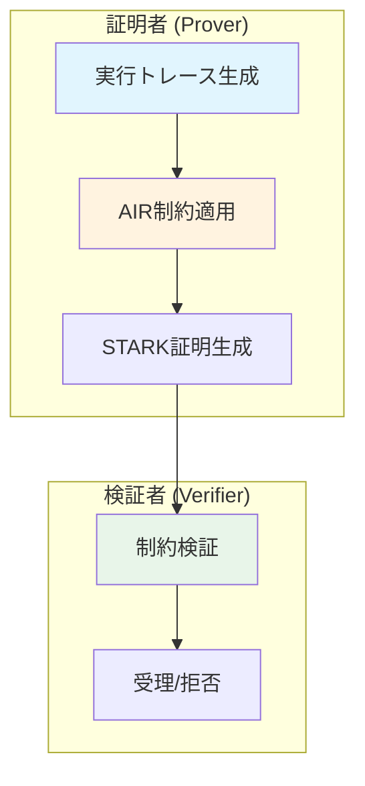
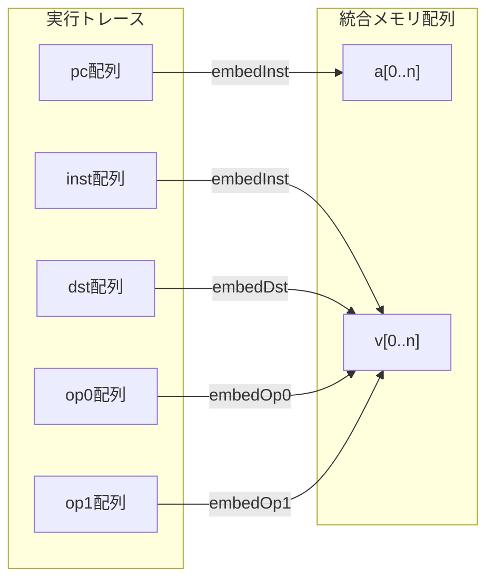
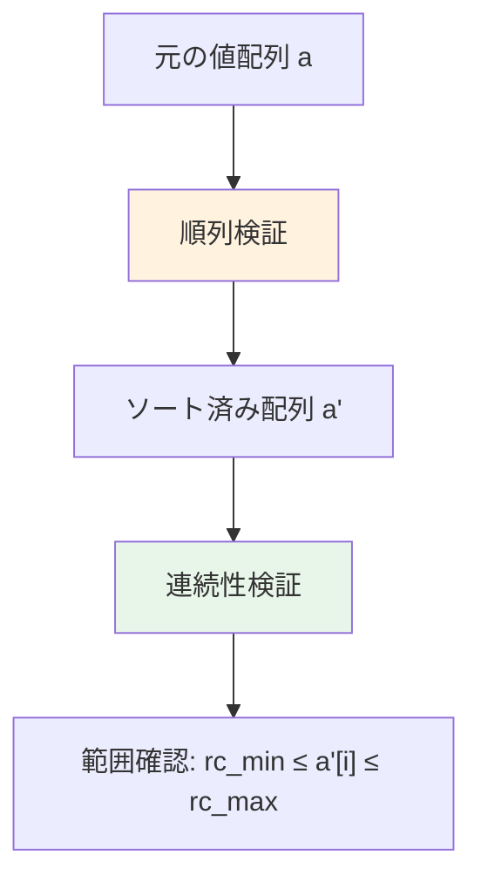
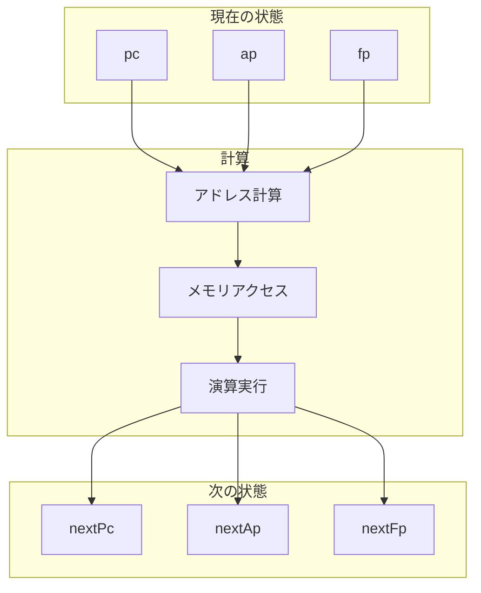
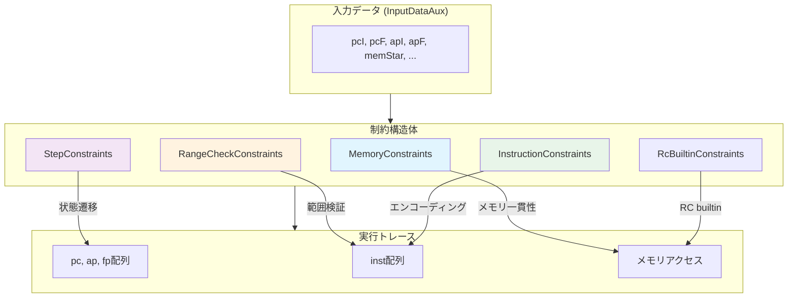

# 第14章: AIR制約システム (Constraints.lean)

## 14.1 概要

本章では、Cairo VMの実行トレースを検証するためのAIR（Algebraic Intermediate Representation）制約システムを解説する。

### 本章の目的

- STARKプロトコルにおけるAIR制約の役割を理解する
- 実行トレースの代数的表現方法を学ぶ
- メモリ、レンジチェック、命令、ステップの各制約を理解する

### 対象ファイル

- `Verification/Semantics/AirEncoding/Constraints.lean` (299行)
- 関連: `Memory.lean`, `RangeCheck.lean`, `Step.lean`

### 前提知識

- 有限体の基礎（第1章）
- Cairo VMの命令構造（第5章）
- CPU実行セマンティクス（第6章）

---

## 14.2 AIR制約の基本概念

### 14.2.1 STARKプロトコルとAIR



AIR制約は、正しいCairo VM実行の「指紋」として機能する。実行トレースが制約を満たすことは、その実行が有効であることの証拠となる。

### 14.2.2 制約の種類

本システムでは4種類の制約を定義している：

| 制約種別 | 役割 | 構造体名 |
|:--|:--|:--|
| メモリ制約 | メモリの一貫性を保証 | `MemoryConstraints` |
| レンジチェック制約 | 値が範囲内にあることを保証 | `RangeCheckConstraints` |
| 命令制約 | 命令エンコーディングの正しさを保証 | `InstructionConstraints` |
| ステップ制約 | 状態遷移の正しさを保証 | `StepConstraints` |

---

## 14.3 入力データ構造

### 14.3.1 InputDataAux構造体

```lean
structure InputDataAux (F : Type _) where
  t : Nat                              -- 実行ステップ数
  rc16Len : Nat                        -- 16ビットレンジチェック要素数
  pcI : F                              -- 初期プログラムカウンタ
  pcF : F                              -- 最終プログラムカウンタ
  apI : F                              -- 初期アロケーションポインタ
  apF : F                              -- 最終アロケーションポインタ
  memStar : F → Option F               -- 部分メモリ仕様
  rcMin : Nat                          -- レンジチェック最小値
  rcMax : Nat                          -- レンジチェック最大値
  initialRcAddr : Nat                  -- レンジチェックビルトイン初期アドレス
  rcLen : Nat                          -- レンジチェック対象値の数
  rcToRc16 : Fin rcLen → Fin 8 → Fin rc16Len  -- RC→RC16マッピング
  h_rc_lt : rcMax < 2 ^ 16             -- レンジチェック上限の証明
  h_rc_le : rcMin ≤ rcMax              -- レンジチェック範囲の証明
```

**詳細解説**:

- **`t`**: 実行トレースのステップ数。`Fin (t + 1)`で状態インデックスを表す
- **`memStar`**: 部分関数として定義されたメモリ仕様。`Option F`で「未定義」を表現
- **`rcToRc16`**: 128ビット値を8個の16ビット値にマッピングする関数

### 14.3.2 メモリドメインの補助定義

```lean
/-- 部分メモリ仕様のドメイン -/
def MemDom {F : Type _} (memStar : F → Option F) :=
  { x // Option.isSome (memStar x) }

/-- メモリの値を取得 -/
def memVal {F : Type _} {memStar : F → Option F} (a : MemDom memStar) : F :=
  Option.get _ (a.property)
```

`MemDom`は部分型（subtype）で、メモリが定義されているアドレスの集合を表す。

---

## 14.4 フラグのチルダエンコーディング

### 14.4.1 TildeType型

命令フラグは16個のトレースセルに格納され、チルダエンコーディングで表現される：

```lean
/-- フラグのビットベクトルを格納するトレースセル列 -/
def TildeType (F : Type _) := Fin 16 → F
```

### 14.4.2 フラグ抽出関数

```lean
namespace TildeType

variable {F : Type _} [Field F] (f_tilde : TildeType F)

/-- チルダ値から個々のフラグビットを復元 -/
def toF := fun i : Fin 15 => f_tilde (Fin.castSucc i) - 2 * f_tilde i.succ

-- 各フラグへのアクセサ
def fDstReg := f_tilde.toF DST_REG          -- ビット0
def fOp0Reg := f_tilde.toF OP0_REG          -- ビット1
def fOp1Imm := f_tilde.toF OP1_IMM          -- ビット2
def fOp1Fp := f_tilde.toF OP1_FP            -- ビット3
def fOp1Ap := f_tilde.toF OP1_AP            -- ビット4
def fResAdd := f_tilde.toF RES_ADD          -- ビット5
def fResMul := f_tilde.toF RES_MUL          -- ビット6
def fPcJumpAbs := f_tilde.toF PC_JUMP_ABS   -- ビット7
def fPcJumpRel := f_tilde.toF PC_JUMP_REL   -- ビット8
def fPcJnz := f_tilde.toF PC_JNZ            -- ビット9
def fApAdd := f_tilde.toF AP_ADD            -- ビット10
def fApAdd1 := f_tilde.toF AP_ADD1          -- ビット11
def fOpcodeCall := f_tilde.toF OPCODE_CALL  -- ビット12
def fOpcodeRet := f_tilde.toF OPCODE_RET    -- ビット13
def fOpcodeAssertEq := f_tilde.toF OPCODE_ASSERT_EQ  -- ビット14

def instructionSize := f_tilde.fOp1Imm + 1

end TildeType
```

**チルダエンコーディングの原理**:

```
f_tilde[i] = Σ(j=i to 14) b_j * 2^(j-i)
```

ここで`b_j`はビット`j`の値（0または1）。これにより：

```
toF(i) = f_tilde[i] - 2 * f_tilde[i+1] = b_i
```

---

## 14.5 メモリ制約

### 14.5.1 メモリ埋め込み制約

```lean
structure MemoryEmbeddingConstraints {F : Type _} [Field F] [Fintype F]
    (T : Nat) (rcLen : Nat)
    (pc : Fin T → F) (inst : Fin T → F)
    (dstAddr : Fin T → F) (dst : Fin T → F)
    (op0Addr : Fin T → F) (op0 : Fin T → F)
    (op1Addr : Fin T → F) (op1 : Fin T → F)
    (rcAddr : Fin rcLen → F) (rcVal : Fin rcLen → F)
    (memStar : F → Option F)
    (n : Nat) (a : Fin (n + 1) → F) (v : Fin (n + 1) → F) where
  -- 埋め込み関数
  embedInst : Fin T → Fin (n + 1)
  embedDst : Fin T → Fin (n + 1)
  embedOp0 : Fin T → Fin (n + 1)
  embedOp1 : Fin T → Fin (n + 1)
  embedRc : Fin rcLen → Fin (n + 1)
  embedMem : MemDom memStar → Fin (n + 1)

  -- 埋め込みの正しさ
  h_embed_pc : ∀ i, a (embedInst i) = pc i
  h_embedInst : ∀ i, v (embedInst i) = inst i
  -- ... (他のフィールドも同様)

  -- 単射性と分離性
  h_embedMem_inj : Function.Injective embedMem
  h_embedMem_disj_inst : ∀ i j, embedMem i ≠ embedInst j
  -- ... (他の分離条件)
```

**図解: メモリ埋め込みの概念**



### 14.5.2 メモリブロック制約

```lean
structure MemoryBlockConstraints {F : Type _} [Field F] [Fintype F]
    (n : Nat) (a : Fin (n + 1) → F) (v : Fin (n + 1) → F)
    (memStar : F → Option F) where
  a' : Fin (n + 1) → F          -- ソート済みアドレス
  v' : Fin (n + 1) → F          -- ソート済み値
  p : Fin (n + 1) → F           -- 累積積
  alpha : F                      -- ランダム線形結合係数
  z : F                          -- ランダム評価点

  -- 連続性制約: 隣接するa'の差は0か1
  h_continuity : ∀ i : Fin n,
    (a' i.succ - a' (Fin.castSucc i)) * (a' i.succ - a' (Fin.castSucc i) - 1) = 0

  -- 単一値制約: 同じアドレスには同じ値
  h_single_valued : ∀ i : Fin n,
    (v' i.succ - v' (Fin.castSucc i)) * (a' i.succ - a' (Fin.castSucc i) - 1) = 0

  -- 初期値制約
  h_initial : (z - (a' 0 + alpha * v' 0)) * p 0 = z - (a 0 + alpha * v 0)

  -- 累積制約
  h_cumulative : ∀ i : Fin n,
    (z - (a' i.succ + alpha * v' i.succ)) * p i.succ =
      (z - (a i.succ + alpha * v i.succ)) * p (Fin.castSucc i)

  -- 最終値制約（memStarとの整合性）
  h_final : p (Fin.last n) * ∏ b : MemDom memStar, (z - (b.val + alpha * memVal b)) =
            z ^ Fintype.card (MemDom memStar)
```

**順列検証の原理**:

メモリの一貫性は、`(a, v)`配列が`(a', v')`配列の順列であることで証明される。この順列関係は多項式の積で表現される：

```
∏_i (z - (a[i] + α * v[i])) = ∏_i (z - (a'[i] + α * v'[i]))
```

### 14.5.3 統合メモリ制約

```lean
structure MemoryConstraints {F : Type _} [Field F] [Fintype F]
    (T : Nat) (rcLen : Nat) ... (memStar : F → Option F) where
  n : Nat
  a : Fin (n + 1) → F
  v : Fin (n + 1) → F
  em : MemoryEmbeddingConstraints T rcLen pc inst dstAddr dst op0Addr op0
       op1Addr op1 rcAddr rcVal memStar n a v
  mb : MemoryBlockConstraints n a v memStar
  h_n_lt : n < ringChar F  -- 配列サイズが体の標数より小さい
```

---

## 14.6 レンジチェック制約

### 14.6.1 RangeCheckConstraints構造体

```lean
structure RangeCheckConstraints {F : Type _} [Field F]
    (T : Nat) (rc16Len : Nat)
    (offOp0Tilde : Fin T → F) (offOp1Tilde : Fin T → F) (offDstTilde : Fin T → F)
    (rc16Val : Fin rc16Len → F) (rc_min : Nat) (rcMax : Nat) where
  n : Nat
  a : Fin (n + 1) → F          -- レンジチェック対象値
  a' : Fin (n + 1) → F         -- ソート済み値
  p : Fin (n + 1) → F          -- 累積積
  z : F                         -- ランダム評価点

  -- 埋め込み関数
  embedOffOp0 : Fin T → Fin (n + 1)
  embedOffOp1 : Fin T → Fin (n + 1)
  embedOffDst : Fin T → Fin (n + 1)
  embedRc16Vals : Fin rc16Len → Fin (n + 1)

  -- 埋め込みの正しさ
  h_embedOp0 : ∀ i, a (embedOffOp0 i) = offOp0Tilde i
  h_embedOp1 : ∀ i, a (embedOffOp1 i) = offOp1Tilde i
  h_embedDst : ∀ i, a (embedOffDst i) = offDstTilde i
  h_embedRc16 : ∀ i, a (embedRc16Vals i) = rc16Val i

  -- 連続性制約
  h_continuity : ∀ i : Fin n,
    (a' i.succ - a' (Fin.castSucc i)) * (a' i.succ - a' (Fin.castSucc i) - 1) = 0

  -- 順列制約
  h_initial : (z - a' 0) * p 0 = z - a 0
  h_cumulative : ∀ i : Fin n, (z - a' i.succ) * p i.succ = (z - a i.succ) * p (Fin.castSucc i)
  h_final : p (Fin.last n) = 1

  -- 範囲制約
  h_rc_min : a' 0 = rc_min
  h_rcMax : a' (Fin.last n) = rcMax
  h_n_lt : n < ringChar F
```

**レンジチェックの原理**:



ソート済み配列`a'`が連続的（差が0または1）で、最小値が`rc_min`、最大値が`rc_max`であれば、すべての元の値が`[rc_min, rc_max]`の範囲内にあることが保証される。

---

## 14.7 命令制約

### 14.7.1 InstructionConstraints構造体

```lean
structure InstructionConstraints {F : Type _} [Field F]
    (inst : F) (offOp0Tilde : F) (offOp1Tilde : F) (offDstTilde : F)
    (f_tilde : TildeType F) where
  -- 命令エンコーディング制約
  h_instruction : inst = offDstTilde + 2 ^ 16 * offOp0Tilde +
                         2 ^ 32 * offOp1Tilde + 2 ^ 48 * f_tilde 0

  -- ビット制約: 各フラグは0または1
  h_bit : ∀ i : Fin 15, f_tilde.toF i * (f_tilde.toF i - 1) = 0

  -- 最終値制約
  h_last_value : f_tilde ⟨15, by norm_num⟩ = 0
```

**命令エンコーディングのビットレイアウト**:

```
|<-- 16 bits -->|<-- 16 bits -->|<-- 16 bits -->|<-- 15 bits -->|
+---------------+---------------+---------------+---------------+
|   offDst      |    offOp0     |    offOp1     |    flags      |
+---------------+---------------+---------------+---------------+
```

### 14.7.2 ビット制約の数学的意味

`h_bit`制約は、各フラグ値`x`が`x * (x - 1) = 0`を満たすことを要求する。

体上でこの等式が成り立つのは`x = 0`または`x = 1`の場合のみ。つまり、フラグが真のブール値であることを代数的に表現している。

---

## 14.8 ステップ制約

### 14.8.1 StepConstraints構造体

```lean
structure StepConstraints {F : Type _} [Field F]
    (offOp0Tilde : F) (offOp1Tilde : F) (offDstTilde : F) (f_tilde : TildeType F)
    (fp : F) (ap : F) (pc : F)
    (nextFp : F) (nextAp : F) (nextPc : F)
    (dstAddr : F) (op0Addr : F) (op1Addr : F)
    (dst : F) (op0 : F) (op1 : F) where
  mul : F      -- op0 * op1の補助変数
  res : F      -- 演算結果の補助変数
  t0 : F       -- JNZ用の補助変数
  t1 : F       -- JNZ用の補助変数

  -- アドレス計算制約
  h_dstAddr : dstAddr = f_tilde.fDstReg * fp + (1 - f_tilde.fDstReg) * ap +
              (offDstTilde - 2 ^ 15)
  h_op0Addr : op0Addr = f_tilde.fOp0Reg * fp + (1 - f_tilde.fOp0Reg) * ap +
              (offOp0Tilde - 2 ^ 15)
  h_op1Addr : op1Addr = f_tilde.fOp1Imm * pc + f_tilde.fOp1Ap * ap +
              f_tilde.fOp1Fp * fp +
              (1 - f_tilde.fOp1Imm - f_tilde.fOp1Ap - f_tilde.fOp1Fp) * op0 +
              (offOp1Tilde - 2 ^ 15)

  -- 演算制約
  h_mul : mul = op0 * op1
  h_res : (1 - f_tilde.fPcJnz) * res =
          f_tilde.fResAdd * (op0 + op1) + f_tilde.fResMul * mul +
          (1 - f_tilde.fResAdd - f_tilde.fResMul - f_tilde.fPcJnz) * op1

  -- 条件分岐用補助変数
  h_t0_eq : t0 = f_tilde.fPcJnz * dst
  h_t1_eq : t1 = t0 * res

  -- 次のPC制約
  h_nextPc_eq : (t1 - f_tilde.fPcJnz) * (nextPc - (pc + (f_tilde.fOp1Imm + 1))) = 0
  h_nextPc_eq' : t0 * (nextPc - (pc + op1)) + (1 - f_tilde.fPcJnz) * nextPc -
                 ((1 - f_tilde.fPcJumpAbs - f_tilde.fPcJumpRel - f_tilde.fPcJnz) *
                  (pc + (f_tilde.fOp1Imm + 1)) +
                  f_tilde.fPcJumpAbs * res +
                  f_tilde.fPcJumpRel * (pc + res)) = 0

  -- CALL命令制約
  h_opcode_call : f_tilde.fOpcodeCall * (dst - fp) = 0
  h_opcode_call' : f_tilde.fOpcodeCall * (op0 - (pc + (f_tilde.fOp1Imm + 1))) = 0

  -- ASSERT_EQ命令制約
  h_opcode_assert_eq : f_tilde.fOpcodeAssertEq * (dst - res) = 0

  -- 次のAP/FP制約
  h_nextAp : nextAp = ap + f_tilde.fApAdd * res + f_tilde.fApAdd1 +
             f_tilde.fOpcodeCall * 2
  h_nextFp : nextFp = f_tilde.fOpcodeRet * dst + f_tilde.fOpcodeCall * (ap + 2) +
             (1 - f_tilde.fOpcodeRet - f_tilde.fOpcodeCall) * fp
```

### 14.8.2 ステップ制約の図解



---

## 14.9 統合制約構造体

### 14.9.1 Constraints構造体

```lean
structure Constraints {F : Type _} [Field F] [Fintype F] (inp : InputDataAux F) where
  -- 実行トレース
  fp : Fin (inp.t + 1) → F
  ap : Fin (inp.t + 1) → F
  pc : Fin (inp.t + 1) → F

  -- 命令列
  inst : Fin inp.t → F
  offOp0Tilde : Fin inp.t → F
  offOp1Tilde : Fin inp.t → F
  offDstTilde : Fin inp.t → F
  rc16Val : Fin inp.rc16Len → F
  fTilde : Fin inp.t → TildeType F

  -- メモリアクセス
  dstAddr : Fin inp.t → F
  dst : Fin inp.t → F
  op0Addr : Fin inp.t → F
  op0 : Fin inp.t → F
  op1Addr : Fin inp.t → F
  op1 : Fin inp.t → F
  rcAddr : Fin inp.rcLen → F
  rcVal : Fin inp.rcLen → F

  -- 開始・終了制約
  h_pcI : pc 0 = inp.pcI
  h_apI : ap 0 = inp.apI
  h_fpI : fp 0 = inp.apI
  h_pcF : pc (Fin.last inp.t) = inp.pcF
  h_apF : ap (Fin.last inp.t) = inp.apF

  -- 主制約
  mc : MemoryConstraints inp.t inp.rcLen (fun i => pc (Fin.castSucc i)) inst
       dstAddr dst op0Addr op0 op1Addr op1 rcAddr rcVal inp.memStar
  rc : RangeCheckConstraints inp.t inp.rc16Len offOp0Tilde offOp1Tilde
       offDstTilde rc16Val inp.rcMin inp.rcMax
  ic : ∀ i : Fin inp.t, InstructionConstraints (inst i) (offOp0Tilde i)
       (offOp1Tilde i) (offDstTilde i) (fTilde i)
  sc : ∀ i : Fin inp.t, StepConstraints (offOp0Tilde i) (offOp1Tilde i)
       (offDstTilde i) (fTilde i) (fp (Fin.castSucc i)) (ap (Fin.castSucc i))
       (pc (Fin.castSucc i)) (fp i.succ) (ap i.succ) (pc i.succ)
       (dstAddr i) (op0Addr i) (op1Addr i) (dst i) (op0 i) (op1 i)
  rcb : RcBuiltinConstraints inp.rc16Len inp.initialRcAddr inp.rcLen rc16Val
        rcAddr rcVal inp.rcToRc16
```

---

## 14.10 制約間の関係図



---

## 14.11 レンジチェックビルトイン制約

### 14.11.1 RcBuiltinConstraints構造体

```lean
structure RcBuiltinConstraints {F : Type _} [Field F]
    (rc16Len : ℕ) (initial_rcAddr : ℕ) (rcLen : ℕ)
    (rc16Val : Fin rc16Len → F)
    (rcAddr : Fin rcLen → F) (rcVal : Fin rcLen → F)
    (rc_to_rc16 : Fin rcLen → Fin 8 → Fin rc16Len) where
  -- 初期アドレス制約
  h_rc_init_addr : ∀ h : 0 < rcLen, rcAddr ⟨0, h⟩ = initial_rcAddr

  -- アドレス連続性制約
  h_rcAddr_step : ∀ i : ℕ, ∀ h : i.succ < rcLen,
    rcAddr ⟨i.succ, h⟩ = rcAddr ⟨i, (Nat.lt_succ_self _).trans h⟩ + 1

  -- 値の構成制約（8個の16ビット値から128ビット値を構成）
  h_rcValue : ∀ i : Fin rcLen,
    rcVal i = ((((((rc16Val (rc_to_rc16 i 0) * 2^16 + rc16Val (rc_to_rc16 i 1)) * 2^16 +
                   rc16Val (rc_to_rc16 i 2)) * 2^16 + rc16Val (rc_to_rc16 i 3)) * 2^16 +
                   rc16Val (rc_to_rc16 i 4)) * 2^16 + rc16Val (rc_to_rc16 i 5)) * 2^16 +
                   rc16Val (rc_to_rc16 i 6)) * 2^16 + rc16Val (rc_to_rc16 i 7)
```

**128ビット値の構成**:

```
rcVal = rc16[0] * 2^112 + rc16[1] * 2^96 + rc16[2] * 2^80 + rc16[3] * 2^64 +
        rc16[4] * 2^48 + rc16[5] * 2^32 + rc16[6] * 2^16 + rc16[7]
```

---

## 14.12 まとめ

### 本章で学んだこと

1. **AIR制約システムの構造**: メモリ、レンジチェック、命令、ステップの4種類の制約
2. **チルダエンコーディング**: フラグビットの代数的表現
3. **順列検証**: 多項式の積を用いたメモリ一貫性の証明
4. **レンジチェック**: ソートと連続性を用いた範囲検証

### 次章との関連

- 第15章では、命令エンコーディングの詳細と`Instruction.lean`の定理を解説する
- 第16章では、これらの制約から実行の存在を導く`execution_exists`定理を証明する

### 重要な定理（予告）

```lean
-- Correctness.leanで証明される主定理
theorem execution_exists (char_ge : ringChar F ≥ 2 ^ 63) (inp : InputDataAux F)
    (c : Constraints inp) (hp : Hprob c) :
    ∃ mem : F → F,
      Option.FnExtends mem inp.memStar ∧
      (∀ i < inp.rcLen, ∃ (n : ℕ), n < 2 ^ 128 ∧ mem (inp.initialRcAddr + i) = (↑n : F)) ∧
      ∃ exec : Fin (inp.t + 1) → RegisterState F,
        (exec 0).pc = inp.pcI ∧ (exec 0).ap = inp.apI ∧ (exec 0).fp = inp.apI ∧
        (exec (Fin.last inp.t)).pc = inp.pcF ∧
        (exec (Fin.last inp.t)).ap = inp.apF ∧
        ∀ i : Fin inp.t, NextState mem (exec i.castSucc) (exec i.succ)
```
