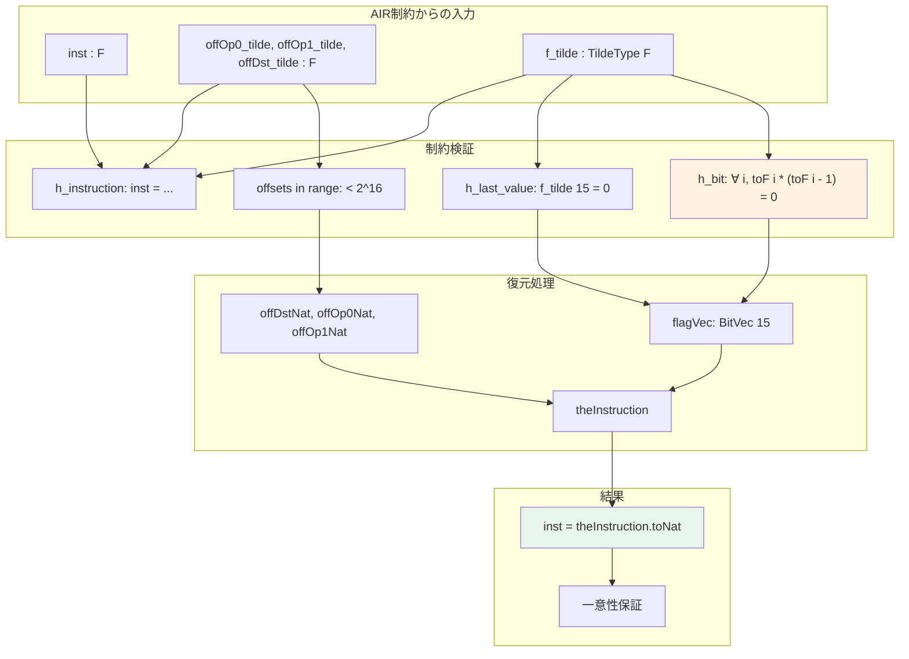

# 第15章: 命令エンコーディング (AirEncoding/Instruction.lean)

## 15.1 概要

本章では、Cairo VMの命令がどのように体の要素としてエンコードされ、その正しさがどのように証明されるかを解説する。これはホワイトペーパーのSection 9.4、Theorem 1に対応する。

### 本章の目的

- 命令のビットベクトル表現と体要素への変換を理解する
- チルダエンコーディングからフラグを復元する方法を学ぶ
- 命令の一意性定理を理解する

### 対象ファイル

- `Verification/Semantics/AirEncoding/Instruction.lean` (334行)

### 前提知識

- 命令定義（第5章）
- AIR制約システム（第14章）

---

## 15.2 BitVecのチルダエンコーディング

### 15.2.1 tilde関数の定義

```lean
namespace BitVec

variable {n : ℕ} (b : BitVec n)

/-- ビットベクトルのチルダエンコーディング -/
def tilde (i : Fin (n + 1)) : ℕ :=
  ∑ j in i.revPerm.range, (2 ^ ((Fin.castSucc (Fin.revPerm j)) - i : ℕ) *
    (b.getLsbD (Fin.revPerm j)).toNat)

end BitVec
```

### 15.2.2 チルダエンコーディングの数学的意味

`n`ビットのビットベクトル`b = [b₀, b₁, ..., b_{n-1}]`に対して、`tilde(i)`は以下の値を表す：

```
tilde(i) = Σ_{j=i}^{n-1} b_j * 2^{j-i}
```

**具体例**（15ビットフラグの場合）:

```
tilde(0) = b₀ + 2*b₁ + 4*b₂ + ... + 2^14*b₁₄  （ビットベクトル全体の数値）
tilde(1) = b₁ + 2*b₂ + ... + 2^13*b₁₄
...
tilde(14) = b₁₄
tilde(15) = 0
```

### 15.2.3 重要な定理

```lean
@[simp]
theorem tilde_last : b.tilde (Fin.last n) = 0 := by
  rw [tilde, Fin.revPerm_last, Fin.sum_range_zero]
```

**チルダの漸化式**:

```lean
theorem tilde_succ (i : Fin n) :
    b.tilde (Fin.castSucc i) = 2 * b.tilde i.succ + (b.getLsbD i).toNat := by
  -- 証明：b.tilde[i] = 2 * b.tilde[i+1] + b[i]
  ...
```

この漸化式は、隣接するチルダ値の差からビットを復元できることを示す：

```
b[i] = tilde[i] - 2 * tilde[i+1]
```

### 15.2.4 tilde値からビットベクトルへの逆変換

```lean
def fromTilde (f : Fin (n + 1) → ℕ) : BitVec n :=
  BitVec.ofFnLE fun i : Fin n => (Bool.ofNat <| f (Fin.castSucc i) - 2 * f i.succ)

theorem fromTilde_tilde : fromTilde b.tilde = b := by
  dsimp [fromTilde]
  apply BitVec.eq_of_getLsbD_eq
  intro i
  rw [getLsbD_ofFnLE, tilde_succ, add_comm, Nat.add_sub_cancel, Bool.ofNat_toNat]
```

### 15.2.5 tildeの零番目の値

```lean
theorem tilde_zero_eq : b.tilde 0 = b.toNat := by
  rw [BitVec.toNat, tilde, Fin.revPerm_zero, Fin.range_last, Fin.val_zero]
  -- tilde(0)はビットベクトルの数値表現と等しい
  ...
```

---

## 15.3 命令のエンコーディング

### 15.3.1 Instruction.toNatの構造

命令は63ビットの自然数としてエンコードされる：

```lean
theorem toNat_eq (inst : Instruction) :
    inst.toNat = inst.offDst.toNat +
      2 ^ 16 * (inst.offOp0.toNat + 2 ^ 16 * (inst.offOp1.toNat + 2 ^ 16 * inst.flags.toNat)) := by
  rw [Instruction.toNat]; ring
```

**ビットレイアウト**:

```
                        63                  48                  32                  16                   0
                         |<-- 15 bits -->|<-- 16 bits -->|<-- 16 bits -->|<-- 16 bits -->|
                         +---------------+---------------+---------------+---------------+
                         |    flags      |    offOp1     |    offOp0     |   offDst      |
                         +---------------+---------------+---------------+---------------+
```

### 15.3.2 命令の上限

```lean
theorem toNat_le (inst : Instruction) : inst.toNat < 2 ^ 63 :=
  calc
    inst.toNat ≤ 2^16 - 1 + 2^16 * (2^16 - 1) + 2^32 * (2^16 - 1) + 2^48 * (2^15 - 1) := by
      -- 各フィールドの上限を加算
      ...
    _ = 2 ^ 63 - 1 := by norm_num
    _ < 2 ^ 63 := by norm_num
```

### 15.3.3 命令の単射性

```lean
theorem toNat_inj {i1 i2 : Instruction} (h : i1.toNat = i2.toNat) : i1 = i2 := by
  have nez : 2 ^ 16 ≠ 0 := by norm_num
  -- 各フィールドを順に分離して等しいことを示す
  rw [toNat_eq, toNat_eq] at h
  have h1 : i1.offDst.toNat = i2.offDst.toNat := by
    have := congr_arg (fun i => i % 2 ^ 16) h
    simp [Nat.add_mul_mod_self_left] at this
    ...
  -- offOp0, offOp1, flagsも同様に
  ...
```

---

## 15.4 Theorem 1: 制約からの命令復元

### 15.4.1 定理の前提条件

```lean
section TheoremOne

variable {F : Type _} [Field F]

-- 制約データ
variable {inst offOp0_tilde offOp1_tilde offDst_tilde : F}
  {f_tilde : TildeType F}

-- 制約条件
variable
  (h_instruction :
    inst = offDst_tilde + 2 ^ 16 * offOp0_tilde + 2 ^ 32 * offOp1_tilde + 2 ^ 48 * f_tilde 0)
  (h_bit : ∀ i : Fin 15, f_tilde.toF i * (f_tilde.toF i - 1) = 0)
  (h_last_value : f_tilde 15 = 0)
  (offOp0_in_range : ∃ j : ℕ, j < 2 ^ 16 ∧ offOp0_tilde = ↑j)
  (offOp1_in_range : ∃ j : ℕ, j < 2 ^ 16 ∧ offOp1_tilde = ↑j)
  (offDst_in_range : ∃ j : ℕ, j < 2 ^ 16 ∧ offDst_tilde = ↑j)
```

### 15.4.2 フラグビットの復元

```lean
/-- ビット制約からブール値が存在することを証明 -/
theorem exists_bool_f_tilde_eq (i : Fin 15) : ∃ b : Bool, f_tilde.toF i = ↑b.toNat := by
  cases' eq_zero_or_eq_zero_of_mul_eq_zero (h_bit i) with h h
  · use false; rw [h]; simp only [Bool.toNat, Bool.cond_false, Nat.cast_zero]
  use true; rw [eq_of_sub_eq_zero h]; exact Nat.cast_one.symm
```

**解説**: `h_bit`制約は`x * (x - 1) = 0`を満たすことを要求する。体上でこれは`x = 0`または`x = 1`を意味する。

### 15.4.3 フラグベクトルの構築

```lean
def flagVec : BitVec 15 :=
  BitVec.ofFnLE fun i => Classical.choose (exists_bool_f_tilde_eq h_bit i)

theorem flagVec_spec (i : Fin 15) :
    ↑((flagVec h_bit).getLsbD i).toNat = f_tilde.toF i := by
  rw [flagVec, BitVec.getLsbD_ofFnLE,
      ← Classical.choose_spec (exists_bool_f_tilde_eq h_bit i)]
```

### 15.4.4 f_tildeとflagVec.tildeの一致

```lean
theorem f_tilde_eq :
    ∀ (i : Fin (15 + 1)), f_tilde i = (flagVec h_bit).tilde i := by
  apply BitVec.tilde_spec _ _ h_last_value
  intro i
  rw [add_comm (2 * f_tilde _)]
  apply eq_add_of_sub_eq
  symm; apply flagVec_spec
```

---

## 15.5 命令の構築

### 15.5.1 theInstruction定義

```lean
def theInstruction : Instruction where
  offDst := BitVec.ofNat 16 (offDstNat offDst_in_range)
  offOp0 := BitVec.ofNat 16 (offOp0Nat offOp0_in_range)
  offOp1 := BitVec.ofNat 16 (offOp1Nat offOp1_in_range)
  dstReg := (Classical.choose (exists_bool_f_tilde_eq h_bit 0))
  op0Reg := (Classical.choose (exists_bool_f_tilde_eq h_bit 1))
  op1Imm := (Classical.choose (exists_bool_f_tilde_eq h_bit 2))
  op1Fp  := (Classical.choose (exists_bool_f_tilde_eq h_bit 3))
  op1Ap  := (Classical.choose (exists_bool_f_tilde_eq h_bit 4))
  resAdd := (Classical.choose (exists_bool_f_tilde_eq h_bit 5))
  resMul := (Classical.choose (exists_bool_f_tilde_eq h_bit 6))
  pcJumpAbs  := (Classical.choose (exists_bool_f_tilde_eq h_bit 7))
  pcJumpRel  := (Classical.choose (exists_bool_f_tilde_eq h_bit 8))
  pcJnz  := (Classical.choose (exists_bool_f_tilde_eq h_bit 9))
  apAdd  := (Classical.choose (exists_bool_f_tilde_eq h_bit 10))
  apAdd1 := (Classical.choose (exists_bool_f_tilde_eq h_bit 11))
  opcodeCall := (Classical.choose (exists_bool_f_tilde_eq h_bit 12))
  opcodeRet  := (Classical.choose (exists_bool_f_tilde_eq h_bit 13))
  opcodeAssertEq := (Classical.choose (exists_bool_f_tilde_eq h_bit 14))
```

### 15.5.2 主定理：inst_eq

```lean
/-- 主定理: 制約を満たすinstは構築した命令のtoNatに等しい -/
theorem inst_eq :
    inst = (theInstruction h_bit offOp0_in_range offOp1_in_range offDst_in_range).toNat := by
  rw [h_instruction, Instruction.toNat, theInstruction_flags_eq, theInstruction]
  simp only [Fin.isValue, BitVec.toNat_ofNat, Nat.cast_add, Nat.cast_mul,
    Nat.cast_ofNat]
  have := f_tilde_eq h_bit h_last_value 0
  rw [Nat.mod_eq_of_lt (offOp0_lt offOp0_in_range),
    Nat.mod_eq_of_lt (offOp1_lt offOp1_in_range),
    Nat.mod_eq_of_lt (offDst_lt offDst_in_range),
    ← offOp0_eq offOp0_in_range, ← offOp1_eq offOp1_in_range,
    ← offDst_eq offDst_in_range, this, BitVec.tilde_zero_eq]
  norm_num
```

---

## 15.6 補助定理

### 15.6.1 オフセット値の等式

```lean
theorem offDst_tilde_eq :
    offDst_tilde =
      ↑(theInstruction h_bit offOp0_in_range offOp1_in_range offDst_in_range).offDst.toNat := by
  dsimp [theInstruction]
  trans
  apply offDst_eq offDst_in_range
  rw [BitVec.toNat_ofNat, Nat.mod_eq_of_lt (offDst_lt offDst_in_range)]

theorem offOp0_tilde_eq :
    offOp0_tilde =
      ↑(theInstruction h_bit offOp0_in_range offOp1_in_range offDst_in_range).offOp0.toNat := by
  -- 同様の証明
  ...

theorem offOp1_tilde_eq :
    offOp1_tilde =
      ↑(theInstruction h_bit offOp0_in_range offOp1_in_range offDst_in_range).offOp1.toNat := by
  -- 同様の証明
  ...
```

### 15.6.2 フラグの等式

```lean
theorem f_tilde_toF_eq :
    ∀ i, f_tilde.toF i =
      ↑((theInstruction h_bit offOp0_in_range offOp1_in_range offDst_in_range).flags.getLsbD i).toNat := by
  intro i
  rw [theInstruction_flags_eq, flagVec_spec h_bit]
```

---

## 15.7 命令の一意性

### 15.7.1 体の標数に関する仮定

```lean
variable (char_ge : CharGe263 F)

/-- CharGe263: 体の標数が2^63以上であることを示す型クラス -/
class CharGe263 (F : Type _) [Field F] where
  h : ringChar F ≥ 2 ^ 63
```

### 15.7.2 一意性定理

```lean
theorem inst_unique (i1 i2 : Instruction) (h : (i1.toNat : F) = i2.toNat) : i1 = i2 := by
  have h1 : i1.toNat < ringChar F := lt_of_lt_of_le i1.toNat_le char_ge.h
  have h2 : i2.toNat < ringChar F := lt_of_lt_of_le i2.toNat_le char_ge.h
  have : i1.toNat = i2.toNat := Nat.cast_inj_of_lt_char h1 h2 h
  exact Instruction.toNat_inj this
```

**解説**: 命令の数値表現は2^63未満であり、体の標数が2^63以上であれば、体上で等しい命令は自然数としても等しい。

### 15.7.3 構築された命令の一意性

```lean
theorem inst_unique' (i : Instruction) (h : inst = i.toNat) :
    i = theInstruction h_bit offOp0_in_range offOp1_in_range offDst_in_range := by
  apply inst_unique char_ge
  rw [← h]; apply inst_eq; apply h_instruction
  exact h_last_value
```

---

## 15.8 処理フローの図解



---

## 15.9 証明構造の要点

### 15.9.1 Classical.chooseの使用

本ファイルでは`noncomputable section`内で`Classical.choose`を使用している：

```lean
noncomputable section

def offOp0Nat := Classical.choose offOp0_in_range

theorem offOp0_lt : @offOp0Nat F _ _ offOp0_in_range < 2 ^ 16 :=
  (Classical.choose_spec offOp0_in_range).left

theorem offOp0_eq : offOp0_tilde = ↑(@offOp0Nat F _ _ offOp0_in_range) :=
  (Classical.choose_spec offOp0_in_range).right
```

**解説**:
- `Classical.choose`は存在命題の証人を取り出す
- `Classical.choose_spec`はその証人が元の命題を満たすことを保証

### 15.9.2 ビット制約の活用

```lean
theorem exists_bool_f_tilde_eq (i : Fin 15) : ∃ b : Bool, f_tilde.toF i = ↑b.toNat := by
  cases' eq_zero_or_eq_zero_of_mul_eq_zero (h_bit i) with h h
  -- x * (x - 1) = 0 から x = 0 または x = 1
  ...
```

`eq_zero_or_eq_zero_of_mul_eq_zero`は、整域（特に体）上で`a * b = 0`ならば`a = 0`または`b = 0`であることを利用している。

---

## 15.10 まとめ

### 本章で学んだこと

1. **チルダエンコーディング**: ビットベクトルを体上のトレースセル列で表現する方法
2. **命令の復元**: AIR制約から命令構造体を構築する方法
3. **一意性の保証**: 体の標数条件下での命令の一意性

### 重要な定理

| 定理名 | 内容 |
|:--|:--|
| `tilde_succ` | `tilde[i] = 2 * tilde[i+1] + b[i]` |
| `fromTilde_tilde` | `fromTilde b.tilde = b` |
| `inst_eq` | 制約を満たす`inst`は構築した命令に等しい |
| `inst_unique` | 体上で等しい命令は一意 |

### 次章との関連

第16章では、本章で確立した命令復元の結果を使って、AIR制約から実行トレースの存在を証明する`execution_exists`定理を解説する。

---

## 15.11 練習問題

1. **問題1**: 4ビットのビットベクトル`b = [1, 0, 1, 1]`（LSBファースト）に対して、`tilde(0)`から`tilde(4)`を手計算せよ。

2. **問題2**: なぜ体の標数が2^63以上であることが命令の一意性に必要なのか説明せよ。

3. **問題3**: `h_bit`制約が成り立たない場合（例：`f_tilde.toF i = 2`の場合）、どのような問題が生じるか考察せよ。
