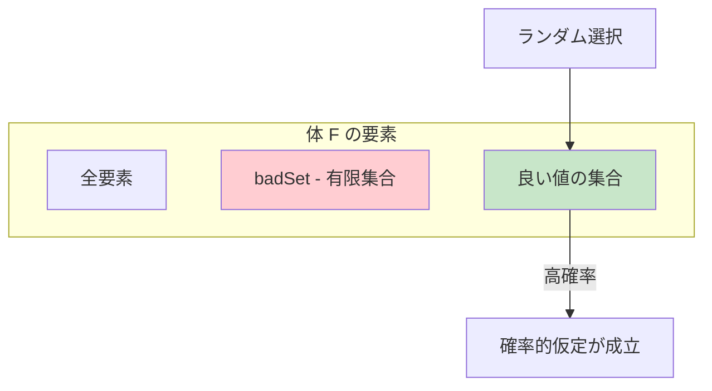
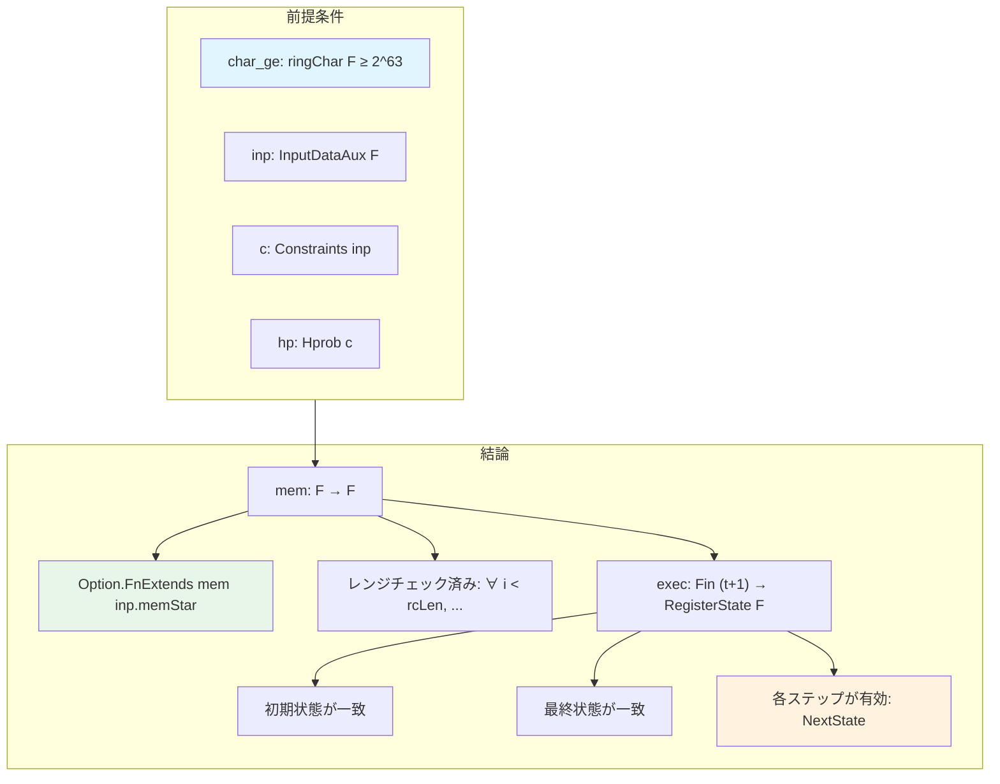
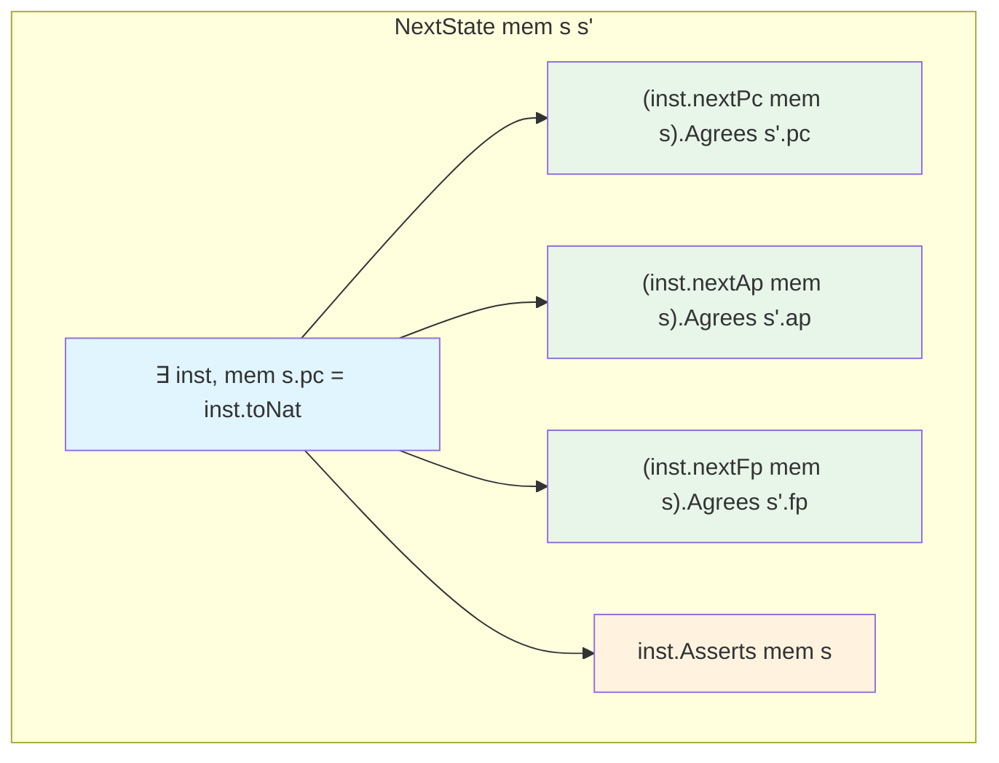
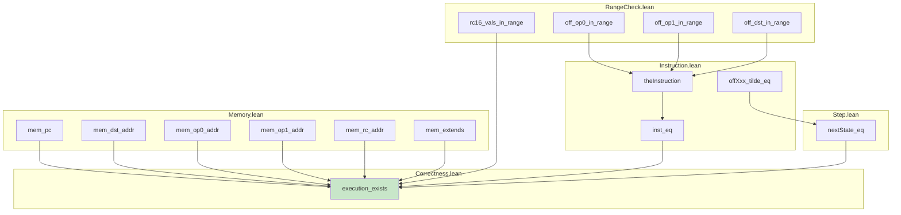

# 第16章: 実行存在定理 (AirEncoding/Correctness.lean)

## 16.1 概要

本章では、AIR制約システムの正しさを証明する主定理`execution_exists`を解説する。この定理は「制約を満たすトレースデータが存在すれば、対応するCairo VM実行が存在する」ことを保証する。

### 本章の目的

- execution_exists定理の構造と意味を理解する
- 確率的仮定（Hprob）の役割を学ぶ
- 制約から実行トレースを構築する方法を理解する

### 対象ファイル

- `Verification/Semantics/AirEncoding/Correctness.lean` (127行)
- 関連: `Memory.lean`, `RangeCheck.lean`, `Instruction.lean`, `Step.lean`

### 前提知識

- AIR制約システム（第14章）
- 命令エンコーディング（第15章）
- CPU実行セマンティクス（第6章）

---

## 16.2 確率的仮定

### 16.2.1 Hprob構造体

STARKプロトコルでは、検証者がランダムに選んだ値に対して確率的仮定が必要となる：

```lean
structure Hprob {inp : InputDataAux F} (c : Constraints inp) where
  -- メモリ制約の確率的仮定
  hprob₁ : (c.mc).mb.alpha ∉
    badSet1 (realA inp.memStar c.mc.a c.mc.em.embedMem)
            (realV inp.memStar c.mc.v c.mc.em.embedMem) c.mc.mb.a' c.mc.mb.v'

  hprob₂ : c.mc.mb.z ∉
    badSet2 (realA inp.memStar c.mc.a c.mc.em.embedMem)
            (realV inp.memStar c.mc.v c.mc.em.embedMem) c.mc.mb.a' c.mc.mb.v' c.mc.mb.alpha

  hprob₃ : ((c.mc).mb).z ≠ 0

  -- レンジチェック制約の確率的仮定
  hprob₄ : c.rc.z ∉ badSet3 c.rc.a c.rc.a'
```

### 16.2.2 各仮定の意味

| 仮定 | 役割 | 数学的意味 |
|:--|:--|:--|
| `hprob₁` | メモリ順列検証 | αが「悪い」線形結合係数ではない |
| `hprob₂` | メモリ順列検証 | zが「悪い」評価点ではない |
| `hprob₃` | メモリ制約 | zがゼロではない |
| `hprob₄` | レンジチェック | zが「悪い」評価点ではない |

### 16.2.3 確率的仮定の正当性

「悪い集合」（badSet）は有限であり、体の要素数に比べて小さい。したがって、ランダムに選んだ値がこれらの集合に含まれる確率は非常に低い。



---

## 16.3 主定理: execution_exists

### 16.3.1 定理の記述

```lean
theorem execution_exists (char_ge : ringChar F ≥ 2 ^ 63) (inp : InputDataAux F)
    (c : Constraints inp) (hp : Hprob c) :
    ∃ mem : F → F,
      Option.FnExtends mem inp.memStar ∧
        (∀ i < inp.rcLen, ∃ (n : ℕ), n < 2 ^ 128 ∧ mem (inp.initialRcAddr + i) = (↑n : F)) ∧
          ∃ exec : Fin (inp.t + 1) → RegisterState F,
            (exec 0).pc = inp.pcI ∧
              (exec 0).ap = inp.apI ∧
                (exec 0).fp = inp.apI ∧
                  (exec (Fin.last inp.t)).pc = inp.pcF ∧
                    (exec (Fin.last inp.t)).ap = inp.apF ∧
                      ∀ i : Fin inp.t, NextState mem (exec i.castSucc) (exec i.succ)
```

### 16.3.2 定理の構造



---

## 16.4 証明の構造

### 16.4.1 メモリの構築

```lean
  have char_gt : ringChar F > 2 ^ 16 := by
    apply lt_of_lt_of_le _ char_ge
    apply pow_lt_pow_right <;> norm_num

  let m := mem c.mc.mb.a' c.mc.mb.v'
```

メモリ`m`は、ソートされたアドレス配列`a'`と値配列`v'`から構築される。

### 16.4.2 メモリ拡張の証明

```lean
  have mem_extends : Option.FnExtends m inp.memStar :=
    mem_extends c.mc.mb.h_continuity c.mc.mb.h_single_valued
      c.mc.mb.h_initial c.mc.mb.h_cumulative c.mc.mb.h_final
      c.mc.em.h_embedDom c.mc.em.h_embedVal c.mc.em.h_embedMem_inj
      hp.hprob₃ hp.hprob₁ hp.hprob₂ c.mc.h_n_lt
```

**Option.FnExtends**の意味:

```lean
def Option.FnExtends (f : α → β) (g : α → Option β) : Prop :=
  ∀ x, (g x).Agrees (f x)
```

つまり、`memStar`で定義されているアドレスに対して、`m`は同じ値を返す。

### 16.4.3 メモリアクセスの正しさ

```lean
  have mem_pcAddr : ∀ i : Fin inp.t, m (c.pc i.castSucc) = c.inst i :=
    mem_pc c.mc.mb.h_continuity c.mc.mb.h_single_valued ...

  have mem_dst_addr : ∀ i, m (c.dstAddr i) = c.dst i :=
    mem_dst_addr ...

  have mem_op0Addr : ∀ i, m (c.op0Addr i) = c.op0 i :=
    mem_op0_addr ...

  have mem_op1Addr : ∀ i, m (c.op1Addr i) = c.op1 i :=
    mem_op1_addr ...
```

これらの補題は、トレースで指定されたアドレスに対して、メモリが正しい値を返すことを保証する。

### 16.4.4 レンジチェックの検証

```lean
  have off_op0_in_range : ∀ i, ∃ k : ℕ, k < 2 ^ 16 ∧ c.offOp0Tilde i = ↑k :=
    off_op0_in_range c.rc.h_continuity c.rc.h_initial c.rc.h_cumulative
      c.rc.h_final c.rc.h_rc_min c.rc.h_rcMax c.rc.h_embedOp0 c.rc.h_n_lt
      inp.h_rc_lt inp.h_rc_le char_gt hp.hprob₄

  have off_op1_in_range : ∀ i, ∃ k : ℕ, k < 2 ^ 16 ∧ c.offOp1Tilde i = ↑k := ...

  have off_dst_in_range : ∀ i, ∃ k : ℕ, k < 2 ^ 16 ∧ c.offDstTilde i = ↑k := ...

  have rc16Vals_in_range : ∀ i, ∃ k : ℕ, k < 2 ^ 16 ∧ c.rc16Val i = ↑k := ...
```

レンジチェック制約から、オフセット値がすべて`[0, 2^16)`の範囲内にあることが証明される。

### 16.4.5 128ビットレンジチェックの証明

```lean
  have range_checked : ∀ i < inp.rcLen, ∃ n : ℕ, n < 2 ^ 128 ∧ m (inp.initialRcAddr + i) = ↑n := by
    intro i hi
    rcases rc_val_checked rc16Vals_in_range c.rcb.h_rcValue ⟨i, hi⟩ with ⟨n, nlt, neq⟩
    use n, nlt
    rw [← neq, ←mem_rcAddr]
    rw [rc_addr_eq c.rcb.h_rc_init_addr c.rcb.h_rcAddr_step ⟨i, hi⟩]
```

8個の16ビット値から構成される128ビット値が正しくレンジチェックされていることを証明。

### 16.4.6 実行トレースの構築

```lean
  use m, mem_extends, range_checked

  let e := fun i : Fin (inp.t + 1) => RegisterState.mk (c.pc i) (c.ap i) (c.fp i)

  use e, c.h_pcI, c.h_apI, c.h_fpI, c.h_pcF, c.h_apF
```

実行トレース`e`は、制約からの`pc`、`ap`、`fp`配列を使って構築される。

### 16.4.7 各ステップの正しさ

```lean
  intro i
  show NextState m (e i.castSucc) (e i.succ)

  let inst' := theInstruction (c.ic i).h_bit (off_op0_in_range i)
               (off_op1_in_range i) (off_dst_in_range i)

  have inst_eq : c.inst i = ↑inst'.toNat :=
    inst_eq (c.ic i).h_instruction (c.ic i).h_bit (c.ic i).h_last_value
      (off_op0_in_range i) (off_op1_in_range i) (off_dst_in_range i)

  -- オフセットとフラグの等式
  have offDstTilde_eq : c.offDstTilde i = ↑inst'.offDst.toNat := ...
  have offOp0Tilde_eq : c.offOp0Tilde i = ↑inst'.offOp0.toNat := ...
  have offOp1Tilde_eq : c.offOp1Tilde i = ↑inst'.offOp1.toNat := ...
  have f_tilde_to_f_eq : ∀ j, (c.fTilde i).toF j = ↑(inst'.flags.getLsbD j).toNat := ...

  exact nextState_eq offDstTilde_eq offOp0Tilde_eq offOp1Tilde_eq f_tilde_to_f_eq
    ((mem_pcAddr i).trans inst_eq) (mem_dst_addr i) (mem_op0Addr i) (mem_op1Addr i)
    (c.sc i).h_dstAddr (c.sc i).h_op0Addr (c.sc i).h_op1Addr (c.sc i).h_mul (c.sc i).h_res
    (c.sc i).h_t0_eq (c.sc i).h_t1_eq (c.sc i).h_nextPc_eq (c.sc i).h_nextPc_eq'
    (c.sc i).h_opcode_call (c.sc i).h_opcode_call' (c.sc i).h_opcode_assert_eq
    (c.sc i).h_nextAp (c.sc i).h_nextFp
```

---

## 16.5 Step.leanとnextState_eq

### 16.5.1 nextState_eq定理

`Step.lean`で定義された`nextState_eq`は、ステップ制約が`NextState`述語を満たすことを証明する：

```lean
theorem nextState_eq : NextState mem ⟨pc, ap, fp⟩ ⟨next_pc, next_ap, next_fp⟩ :=
   ⟨inst, h_mem_pc,
    nextPc_agrees ...,
    nextAp_agrees ...,
    nextFp_agrees ...,
    asserts_hold ...⟩
```

### 16.5.2 NextState述語の分解



---

## 16.6 補助定理の依存関係

### 16.6.1 証明の依存グラフ



---

## 16.7 証明の意味

### 16.7.1 健全性の保証

`execution_exists`定理は以下を保証する：

1. **メモリの存在**: 制約を満たすメモリ関数が存在する
2. **入力との整合性**: そのメモリは入力の部分メモリ仕様を拡張する
3. **レンジチェック**: 指定されたアドレスの値は128ビット以内
4. **実行の存在**: 有効な実行トレースが存在する
5. **境界条件**: 初期・最終状態が入力と一致する
6. **遷移の有効性**: 各ステップが`NextState`を満たす

### 16.7.2 STARKプロトコルにおける役割


---

## 16.8 体の標数条件

### 16.8.1 なぜ ringChar F ≥ 2^63 が必要か

```lean
theorem execution_exists (char_ge : ringChar F ≥ 2 ^ 63) ...
```

この条件が必要な理由：

1. **命令の一意性**: 命令は最大63ビット（< 2^63）なので、体上で等しい命令は自然数としても等しい
2. **オーバーフロー防止**: オフセット計算やアドレス計算がラップアラウンドしない
3. **レンジチェックの正確性**: 16ビット値が正しく表現される

### 16.8.2 実際の使用

Cairoでは、254ビット素体（Stark-friendly prime field）を使用：

```
p = 2^251 + 17 * 2^192 + 1
```

これは2^63よりはるかに大きいため、条件を満たす。

---

## 16.9 証明のポイント

### 16.9.1 構成的証明

この証明は構成的（constructive）である：

- メモリ`m`を明示的に構築
- 実行トレース`e`を明示的に構築
- 各ステップの正しさを個別に証明

### 16.9.2 モジュール性

証明は複数のファイルに分割されている：

| ファイル | 責任 |
|:--|:--|
| `Memory.lean` | メモリの整合性証明 |
| `RangeCheck.lean` | レンジチェック証明 |
| `Instruction.lean` | 命令復元証明 |
| `Step.lean` | ステップ遷移証明 |
| `Correctness.lean` | 統合と主定理 |

### 16.9.3 確率的仮定の処理

確率的仮定は外部から与えられる：

```lean
(hp : Hprob c)
```

実際のSTARKプロトコルでは、検証者がランダムな値を選ぶことでこれらの仮定が高確率で成り立つ。

---

## 16.10 まとめ

### 本章で学んだこと

1. **execution_exists定理**: AIR制約から実行の存在を導く主定理
2. **確率的仮定**: STARKプロトコルで必要なランダム値の条件
3. **証明の構造**: メモリ構築 → レンジチェック → 実行構築 → ステップ検証

### 重要な結論

AIR制約を満たすトレースデータが存在し、確率的仮定が成り立てば、対応する有効なCairo VM実行が存在する。これがSTARKベースの証明システムの健全性の基礎となる。

### 第V部のまとめ

第V部（第14-16章）では、AIRエンコーディングの正当性を扱った：

- **第14章**: 制約システムの構造（メモリ、レンジチェック、命令、ステップ）
- **第15章**: 命令エンコーディングと復元
- **第16章**: 制約から実行の存在を証明

これらを組み合わせて、Cairo VMのSTARK証明システムの数学的基礎が確立された。

---

## 16.11 練習問題

1. **問題1**: `Hprob`の4つの仮定それぞれが欠けた場合、証明のどの部分が成り立たなくなるか説明せよ。

2. **問題2**: 体の標数が2^32（< 2^63）の場合、どのような問題が生じうるか具体例を挙げよ。

3. **問題3**: `Option.FnExtends mem inp.memStar`の意味を説明し、なぜこれが重要かを述べよ。
