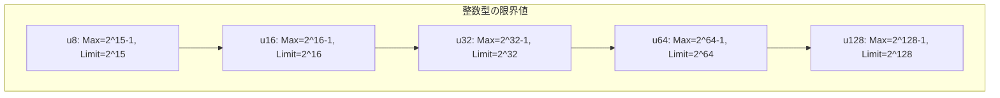
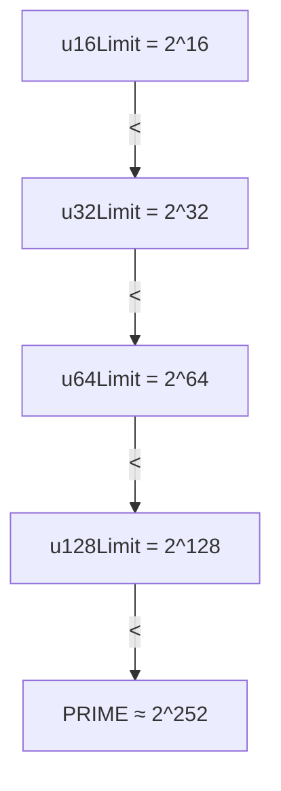
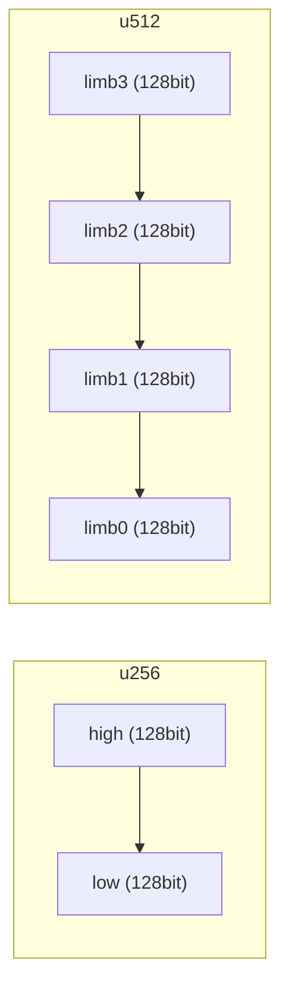

# 第17章: 共通定義 (Common.lean)

## 17.1 概要

本章では、libfunc検証で共通して使用される定義と補助定理を提供する`Common.lean`ファイルを詳細に解説します。このファイルは、整数型の限界値、型述語、有用な補題などを定義しています。

### 本章の目標

- 整数型の限界値（u16Max, u128Limitなど）を理解する
- `is_uXX_of`述語の使い方を学ぶ
- 算術に関する補助定理を活用できるようになる

### ソースファイル

```
Verification/Libfuncs/Common.lean
```

## 17.2 整数型の定数

### 17.2.1 符号なし整数の限界値

```lean
-- Common.lean:30-50
@[reducible, inline] def u8Max : ℕ := 32767
@[reducible, inline] def u8Limit : ℕ := 32768

@[reducible, inline] def u16Max : ℕ := 65535
@[reducible, inline] def u16Limit : ℕ := 65536

@[reducible, inline] def u32Max : ℕ := 4294967295
@[reducible, inline] def u32Limit : ℕ := 4294967296

@[reducible, inline] def u64Max : ℕ := 18446744073709551615
@[reducible, inline] def u64Limit : ℕ := 18446744073709551616

@[reducible, inline] def u128Max : ℕ := 340282366920938463463374607431768211455
@[reducible, inline] def u128Limit : ℕ := 340282366920938463463374607431768211456
```

### 17.2.2 定数の関係



### 17.2.3 MaxとLimitの関係

| 型 | Max | Limit | 関係 |
|:--|:--|:--|:--|
| uN | 2^N - 1 | 2^N | Limit = Max + 1 |

```lean
-- 例: u32
theorem u32Limit_eq_u32Max_succ : u32Limit = u32Max + 1 := by
  unfold u32Limit u32Max; norm_num1
```

### 17.2.4 符号付き整数

```lean
-- Common.lean:52-53
@[reducible, inline] def i16Min : ℤ := -32768
@[reducible, inline] def i16Max : ℤ := 32767
```

## 17.3 PRIMEとの比較定理

### 17.3.1 基本的な比較

```lean
-- Common.lean:55-73
theorem u16Max_lt_u128Max : u16Max < u128Max := by simp [u16Max, u128Max]
theorem u16Limit_lt_u128Max : u16Limit < u128Max := by simp [u16Limit, u128Max]
theorem u16Max_lt_PRIME : u16Max < PRIME := by simp [PRIME, u16Max]
theorem u16Limit_lt_PRIME : u16Limit < PRIME := by simp [PRIME, u16Limit]

-- 同様に u32, u64, u128 についても
theorem u128Max_lt_PRIME : u128Max < PRIME := by simp [PRIME, u128Max]
theorem u128Limit_lt_PRIME : u128Limit < PRIME := by simp [PRIME, u128Limit]
```

### 17.3.2 加算の範囲

```lean
-- Common.lean:180-184
theorem u128Limit_double_lt_PRIME : u128Limit + u128Limit < PRIME := by
  unfold u128Limit PRIME; norm_num1

theorem u128Limit_triple_lt_PRIME : u128Limit + u128Limit + u128Limit < PRIME := by
  unfold u128Limit PRIME; norm_num1
```

**用途**: 複数のu128値の加算がPRIME内に収まることの保証

### 17.3.3 階層図



## 17.4 非ゼロ定理

### 17.4.1 自然数版

```lean
-- Common.lean:101-113
theorem u16Max_pos : u16Max > 0 := by decide
theorem u16Limit_pos : u16Limit > 0 := by decide
theorem u16Max_ne_zero : u16Max ≠ 0 := Nat.pos_iff_ne_zero.mp u16Max_pos
theorem u16Limit_ne_zero : u16Limit ≠ 0 := Nat.pos_iff_ne_zero.mp u16Limit_pos
```

### 17.4.2 体要素版

```lean
-- Common.lean:106-116
theorem u16Max_coe_ne_zero : (u16Max : F) ≠ 0 :=
  PRIME.nat_coe_field_ne_zero u16Max_lt_PRIME rfl u16Max_ne_zero

theorem u16Limit_coe_ne_zero : (u16Limit : F) ≠ 0 :=
  PRIME.nat_coe_field_ne_zero u16Limit_lt_PRIME rfl u16Limit_ne_zero
```

**用途**: 除算の分母がゼロでないことの証明

### 17.4.3 整数キャスト版

```lean
-- Common.lean:109-116
theorem u16Max_coe_coe_ne_zero : ((u16Max : ℤ) : F) ≠ 0 := by
  rw [Nat.cast_ofNat, Int.cast_ofNat]; exact u16Max_coe_ne_zero
```

## 17.5 二乗の関係

### 17.5.1 限界値の二乗

```lean
-- Common.lean:242-249
theorem u16Limit_squared_eq : u16Limit * u16Limit = u32Limit := by norm_num1
theorem u32Limit_squared_eq : u32Limit * u32Limit = u64Limit := by norm_num1
theorem u64Limit_squared_eq : u64Limit * u64Limit = u128Limit := by norm_num1
```

### 17.5.2 図解

```
u16Limit^2 = u32Limit
2^16 * 2^16 = 2^32

u32Limit^2 = u64Limit
2^32 * 2^32 = 2^64

u64Limit^2 = u128Limit
2^64 * 2^64 = 2^128
```

## 17.6 is_uXX_of述語

### 17.6.1 定義

```lean
-- Common.lean:255-258
def is_u16_of (a : F) (na : ℕ) : Prop := na < u16Limit ∧ a = ↑na
def is_u32_of (a : F) (na : ℕ) : Prop := na < u32Limit ∧ a = ↑na
def is_u64_of (a : F) (na : ℕ) : Prop := na < u64Limit ∧ a = ↑na
def is_u128_of (a : F) (na : ℕ) : Prop := na < u128Limit ∧ a = ↑na
```

### 17.6.2 意味

```lean
is_u128_of a na  ≡  na < 2^128 ∧ a = ↑na
```

「体要素`a`が、u128範囲内の自然数`na`に対応する」

### 17.6.3 使用例

```lean
-- 仕様での使用例
def spec_example (result : F) : Prop :=
  ∃ n : ℕ, is_u128_of result n ∧ some_property n
```

## 17.7 リム（Limb）による表現

### 17.7.1 u256の表現

```lean
-- Common.lean:262
def u256_from_limbs (na nb : ℕ) : ℕ := (u128Limit * na) + nb
```

**意味**: 256ビット値を2つの128ビットリムで表現

```
u256 = high * 2^128 + low
```

### 17.7.2 u512の表現

```lean
-- Common.lean:264-265
def u512_from_limbs (na nb nc nd : ℕ) : ℕ :=
  (u128Limit^3 * na) + (u128Limit^2 * nb) + (u128Limit * nc) + nd
```

**意味**: 512ビット値を4つの128ビットリムで表現

```
u512 = a * 2^384 + b * 2^256 + c * 2^128 + d
```

### 17.7.3 リム構造図



## 17.8 乗算保証

### 17.8.1 u128_mul_guarantee

```lean
-- Common.lean:269-274
def u128_mul_guarantee (a b upper lower : F) : Prop :=
  ∀ ⦃na⦄, is_u128_of a na →
  ∀ ⦃nb⦄, is_u128_of b nb →
  ∃ nh : ℕ, is_u128_of upper nh ∧
  ∃ nl : ℕ, is_u128_of lower nl ∧
    na * nb = u256_from_limbs nh nl
```

**意味**: 2つのu128値の乗算結果が、u256として正しく表現される

```
a * b = upper * 2^128 + lower
```

## 17.9 算術補助定理

### 17.9.1 除算に関する定理

```lean
-- Common.lean:287-296
theorem dvd_sub_of_mul_add_eq_mul_add {a b c d e : ℕ} :
    a * b + c = a * d + e → a ∣ e - c := by ...
```

### 17.9.2 平方根に関する定理

```lean
-- Common.lean:300-316
theorem sqrt_lt_of_lt_square {a b : ℕ} : a < b * b → sqrt a < b := by ...
theorem le_sqrt_of_square_le {a b : ℕ} : a * a ≤ b → a ≤ sqrt b := by ...
```

### 17.9.3 不等式の操作

```lean
-- Common.lean:322-401
theorem add_sub_lt {a b c : ℕ} (hb : 0 < b) (hac : a < c) : a + b - c < b := by ...
theorem lt_of_add_sub_lt {a b c : ℕ} : a + (b - c) < b → a < c := by ...
theorem sub_lt_sub_of_lt_of_lt {a b k : ℕ} : b < k → b < a → a - k < a - b := by ...
```

## 17.10 整数版の定理

### 17.10.1 加算の不等式

```lean
-- Common.lean:382-401
theorem Int.add_lt_of_left_lt_of_add_lt {a b c d : ℤ} :
    a < b → b + c < d → a + c < d := ...

theorem Int.add_lt_of_right_lt_of_add_lt {a b c d : ℤ} :
    b < c → a + c < d → a + b < d := ...
```

### 17.10.2 剰余と等式

```lean
-- Common.lean:403-406
theorem Int.eq_sub_emod_iff_add_emod_eq {a b c : ℤ} :
    a % PRIME = (b - c) % PRIME ↔ (a + c) % PRIME = b % PRIME := by ...
```

### 17.10.3 減算とtoNat

```lean
-- Common.lean:408-412
theorem Int.sub_nonneg_toNat {z : Int} {a b : ℕ} (h : z = a - b) (h_lt : b ≤ a) :
    z.toNat = a - b := by ...
```

## 17.11 使用パターン

### 17.11.1 仕様定義での使用

```lean
def spec_u128_add (a b result : F) : Prop :=
  ∃ na, is_u128_of a na →
  ∃ nb, is_u128_of b nb →
  ∃ nr, is_u128_of result nr ∧ na + nb = nr
```

### 17.11.2 証明での使用

```lean
-- 範囲チェックの証明
have h_lt : n < u128Limit := ...
have h_lt_PRIME : n < PRIME := lt_PRIME_of_lt_u128Limit h_lt

-- 非ゼロ性の使用
have h_ne : (u128Limit : F) ≠ 0 := u128Limit_coe_ne_zero
```

## 17.12 まとめ

### 重要な定義

| 定義 | 用途 |
|:--|:--|
| `uXXMax`, `uXXLimit` | 整数型の範囲 |
| `is_uXX_of` | 体要素と自然数の関係 |
| `u256_from_limbs` | 多倍長整数の表現 |
| `u128_mul_guarantee` | 乗算結果の仕様 |

### 重要な定理

| 定理 | 用途 |
|:--|:--|
| `uXXLimit_lt_PRIME` | PRIME内に収まる保証 |
| `uXXLimit_coe_ne_zero` | 除算の分母 |
| `uXXLimit_squared_eq` | 型の階層関係 |

### 次章との関連

第18章「u128_overflowing_add」では、これらの定義を使って実際のlibfunc検証を行います。特に`is_u128_of`と`u128Limit`が頻繁に使用されます。

## 17.13 演習問題

### 問題1
`is_u128_of a na`と`IsRangeChecked (rcBound F) a`の関係は？

<details>
<summary>解答</summary>

`rcBound F ≤ 2^128 = u128Limit`より、`IsRangeChecked`で検証された値は自動的に`is_u128_of`の条件を満たします。

```lean
-- IsRangeChecked (rcBound F) a
-- ∃ n, n < rcBound F ∧ a = ↑n

-- rcBound F ≤ u128Limit より
-- n < rcBound F → n < u128Limit

-- したがって is_u128_of a n が成立
```

</details>

### 問題2
`u256_from_limbs`で`na`と`nb`の順序が重要な理由は？

<details>
<summary>解答</summary>

```lean
u256_from_limbs na nb = u128Limit * na + nb
```

`na`は上位128ビット（係数が大きい）、`nb`は下位128ビットです。順序を間違えると値が全く異なります。

例: na=1, nb=0の場合
- 正しい: 1 * 2^128 + 0 = 2^128
- 逆順: 0 * 2^128 + 1 = 1

</details>

### 問題3
なぜ`u128Limit_double_lt_PRIME`が重要ですか？

<details>
<summary>解答</summary>

2つのu128値を加算する場合、結果は最大で`2 * u128Limit`になります。この値がPRIME未満であれば：

1. オーバーフローなしで加算可能
2. 有限体での計算が正確（ラップアラウンドなし）
3. 結果を安全にu128として解釈可能

u128_overflowing_addなどの実装で、この性質が活用されます。

</details>
