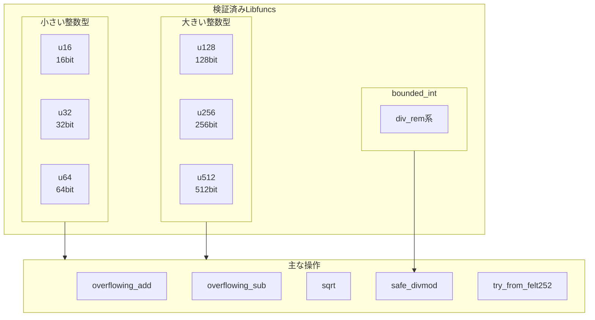
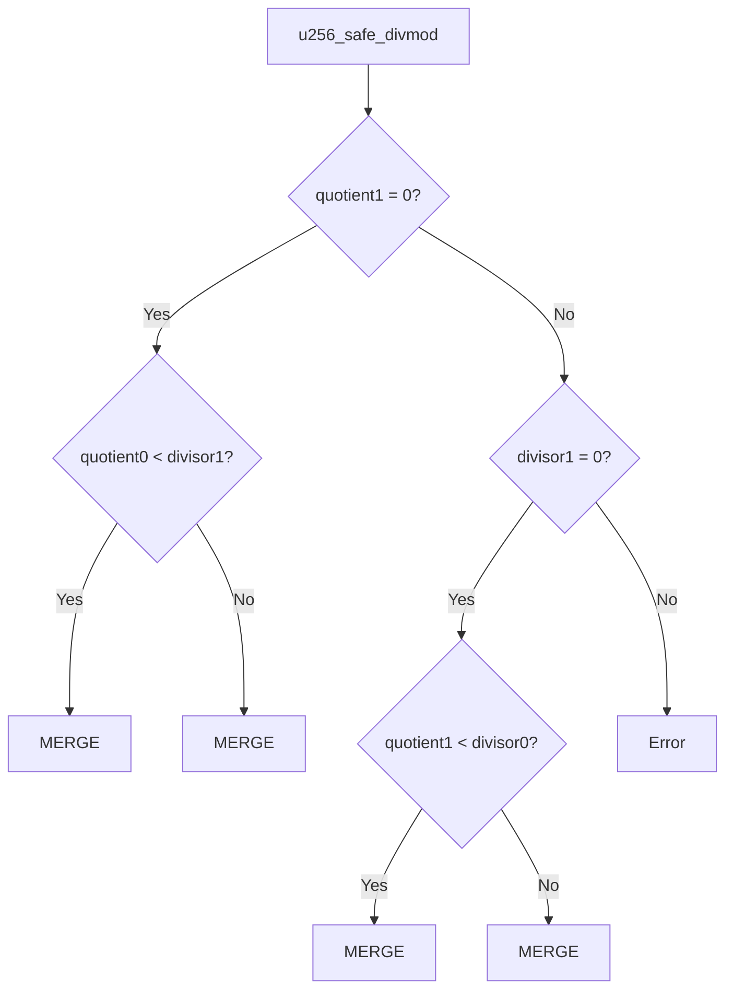
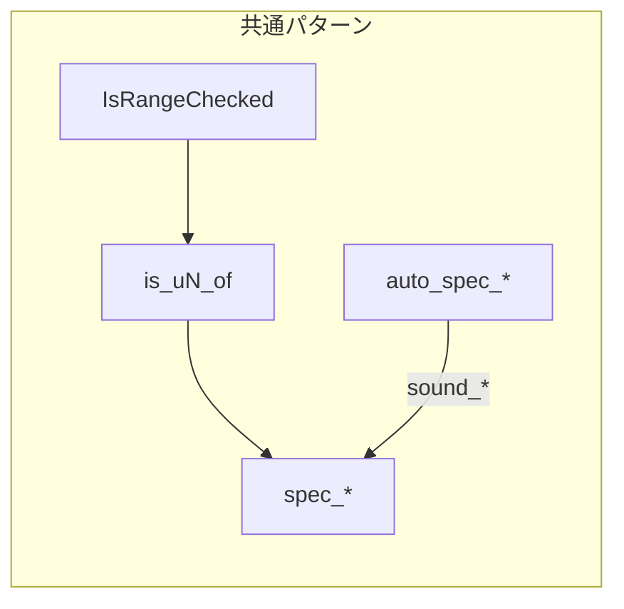

# 第19章: 他のlibfunc検証パターン

本章では、u128以外の整数型（u16, u32, u64, u256, u512）とbounded_intの検証パターンについて解説する。第18章で学んだu128_overflowing_addの知識を基盤として、異なる関数の検証がどのように行われるかを理解する。

## 19.1 概要

本プロジェクトで検証されているlibfuncの全体像：



---

## 19.2 整数型別ディレクトリ構造

### 19.2.1 ディレクトリ一覧

```
Verification/Libfuncs/
├── Common.lean          # 共通定義
├── u16/                 # 16bit整数
├── u32/                 # 32bit整数
├── u64/                 # 64bit整数
├── u128/                # 128bit整数（第18章で詳解）
├── u256/                # 256bit整数
├── u512/                # 512bit整数
└── bounded_int/         # 境界付き整数
```

### 19.2.2 各ディレクトリの関数

| ディレクトリ | 検証済み関数 |
|:--|:--|
| u16 | overflowing_add, overflowing_sub, sqrt |
| u32 | overflowing_add, overflowing_sub, sqrt |
| u64 | overflowing_add, overflowing_sub, sqrt, try_from_felt252 |
| u128 | overflowing_add, overflowing_sub, sqrt, safe_divmod |
| u256 | sqrt, safe_divmod, guarantee_inv_mod_n |
| u512 | safe_divmod_by_u256 |
| bounded_int | div_rem_known_small_lhs/rhs/quotient |

---

## 19.3 u64_sqrt - 平方根の検証

### 19.3.1 仕様の定義

u64の平方根はu32を返す（√(2^64 - 1) < 2^32）：

```lean
-- Verification/Libfuncs/u64/u64_sqrt_soundness_spec.lean:16
def spec_u64_sqrt (a ρ_sqrt : F) : Prop :=
  ∀ na, is_u64_of a na → is_u32_of ρ_sqrt na.sqrt
```

**意味**:
- 入力 `a` がu64範囲の値 `na` を表すなら
- 出力 `ρ_sqrt` は `na.sqrt` を表すu32値

### 19.3.2 自動生成仕様

```lean
-- Verification/Libfuncs/u64/u64_sqrt_soundness_spec.lean:18-27
def auto_spec_u64_sqrt (a ρ_sqrt : F) : Prop :=
  ∃ ret_val : F,
  ∃ sqrt_adj : F, sqrt_adj = ret_val + sqrtAdjustment ∧
  ∃ lb : F, lb = a - (ret_val * ret_val) ∧
  ∃ ub : F, ub = (ret_val + ret_val) - lb ∧
  IsRangeChecked (rcBound F) ret_val ∧
  IsRangeChecked (rcBound F) sqrt_adj ∧
  IsRangeChecked (rcBound F) lb ∧
  IsRangeChecked (rcBound F) ub ∧
  ρ_sqrt = ret_val
```

### 19.3.3 sqrtの数学的条件

平方根 `r = √n` は以下を満たす：
- `r² ≤ n < (r+1)²`
- これは `r² ≤ n` かつ `n < r² + 2r + 1`
- つまり `n - r² ≥ 0` かつ `2r - (n - r²) ≥ 0`

```lean
-- lb = a - ret_val² ≥ 0    (下界チェック)
-- ub = 2*ret_val - lb ≥ 0  (上界チェック)
```

### 19.3.4 健全性証明の構造

```lean
-- Verification/Libfuncs/u64/u64_sqrt_soundness_spec.lean:31-90
theorem sound_u64_sqrt {a ρ_sqrt : F}
  (h_auto : auto_spec_u64_sqrt a ρ_sqrt) : spec_u64_sqrt a ρ_sqrt := by
  -- 1. auto_specを分解
  rcases h_auto with ⟨_, _, rfl, _, rfl, _, rfl, h₁, h₂, h₃, h₄, rfl⟩
  -- 2. レンジチェック境界を取得
  have h_rc_bound := @rcBound_hyp F
  -- 3. ret_val² ≤ na を証明
  have h_le : ret_val * ret_val ≤ na := ...
  -- 4. ret_val ≤ √na を証明
  have h_le' : ret_val ≤ na.sqrt := ...
  -- 5. ret_val ≥ √na を証明
  have h_ge : ret_val ≥ na.sqrt := ...
  -- 6. 等式から結論
  rw [antisymm h_le' h_ge]
```

---

## 19.4 u256_safe_divmod - 256bit除算

### 19.4.1 u256の表現

u256は2つのu128リムで表現される：

```lean
-- Verification/Libfuncs/Common.lean:262
def u256_from_limbs (na nb : ℕ) : ℕ := (u128Limit * na) + nb
-- na: 上位128bit, nb: 下位128bit
```

### 19.4.2 仕様の定義

```lean
-- Verification/Libfuncs/u256/u256_safe_divmod_soundness_spec.lean:23-40
def spec_u256_safe_divmod (κ : ℕ)
    (range_check
      dividend0 dividend1 divisor0 divisor1
      ρ_quotient0 ρ_quotient1
      ρ_remainder0 ρ_remainder1 ρ_quotient0₁ ρ_divisor0 ρ_q0d0_high ρ_q0d0_low : F) : Prop :=
  ∀ n_dividend0 : Nat, is_u128_of dividend0 n_dividend0 →
  ∀ n_dividend1 : Nat, is_u128_of dividend1 n_dividend1 →
  ∀ n_divisor0  : Nat, is_u128_of divisor0 n_divisor0 →
  ∀ n_divisor1  : Nat, is_u128_of divisor1 n_divisor1 →
    u128_mul_guarantee ρ_quotient0 divisor0 ρ_q0d0_high ρ_q0d0_low →
    ∃ n_quotient0 : Nat, is_u128_of ρ_quotient0 n_quotient0 ∧
    ∃ n_quotient1 : Nat, is_u128_of ρ_quotient1 n_quotient1 ∧
    ∃ n_remainder0 : Nat, is_u128_of ρ_remainder0 n_remainder0 ∧
    ∃ n_remainder1 : Nat, is_u128_of ρ_remainder1 n_remainder1 ∧
      u256_from_limbs n_remainder1 n_remainder0 < u256_from_limbs n_divisor1 n_divisor0 ∧
      u256_from_limbs n_dividend1 n_dividend0 =
        u256_from_limbs n_quotient1 n_quotient0 * u256_from_limbs n_divisor1 n_divisor0 +
          u256_from_limbs n_remainder1 n_remainder0
```

**仕様の解釈**:
1. 被除数 = dividend1 * 2^128 + dividend0
2. 除数 = divisor1 * 2^128 + divisor0
3. 結果: dividend = quotient * divisor + remainder
4. 条件: remainder < divisor

### 19.4.3 複雑な分岐構造

u256除算は多くの場合分けを含む：



### 19.4.4 手動仕様への変換

自動生成された複雑な仕様を、証明しやすい形に変換：

```lean
-- Verification/Libfuncs/u256/u256_safe_divmod_soundness_spec.lean:153-163
def man_auto_spec_u256_safe_divmod_merge (...) : Prop :=
  IsRangeChecked (rcBound F) (qd1_small + u128_bound_minus_u64_bound) ∧
  dividend1 = leftover + q0d0_high + remainder1 + qd1_small * qd1_large ∧
  ρ_quotient0 = quotient0 ∧ ...
```

---

## 19.5 bounded_int - 境界付き整数

### 19.5.1 概念

bounded_intは、コンパイル時に既知の上下界を持つ整数型：

```lean
-- 概念的な定義
BoundedInt<lower, upper>  -- lower ≤ value ≤ upper
```

### 19.5.2 div_rem関数群

| 関数 | 意味 | 最適化条件 |
|:--|:--|:--|
| `known_small_lhs` | 左辺が小さい | dividend < divisor の保証 |
| `known_small_rhs` | 右辺が小さい | divisor の上界が既知 |
| `known_small_quotient` | 商が小さい | quotient の上界が既知 |

### 19.5.3 known_small_quotientの例

商が小さいことが分かっている場合の除算最適化：

```lean
-- Verification/Libfuncs/bounded_int/bounded_int_div_rem_known_small_quotient_soundness_spec.lean
def spec_bounded_int_div_rem_known_small_quotient
    (lhs rhs q r : F) (nl nh dl dh : ℤ) : Prop :=
  ∀ n_lhs : ℕ, is_u128_of lhs n_lhs →
  ∀ n_rhs : ℕ, is_u128_of rhs n_rhs →
    ∃ n_q : ℕ, is_u128_of q n_q ∧
    ∃ n_r : ℕ, is_u128_of r n_r ∧
      n_lhs = n_q * n_rhs + n_r ∧
      n_r < n_rhs
```

---

## 19.6 検証パターンの比較

### 19.6.1 共通パターン

全てのlibfunc検証に共通する要素：



### 19.6.2 型別の違い

| 型 | 境界定数 | リム数 | 特別な考慮 |
|:--|:--|:--:|:--|
| u16 | `u16Limit` | 1 | - |
| u32 | `u32Limit` | 1 | - |
| u64 | `u64Limit` | 1 | - |
| u128 | `u128Limit` | 1 | レンジチェック境界 |
| u256 | - | 2 | リム分解・結合 |
| u512 | - | 4 | 複雑な桁上げ |

### 19.6.3 操作別の証明戦略

| 操作 | 主な証明戦略 |
|:--|:--|
| overflowing_add | オーバーフロー検出、キャリービット |
| overflowing_sub | アンダーフロー検出、ボロービット |
| sqrt | 上下界の挟み撃ち |
| safe_divmod | 除算等式、剰余の境界 |

---

## 19.7 健全性証明のパターン

### 19.7.1 基本的な流れ

```lean
theorem sound_function_name
    (h_auto : auto_spec_function_name args) :
    spec_function_name args := by
  -- 1. auto_specの分解
  rcases h_auto with ⟨var1, h1, var2, h2, ...⟩

  -- 2. レンジチェックから自然数値を取得
  rcases h1 with ⟨n1, n1_lt, eq1⟩

  -- 3. 入力条件の処理
  rintro input_n ⟨input_lt, input_eq⟩

  -- 4. 主要な数学的等式/不等式の証明
  have main_eq : ... := by ...

  -- 5. 存在量化子の具体化
  use n1
  constructor
  · exact ⟨n1_lt.trans bound_lt, eq1⟩
  ...
```

### 19.7.2 フィールド要素から自然数への変換

```lean
-- パターン: フィールドでの等式から自然数の等式を得る
have h : (a : F) = (b : F) := ...
have nat_eq : n_a = n_b := by
  apply @PRIME.nat_coe_field_inj F
  · exact n_a_lt.trans u128Limit_lt_PRIME
  · exact n_b_lt.trans u128Limit_lt_PRIME
  · exact h
```

---

## 19.8 完全性証明の有無

### 19.8.1 完全性証明がある関数

| 関数 | 健全性 | 完全性 |
|:--|:--:|:--:|
| u128_overflowing_add | ✓ | ✓ |
| u128_overflowing_sub | ✓ | ✓ |
| u128_sqrt | ✓ | ✓ |
| u128_safe_divmod | ✓ | ✓ |
| u256_guarantee_inv_mod_n | ✓ | ✓* |
| bounded_int_div_rem_* | ✓ | ✓ |

*注: u256_guarantee_inv_mod_n_completenessはビルド時間の問題でコメントアウト

### 19.8.2 健全性のみの関数

以下の関数は健全性証明のみ：

- u16/u32/u64のoveflowing_add, overflowing_sub, sqrt
- u64_try_from_felt252
- u256_sqrt, u256_safe_divmod
- u512_safe_divmod_by_u256

---

## 19.9 複合型の処理

### 19.9.1 u512の表現

u512は4つのu128リムで表現：

```lean
-- Verification/Libfuncs/Common.lean:264-265
def u512_from_limbs (na nb nc nd : ℕ) : ℕ :=
  (u128Limit^3 * na) + (u128Limit^2 * nb) + (u128Limit * nc) + nd
```

### 19.9.2 リム間演算の証明

複数リム間の演算では、桁上げ/桁借りの正確な追跡が必要：

```lean
-- u256加算の概念的な流れ
-- 低位リム: result0 = a0 + b0
-- キャリー: carry = if result0 ≥ u128Limit then 1 else 0
-- 高位リム: result1 = a1 + b1 + carry
```

---

## 19.10 まとめ

### 主要なポイント

| 項目 | 説明 |
|:--|:--|
| 型の多様性 | u16〜u512、bounded_int |
| 共通インフラ | IsRangeChecked、is_uN_of |
| 証明戦略 | auto_spec → spec変換 |
| リム処理 | u256以上は複数リムを管理 |

### 次章への橋渡し

第20章では、新規libfuncを検証する際の具体的な手順を学ぶ。本章で見た様々なパターンを参考に、自分で検証を行う方法を習得する。

---

## 演習問題

1. u64_sqrtの健全性証明で、なぜ`sqrtAdjustment`が必要か説明せよ。

2. u256_safe_divmodで、なぜ複数の分岐ケース（MERGE, HighDiff等）が存在するか説明せよ。

3. bounded_intがu128と異なる点を3つ挙げよ。

---

## 参考

- ソースファイル: `Verification/Libfuncs/u64/*.lean`
- ソースファイル: `Verification/Libfuncs/u256/*.lean`
- ソースファイル: `Verification/Libfuncs/bounded_int/*.lean`
