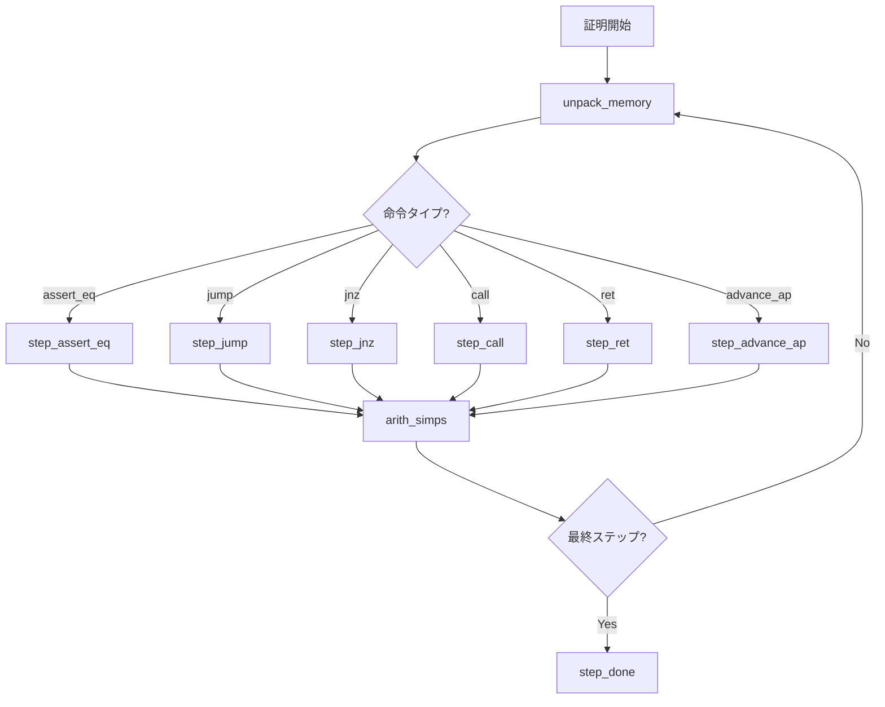
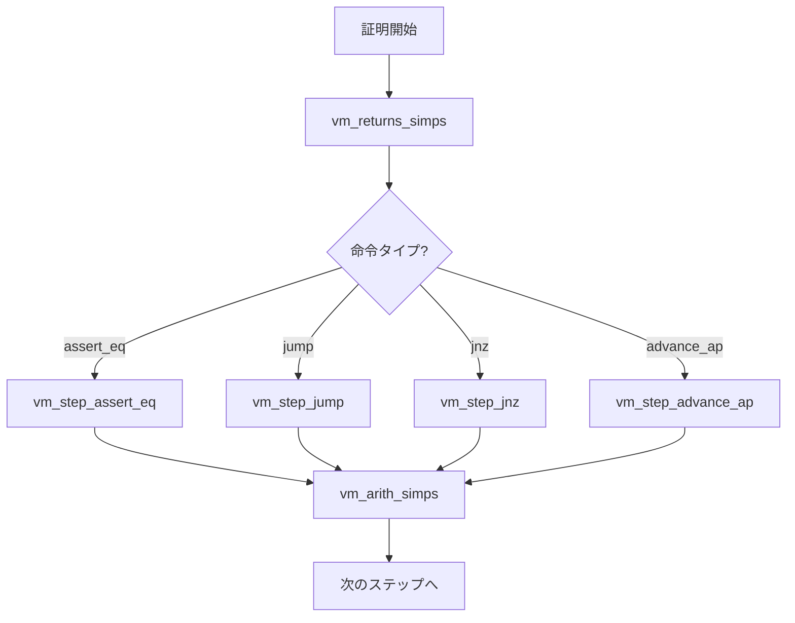

# 付録A: タクティック一覧

本付録では、本プロジェクトで使用するタクティックを解説します。Lean 4標準タクティック、Mathlibタクティック、およびプロジェクト固有のカスタムタクティックに分類して紹介します。

---

## A.1 Lean 4標準タクティック

### 基本タクティック

| タクティック     | 説明                             | 使用例                  |
| :--------------- | :------------------------------- | :---------------------- |
| `intro`          | 仮定を導入する                   | `intro h`               |
| `exact`          | 項を直接与えて証明を終える       | `exact h`               |
| `apply`          | 定理や補題を適用する             | `apply some_theorem`    |
| `have`           | 中間ゴールを導入する             | `have h : P := ...`     |
| `let`            | 局所定義を導入する               | `let x := 5`            |
| `show`           | ゴールを明示的に書き換える       | `show P ∧ Q`            |
| `constructor`    | 構造体やAnd/Existsを構築         | `constructor`           |
| `cases`          | 場合分けを行う                   | `cases h with ...`      |
| `induction`      | 帰納法を適用する                 | `induction n with ...`  |
| `rfl`            | 定義による等式を証明             | `rfl`                   |
| `rw`             | 等式による書き換え               | `rw [h]`                |
| `simp`           | 簡約ルールで単純化               | `simp [h1, h2]`         |
| `decide`         | 決定可能な命題を自動証明         | `decide`                |
| `trivial`        | 自明な証明を試みる               | `trivial`               |
| `assumption`     | 仮定から証明を見つける           | `assumption`            |
| `contradiction`  | 矛盾を導く                       | `contradiction`         |
| `exfalso`        | 偽から任意の命題を導く           | `exfalso`               |
| `funext`         | 関数等価性を示す                 | `funext x`              |
| `ext`            | 外延性による等価性証明           | `ext`                   |
| `congr`          | 合同性を利用した等式証明         | `congr`                 |
| `left` / `right` | Or命題の証明                     | `left`                  |
| `use`            | 存在量化子の証人を与える         | `use 5`                 |
| `obtain`         | 存在量化を分解                   | `obtain ⟨x, hx⟩ := h`   |
| `rcases`         | パターンマッチで分解             | `rcases h with ⟨a, b⟩`  |
| `rintro`         | パターンマッチで導入             | `rintro ⟨a, b⟩`         |
| `by_contra`      | 背理法                           | `by_contra h`           |
| `by_cases`       | 排中律による場合分け             | `by_cases h : P`        |
| `push_neg`       | 否定を内側に移動                 | `push_neg`              |
| `first`          | 最初に成功したタクティックを使用 | `first \| tac1 \| tac2` |
| `repeat`         | タクティックを繰り返し適用       | `repeat apply h`        |
| `all_goals`      | 全ゴールに適用                   | `all_goals simp`        |
| `any_goals`      | いずれかのゴールに適用           | `any_goals trivial`     |
| `try`            | 失敗しても続行                   | `try simp`              |
| `focus`          | 最初のゴールに集中               | `focus tac`             |
| `done`           | 証明完了を確認                   | `done`                  |

### 等式・算術タクティック

| タクティック | 説明                 | 使用例       |
| :----------- | :------------------- | :----------- |
| `ring`       | 環での等式を自動証明 | `ring`       |
| `ring_nf`    | 環の正規形に変換     | `ring_nf`    |
| `linarith`   | 線形算術を自動証明   | `linarith`   |
| `nlinarith`  | 非線形算術を自動証明 | `nlinarith`  |
| `omega`      | 整数算術を自動証明   | `omega`      |
| `norm_num`   | 数値計算を自動実行   | `norm_num`   |
| `norm_num1`  | 1ステップの数値計算  | `norm_num1`  |
| `norm_cast`  | 型変換を正規化       | `norm_cast`  |
| `field_simp` | 体での分数を単純化   | `field_simp` |

---

## A.2 Mathlibタクティック

### 一般的なタクティック

| タクティック     | 説明                   | 使用例              |
| :--------------- | :--------------------- | :------------------ |
| `positivity`     | 正値性を自動証明       | `positivity`        |
| `interval_cases` | 区間内の整数で場合分け | `interval_cases n`  |
| `fin_cases`      | 有限型で場合分け       | `fin_cases x`       |
| `aesop`          | 自動証明探索           | `aesop`             |
| `refine`         | 穴あき証明を構築       | `refine ⟨?_, ?_⟩`   |
| `convert`        | 弱い等価性で適用       | `convert h using 1` |
| `gcongr`         | 不等式の単調性         | `gcongr`            |
| `calc`           | 計算列を記述           | `calc a = b := ...` |
| `trans`          | 推移律を適用           | `trans b`           |
| `symm`           | 対称性を適用           | `symm`              |
| `ac_refl`        | 結合・可換による等価性 | `ac_refl`           |

### 集合・論理タクティック

| タクティック | 説明                       | 使用例           |
| :----------- | :------------------------- | :--------------- |
| `simp only`  | 指定したルールのみで単純化 | `simp only [h]`  |
| `simp_all`   | 全仮定を使って単純化       | `simp_all`       |
| `tauto`      | トートロジーを自動証明     | `tauto`          |
| `set`        | 局所的に変数を導入         | `set x := a + b` |
| `subst`      | 等式で置換                 | `subst h`        |

---

## A.3 プロジェクト固有タクティック

本プロジェクトでは、健全性・完全性証明を効率化するためのカスタムタクティックを定義しています。

### A.3.1 健全性証明用タクティック（Hoare.lean）

#### step_assert_eq

```lean
-- 定義場所: Semantics/Soundness/Hoare.lean:590-605
macro "step_assert_eq" h:term " with " hw:ident : tactic
macro "step_assert_eq" h:term "," h':term " with " hw:ident : tactic
```

**目的**: `assert_eq`命令（`[dst] = res`のアサーション）のステップを証明

**使用例**:

```lean
step_assert_eq hmem with hwrite
```

**動作**:

1. `ensuresb_make_succ`でboundを増加
2. `apply ensuresb_step_assert_eq`を適用
3. メモリ書き込み仮説`hwrite`を導入

#### step_jump

```lean
-- 定義場所: Semantics/Soundness/Hoare.lean:607-612
macro "step_jump" h:term : tactic
```

**目的**: 無条件ジャンプ命令のステップを証明

**使用例**:

```lean
step_jump hmem
```

**動作**:

1. `ensuresb_make_succ`でboundを増加
2. `apply ensuresb_step_jump`を適用
3. メモリ仮説でpc更新を確認

#### step_jump_imm

```lean
-- 定義場所: Semantics/Soundness/Hoare.lean:614-622
macro "step_jump_imm" h:term "," h':term : tactic
```

**目的**: 即値付きジャンプ命令（`jmp abs [imm]`）のステップを証明

**使用例**:

```lean
step_jump_imm hmem, himm
```

#### step_jnz

```lean
-- 定義場所: Semantics/Soundness/Hoare.lean:624-646
macro "step_jnz" h:term " with " hw:ident hw':ident : tactic
macro "step_jnz" h:term "," h':term " with " hw:ident hw':ident : tactic
```

**目的**: 条件付きジャンプ命令（`jnz`）のステップを証明

**使用例**:

```lean
step_jnz hmem with hcond hdst
```

**動作**:

- 条件値が非ゼロの場合: ジャンプを実行
- 条件値がゼロの場合: 次の命令へ
- `hw`: ゼロ判定の仮説、`hw'`: 宛先の仮説

#### step_call

```lean
-- 定義場所: Semantics/Soundness/Hoare.lean:648-652
macro "step_call" h:term : tactic
```

**目的**: 関数呼び出し命令のステップを証明

**使用例**:

```lean
step_call hmem
```

**動作**:

- fp、戻りアドレスをスタックにプッシュ
- 新しいfpを設定
- 呼び出し先にジャンプ

#### step_ret

```lean
-- 定義場所: Semantics/Soundness/Hoare.lean:654-658
macro "step_ret" h:term : tactic
```

**目的**: 関数復帰命令のステップを証明

**使用例**:

```lean
step_ret hmem
```

**動作**:

- 旧pcを復元（戻りアドレス）
- 旧fpを復元
- 呼び出し元に戻る

#### step_advance_ap

```lean
-- 定義場所: Semantics/Soundness/Hoare.lean:660-672
macro "step_advance_ap" h:term : tactic
macro "step_advance_ap" h:term "," h':term : tactic
```

**目的**: `ap += <offset>`命令のステップを証明

**使用例**:

```lean
step_advance_ap hmem
```

#### step_done

```lean
-- 定義場所: Semantics/Soundness/Hoare.lean:674-675
macro "step_done" : tactic
```

**目的**: 証明の終了（停止状態到達）を示す

**使用例**:

```lean
step_done
```

**動作**:

1. `ensuresb_make_succ`
2. `apply ensuresb_id`

### A.3.2 補助タクティック（Hoare.lean）

#### arith_simps

```lean
-- 定義場所: Semantics/Soundness/Hoare.lean:524-540
macro "arith_simps" : tactic
macro "arith_simps_at" loc:ident : tactic
```

**目的**: 算術式を単純化（fp/ap/pcオフセット計算）

**動作**: `simp only`で以下のルールを適用:

- `add_sub_cancel`
- `sub_add_cancel`
- `Int.ofNat_add`
- `Int.ofNat_sub`

#### ensures_simps

```lean
-- 定義場所: Semantics/Soundness/Hoare.lean:542-566
macro "ensures_simps" : tactic
macro "ensures_simps_at" loc:ident : tactic
```

**目的**: Ensures述語を展開・単純化

**動作**:

- `Ensures`/`EnsuresRet`の定義を展開
- `IsHaltingTrace`/`IsHaltingState`を展開
- レジスタアクセスを単純化

#### unpack_memory

```lean
-- 定義場所: Semantics/Soundness/Hoare.lean:568-578
macro "unpack_memory" code:ident " at " loc:ident : tactic
macro "unpack_memory" code:ident " at " loc:ident " with " pat:rcasesPat : tactic
```

**目的**: コードメモリの内容を展開

**使用例**:

```lean
unpack_memory code at h with ⟨h_pc, h_instr⟩
```

#### next_memory

```lean
-- 定義場所: Semantics/Soundness/Hoare.lean:580-583
macro "next_memory" loc:ident " with " instr:ident : tactic
```

**目的**: 次のメモリ位置の命令を取得

#### ensuresb_make_succ

```lean
-- 定義場所: Semantics/Soundness/Hoare.lean:585-588
macro "ensuresb_make_succ" : tactic
```

**目的**: `Ensuresb`のboundを増やす（帰納法のステップ）

**動作**:

```lean
first
  | apply Nat.succ.inj; assumption
  | omega
```

#### use_only

```lean
-- 定義場所: Semantics/Soundness/Hoare.lean:677-679
macro "use_only" es:term,+ : tactic
```

**目的**: `use`の弱いバージョン（`triv`や`rfl`を呼ばない）

**使用例**:

```lean
use_only x, y
```

#### norm_num2

```lean
-- 定義場所: Semantics/Soundness/Hoare.lean:682-683
macro "norm_num2" : tactic
```

**目的**: `norm_num1`を実行し、`add_neg_eq_sub`で正規化

#### rc_app

```lean
-- 定義場所: Semantics/Soundness/Hoare.lean:688-699
macro "rc_app" h_rc:ident x:num tv:ident rc:ident : tactic
```

**目的**: レンジチェック仮説を適用

**使用例**:

```lean
rc_app h_rc 0 val rc
```

#### unwrap_hyp

```lean
-- 定義場所: Semantics/Soundness/Hoare.lean:701-715
macro "unwrap_hyp" "at" h:ident " as " h':ident : tactic
```

**目的**: Option型の仮説をアンラップ

**使用例**:

```lean
unwrap_hyp at h as h'
```

#### mkdef

```lean
-- 定義場所: Semantics/Soundness/Hoare.lean:717-722
macro "mkdef " h:ident " : " x:ident " = " t:term : tactic
```

**目的**: 定義と等式を同時に導入

**使用例**:

```lean
mkdef hx : x = a + b
```

### A.3.3 完全性証明用タクティック（VmHoare.lean）

#### vm_arith_simps

```lean
-- 定義場所: Semantics/Completeness/VmHoare.lean:439-448
macro "vm_arith_simps" : tactic
```

**目的**: VM算術式を単純化

#### vm_returns_simps

```lean
-- 定義場所: Semantics/Completeness/VmHoare.lean:450-477
macro "vm_returns_simps" : tactic
```

**目的**: Returns述語を展開・単純化

#### vm_step_assert_eq

```lean
-- 定義場所: Semantics/Completeness/VmHoare.lean:479-488
macro "vm_step_assert_eq" h:term : tactic
macro "vm_step_assert_eq" h:term "," h':term : tactic
```

**目的**: VMレベルでの`assert_eq`ステップを証明

#### vm_step_jump

```lean
-- 定義場所: Semantics/Completeness/VmHoare.lean:490-494
macro "vm_step_jump" h:term : tactic
```

**目的**: VMレベルでのジャンプステップを証明

#### vm_step_jump_imm

```lean
-- 定義場所: Semantics/Completeness/VmHoare.lean:496-504
macro "vm_step_jump_imm" h:term "," h':term : tactic
```

**目的**: VMレベルでの即値ジャンプステップを証明

#### vm_step_jnz

```lean
-- 定義場所: Semantics/Completeness/VmHoare.lean:506-522
macro "vm_step_jnz" h:term : tactic
macro "vm_step_jnz" h:term "," h':term : tactic
```

**目的**: VMレベルでの条件分岐ステップを証明

#### vm_step_advance_ap

```lean
-- 定義場所: Semantics/Completeness/VmHoare.lean:524-530
macro "vm_step_advance_ap" h:term "," h':term : tactic
```

**目的**: VMレベルでのap増加ステップを証明

### A.3.4 その他のカスタムタクティック

#### simp_int_casts（Util.lean）

```lean
-- 定義場所: Semantics/Util.lean:34-36
macro "simp_int_casts" : tactic
macro "simp_int_casts_at" h:ident : tactic
```

**目的**: 整数型変換を単純化

#### simp_int_nat_offset（Common.lean）

```lean
-- 定義場所: Libfuncs/Common.lean:10-14
macro "simp_int_nat_offset" : tactic
```

**目的**: 整数/自然数オフセット計算を単純化

#### abs_lt_tac（Assembly.lean）

```lean
-- 定義場所: Semantics/Assembly.lean:17-19
macro "abs_lt_tac" : tactic
```

**目的**: 絶対値の範囲証明を自動化

#### casm_cleanup_tac（Assembly.lean）

```lean
-- 定義場所: Semantics/Assembly.lean:580-581
macro "casm_cleanup_tac" : tactic
```

**目的**: Casmコード生成後のクリーンアップ

---

## A.4 タクティック選択ガイド

### 健全性証明での典型的なフロー



### 完全性証明での典型的なフロー



### 状況別タクティック推奨

| 状況             | 推奨タクティック                       |
| :--------------- | :------------------------------------- |
| 数値等式の証明   | `norm_num`, `ring`, `omega`            |
| 有限体での計算   | `ring`, `field_simp`                   |
| 不等式の証明     | `linarith`, `omega`                    |
| 論理的な分解     | `rcases`, `obtain`, `cases`            |
| 帰納法           | `induction`, `Nat.strong_induction_on` |
| 構造体の等価性   | `ext`, `congr`                         |
| 停止状態への到達 | `step_done`, `ensuresb_id`             |

---

## A.5 タクティックのデバッグ

### よくあるエラーと対処法

#### 1. `step_*`タクティックが失敗する

**原因**: メモリ仮説が正しくない、または命令タイプが一致しない

**対処法**:

```lean
-- メモリ内容を確認
#check h_mem
-- 命令タイプを確認
simp only [code] at h_mem
```

#### 2. `arith_simps`で解決しない

**原因**: 複雑な算術式、または特殊な変換が必要

**対処法**:

```lean
-- 手動で書き換え
rw [Int.add_comm]
arith_simps
-- または直接計算
omega
```

#### 3. `ensures_simps`が無限ループする

**原因**: 自己参照的な定義

**対処法**:

```lean
-- 限定的に展開
simp only [Ensures] at h
-- 展開せずに直接適用
apply ensures_step
```

---

## A.6 まとめ

本プロジェクトのカスタムタクティックは、Cairo VM検証の定型作業を自動化するために設計されています：

1. **健全性証明**: `step_*`系タクティックで各命令の効果を証明
2. **完全性証明**: `vm_step_*`系タクティックでVM動作を追跡
3. **算術処理**: `arith_simps`でオフセット計算を自動化
4. **メモリ操作**: `unpack_memory`でコード内容を展開

これらを組み合わせることで、libfunc検証の証明を効率的に構築できます。
