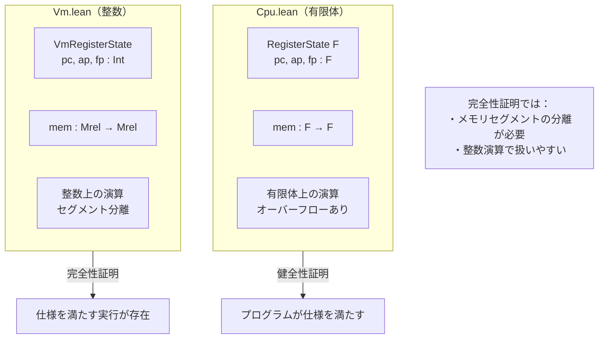
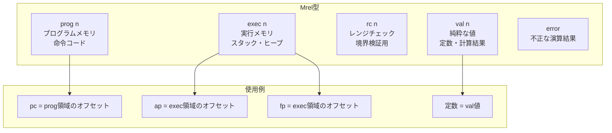
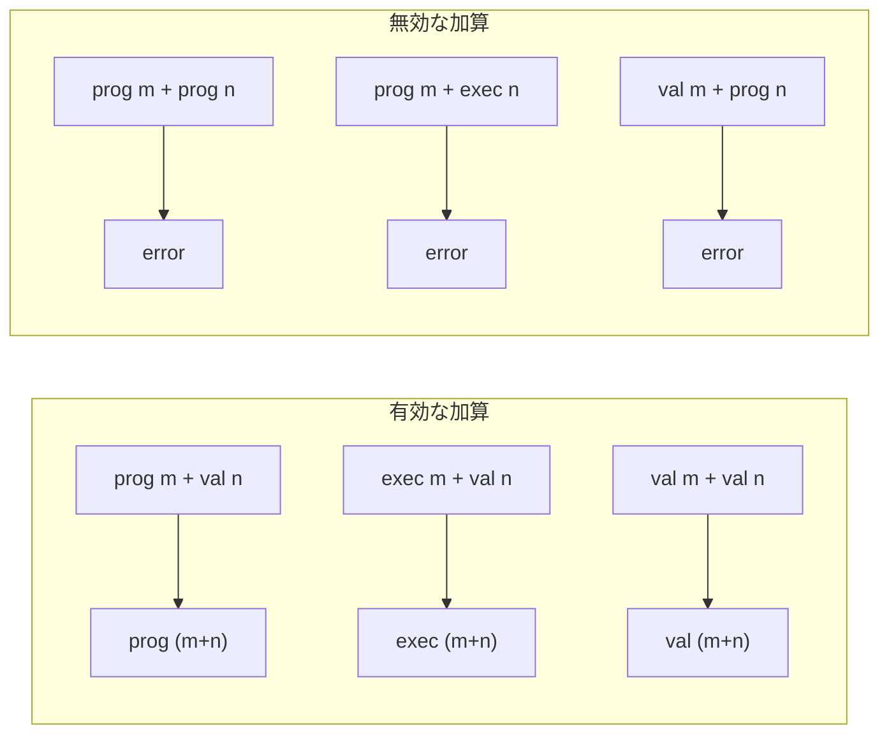
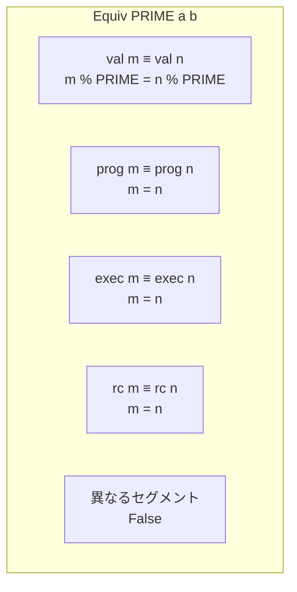
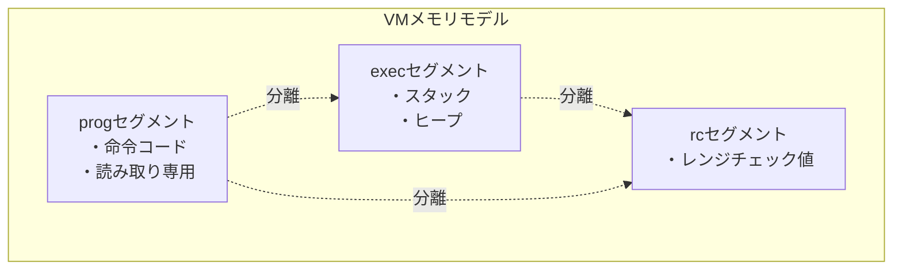

# 第7章: VM抽象セマンティクス (Vm.lean)

## 7.1 概要

本章では、Cairo仮想マシンの抽象セマンティクスを定義する`Vm.lean`ファイルを詳細に解説します。このファイルは、第6章で学んだCPUセマンティクスを完全性証明に適した形で再定義しています。

### 本章の目標

- `Mrel`型（Maybe Relocatable）の理解
- `VmRegisterState`と`RegisterState`の違いを理解
- `Equiv`述語による等価性判定を学ぶ
- VM版の状態遷移関数を理解する

### なぜVM抽象化が必要か



### ソースファイル

```
Verification/Semantics/Vm.lean
```

## 7.2 Mrel型（Maybe Relocatable）

### 7.2.1 定義

```lean
-- Vm.lean:20-26
inductive Mrel
  | prog : Int → Mrel  -- プログラムセグメント
  | exec : Int → Mrel  -- 実行セグメント
  | rc : Int → Mrel    -- レンジチェックセグメント
  | val : Int → Mrel   -- 純粋な整数値
  | error : Mrel       -- エラー状態
  deriving DecidableEq
```

### 7.2.2 セグメント構造図



### 7.2.3 各コンストラクタの意味

| コンストラクタ | 意味                                | 例                      |
| :------------- | :---------------------------------- | :---------------------- |
| `prog n`       | プログラムセグメントのアドレスn     | 命令アドレス            |
| `exec n`       | 実行セグメントのアドレスn           | スタック/ヒープアドレス |
| `rc n`         | レンジチェックセグメントのアドレスn | 検証用メモリ            |
| `val n`        | 純粋な整数値n                       | 定数、計算結果          |
| `error`        | 不正な演算の結果                    | 型エラー                |

## 7.3 Mrelの演算

### 7.3.1 加算（add）

```lean
-- Vm.lean:30-35
def add : Mrel → Mrel → Mrel
  | prog m, val n => prog (m + n)
  | exec m, val n => exec (m + n)
  | rc m,   val n => rc (m + n)
  | val m,  val n => val (m + n)
  | _,      _     => error
```

**重要なポイント**:

- アドレス + 値 = 同じセグメントのアドレス
- 値 + 値 = 値
- それ以外 = error



### 7.3.2 乗算（mul）

```lean
-- Vm.lean:37-39
def mul : Mrel → Mrel → Mrel
  | val m, val n => val (m * n)
  | _,     _     => error
```

**乗算は値同士のみ有効**:

- アドレスの乗算は意味を持たないため`error`

### 7.3.3 減算（sub）

```lean
-- Vm.lean:45-53
def sub : Mrel → Mrel → Mrel
  | val m,  val n  => val (m - n)
  | prog m, prog n => val (m - n)  -- 同セグメント内の距離
  | prog m, val n  => prog (m - n)
  | exec m, exec n => val (m - n)
  | exec m, val n  => exec (m - n)
  | rc m,   rc n   => val (m - n)
  | rc m,   val n  => rc (m - n)
  | _,      _      => error
```

**減算の特殊ルール**:

- 同じセグメントのアドレス同士の減算 → 値（距離）
- アドレス - 値 = アドレス

### 7.3.4 型判定述語

```lean
-- Vm.lean:55-69
def IsVal : Mrel → Prop
  | val _ => True
  | _     => False

def IsProg : Mrel → Prop
  | prog _ => True
  | _      => False

def IsExec : Mrel → Prop
  | exec _ => True
  | _      => False

def IsRc : Mrel → Prop
  | rc _ => True
  | _    => False
```

### 7.3.5 toInt関数

```lean
-- Vm.lean:71-76
def toInt : Mrel → Int
  | prog m => m
  | exec m => m
  | rc m   => m
  | val m  => m
  | error  => 0
```

**用途**: セグメント情報を無視して整数部分のみを取り出す

## 7.4 Equiv述語

### 7.4.1 定義

```lean
-- Vm.lean:110-115
def Equiv (PRIME : Int) : Mrel → Mrel → Prop
  | val m, val n => m % PRIME = n % PRIME
  | prog m, prog n => m = n
  | exec m, exec n => m = n
  | rc m, rc n => m = n
  | _, _ => False
```

### 7.4.2 等価性の意味



**重要なポイント**:

- `val`同士: PRIME剰余で比較（有限体の等価性をシミュレート）
- アドレス同士: 同じセグメントかつ同じオフセット
- 異なるセグメント: 等価にならない

### 7.4.3 Equivの性質

```lean
-- 反射性（valの場合のみ安全）
theorem Equiv.refl_val {PRIME : Int} (m : Int) :
    Equiv PRIME (val m) (val m) := rfl

-- 対称性
@[symm]
theorem Equiv.symm {PRIME : Int} {a b : Mrel}
    (h : Equiv PRIME a b) : Equiv PRIME b a := by ...

-- 推移性
@[trans]
theorem Equiv.trans {PRIME : Int} {a b c : Mrel}
    (h1 : Equiv PRIME a b) (h2 : Equiv PRIME b c) :
    Equiv PRIME a c := by ...
```

**注意**: `error`に対しては反射性が成り立たない

### 7.4.4 Agrees述語

```lean
-- Vm.lean:131-133
def Agrees (PRIME : Int) : Option Mrel → Mrel → Prop
  | some a, b => Equiv PRIME a b
  | none, _ => True
```

**`Option`型との組み合わせ**:

- `some a`: `Equiv`で比較
- `none`: 常に`True`（未定義は何にでも一致）

## 7.5 VmRegisterState構造体

### 7.5.1 定義

```lean
-- Vm.lean:137-141
@[ext]
structure VmRegisterState where
  pc : Int  -- offset to `prog`
  ap : Int  -- offset to `exec`
  fp : Int  -- offset to `exec`
```

### 7.5.2 RegisterStateとの比較

| 項目 | RegisterState F         | VmRegisterState              |
| :--- | :---------------------- | :--------------------------- |
| 型   | 型パラメータF（有限体） | 固定（Int）                  |
| pc   | F型の値                 | progセグメントへのオフセット |
| ap   | F型の値                 | execセグメントへのオフセット |
| fp   | F型の値                 | execセグメントへのオフセット |
| 用途 | 健全性証明              | 完全性証明                   |

## 7.6 VMセマンティクス関数

### 7.6.1 vmSize関数

```lean
-- Vm.lean:148
def vmSize : Int := i.op1Imm.toNat + 1
```

### 7.6.2 vmOp0関数

```lean
-- Vm.lean:150-151
def vmOp0 := cond i.op0Reg
  (mem (exec s.fp + val i.offOp0.toBiased16))
  (mem (exec s.ap + val i.offOp0.toBiased16))
```

**Cpu.leanとの違い**:

- ベースアドレスが`exec`セグメントとして明示
- オフセットが`val`型として追加

### 7.6.3 vmOp1関数

```lean
-- Vm.lean:153-159
def vmOp1 : Option Mrel :=
  match i.op1Imm, i.op1Fp, i.op1Ap with
    | false, false, false => some (mem (i.vmOp0 mem s + val i.offOp1.toBiased16))
    | true,  false, false => some (mem (prog (s.pc + i.offOp1.toBiased16)))
    | false, true,  false => some (mem (exec (s.fp + i.offOp1.toBiased16)))
    | false, false, true  => some (mem (exec (s.ap + i.offOp1.toBiased16)))
    | _,     _,     _     => none
```

**即値モードの違い**:

- Cpu.lean: `mem (s.pc + offset)`
- Vm.lean: `mem (prog (s.pc + offset))`（progセグメントを明示）

### 7.6.4 vmRes関数

```lean
-- Vm.lean:161-174
def vmResAux : Option Mrel := ...
def vmRes : Option Mrel := ...
```

構造はCpu.leanと同様ですが、`Mrel`型を使用します。

### 7.6.5 vmDst関数

```lean
-- Vm.lean:177-178
def vmDst :=
  cond i.dstReg
    (mem (exec s.fp + i.offDst.toBiased16))
    (mem (exec s.ap + i.offDst.toBiased16))
```

### 7.6.6 vmNextPc関数

```lean
-- Vm.lean:187-202
def vmNextPc : Option Int :=
  match i.pcJumpAbs, i.pcJumpRel, i.pcJnz with
    | false, false, false => some (s.pc + i.vmSize)
    | true,  false, false => (i.vmRes mem s).map Mrel.toInt
    | false, true,  false =>
        match i.vmRes mem s with
          | some res => some (s.pc + res.toInt)
          | none     => none
    | false, false, true  =>
        if i.vmDst mem s = 0 then
          some (s.pc + i.vmSize)
        else
          match i.vmOp1 mem s with
            | some op1 => some (s.pc + op1.toInt)
            | none     => none
    | _,     _,     _     => none
```

**戻り値が`Option Int`である理由**:

- pcはprogセグメントへの整数オフセット
- セグメント情報は不要なのでIntを直接返す

## 7.7 VmAsserts述語

### 7.7.1 定義

```lean
-- Vm.lean:253-261
def VmAsserts : Prop :=
  match i.opcodeCall, i.opcodeRet, i.opcodeAssertEq with
    | false, false, false => True
    | true,  false, false =>
        i.vmOp0 mem s = prog (s.pc + i.vmSize) ∧ i.vmDst mem s = exec s.fp
    | false, true, false => True
    | false, false, true =>
        Mrel.Agrees PRIME (i.vmRes mem s) (i.vmDst mem s)
    |  _, _, _ => True
```

### 7.7.2 call命令の制約の詳細

```lean
i.vmOp0 mem s = prog (s.pc + i.vmSize) ∧ i.vmDst mem s = exec s.fp
```

- `vmOp0 = prog (pc + size)`: 戻りアドレスがprogセグメント
- `vmDst = exec fp`: 旧fpがexecセグメント

**型安全性**: セグメント情報により不正なアドレス使用を防止

## 7.8 VmNextState述語

### 7.8.1 命令レベル

```lean
-- Vm.lean:265-268
protected def VmNextState : Prop :=
  (i.vmNextPc mem s).Agrees t.pc ∧
    (i.vmNextAp mem s).Agrees t.ap ∧
    (i.vmNextFp mem s).Agrees t.fp ∧
    i.VmAsserts PRIME mem s
```

### 7.8.2 グローバルレベル

```lean
-- Vm.lean:272-274
def VmNextState (PRIME : Int) (mem : Mrel → Mrel)
    (s t : VmRegisterState) : Prop :=
  ∃ i : Instruction, mem (Mrel.prog s.pc) = Mrel.val ↑i.toNat ∧
    i.VmNextState PRIME mem s t
```

**デコード条件の違い**:

- Cpu.lean: `mem s.pc = i.toNat`
- Vm.lean: `mem (prog s.pc) = val i.toNat`

## 7.9 セグメント分離の利点

### 7.9.1 メモリ領域の独立性



### 7.9.2 完全性証明での活用

完全性証明では、以下を示す必要があります：

1. プログラムが変更されない（progセグメントの不変性）
2. スタック操作が他の領域に影響しない
3. レンジチェック値が独立に管理される

`Mrel`型により、これらの分離が型レベルで保証されます。

## 7.10 Cpu.leanとVm.leanの対応表

| Cpu.lean          | Vm.lean             | 違い               |
| :---------------- | :------------------ | :----------------- |
| `RegisterState F` | `VmRegisterState`   | 型パラメータの有無 |
| `mem : F → F`     | `mem : Mrel → Mrel` | セグメント情報     |
| `op0`             | `vmOp0`             | Mrel型を使用       |
| `op1`             | `vmOp1`             | progセグメント明示 |
| `res`             | `vmRes`             | Mrel型を使用       |
| `nextPc`          | `vmNextPc`          | Int型を返す        |
| `Asserts`         | `VmAsserts`         | Equiv/Agreesを使用 |
| `NextState`       | `VmNextState`       | PRIMEパラメータ    |

## 7.11 まとめ

### 重要なポイント

1. **Mrel型**: セグメント情報付きの値表現
2. **セグメント分離**: prog/exec/rc/valの4種類
3. **Equiv述語**: PRIME剰余での等価性判定
4. **VmRegisterState**: 整数ベースのレジスタ状態
5. **完全性証明への対応**: メモリ領域の独立性を保証

### 次章との関連

第8章「アセンブリ言語」では、`Instruction`構造体を人間が読みやすいアセンブリ構文で表現する方法を学びます。`Assembly.lean`では：

- 高レベルな命令表現（`Instr`型）
- アセンブリ構文のパーサ
- コード生成マクロ

## 7.12 演習問題

### 問題1

`exec 100 + val 5`の結果は何ですか？

<details>
<summary>解答</summary>

`exec 105`

execセグメントのアドレスにval値を加算すると、同じセグメント内でオフセットが増加します。

</details>

### 問題2

`prog 50 - prog 30`の結果は何ですか？

<details>
<summary>解答</summary>

`val 20`

同じセグメントのアドレス同士の減算は、その距離（整数値）を返します。

</details>

### 問題3

`Equiv PRIME (val 10) (val (10 + PRIME))`は成り立ちますか？

<details>
<summary>解答</summary>

成り立ちます。

```lean
Equiv PRIME (val 10) (val (10 + PRIME))
= 10 % PRIME = (10 + PRIME) % PRIME
= 10 % PRIME = 10 % PRIME  -- PRIMEの剰余なので
= True
```

</details>

### 問題4

なぜVmRegisterStateではpcが`Int`型で、`Mrel`型ではないのですか？

<details>
<summary>解答</summary>

pcは常にprogセグメントへのオフセットです。セグメント情報は固定（prog）なので、オフセットの整数部分だけを保持すれば十分です。

これにより：

- メモリ効率が良い
- 比較が単純になる
- pc計算（nextPc）の結果をそのまま格納できる

fpとapも同様で、常にexecセグメントへのオフセットです。

</details>
