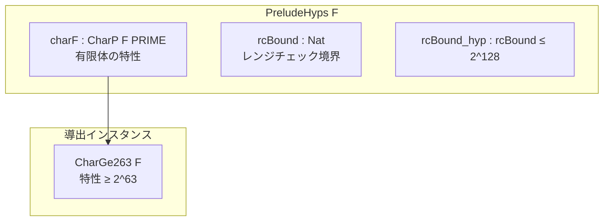

# 第9章: 健全性基盤 (Prelude.lean)

## 9.1 概要

本章では、健全性証明の前提条件を定義する`Prelude.lean`ファイルを詳細に解説します。このファイルは、Cairoの有限体の特性値PRIMEと、それに関連する補助定理を提供します。

### 本章の目標

- `PRIME`定数とその意味を理解する
- `PreludeHyps`型クラスの役割を学ぶ
- フィールド要素に関する基本的な補題を理解する

### ソースファイル

```
Verification/Semantics/Soundness/Prelude.lean
```

## 9.2 PRIME定数

### 9.2.1 定義

```lean
-- Prelude.lean:7-8
def PRIME :=
  3618502788666131213697322783095070105623107215331596699973092056135872020481
```

### 9.2.2 PRIMEの性質

```lean
-- Prelude.lean:10-13
theorem PRIME_gt : PRIME > 2 ^ 251 := by simp [PRIME]
theorem PRIME_pos : 0 < PRIME := by rw [PRIME]; norm_num1
theorem PRIME_sub_one_lt : PRIME - 1 < PRIME := by rw [PRIME]; norm_num1
```

**PRIMEの特徴**:

- 約252ビットの素数
- Cairo VMの有限体で使用される標準的な素数
- Stark曲線（secp256k1相当）に関連

### 9.2.3 PRIMEの値（参考）

```
PRIME = 2^251 + 17 * 2^192 + 1
     ≈ 3.6 × 10^75
```

## 9.3 PreludeHyps型クラス

### 9.3.1 定義

```lean
-- Prelude.lean:15-19
class PreludeHyps (F : Type _) [Field F] where
  [charF : CharP F PRIME]
  rcBound : Nat
  rcBound_hyp : rc_bound ≤ 2 ^ 128
```

### 9.3.2 各フィールドの説明

| フィールド    | 型                 | 意味               |
| :------------ | :----------------- | :----------------- |
| `charF`       | `CharP F PRIME`    | 体Fの特性がPRIME   |
| `rcBound`     | `Nat`              | レンジチェック境界 |
| `rcBound_hyp` | `rc_bound ≤ 2^128` | 境界の制約         |

### 9.3.3 型クラス構造図



### 9.3.4 CharGe263インスタンス

```lean
-- Prelude.lean:25-29
instance char_ge [ph : PreludeHyps F] : CharGe263 F := by
  have : ringChar F ≥ 2 ^ 63 := by
    rw [@ringChar.eq F _ PRIME ph.charF, PRIME]
    norm_num1
  exact ⟨this⟩
```

**CharGe263の意味**: 体の特性が2^63以上であることの保証

## 9.4 rcBound関連

### 9.4.1 境界の利用

```lean
-- Prelude.lean:35
def rcBound_hyp (F : Type _) [Field F] [PreludeHyps F] := @PreludeHyps.rcBound_hyp F _ _
```

### 9.4.2 境界に関する定理

```lean
-- Prelude.lean:37-40
theorem two_mul_rcBound_lt_PRIME (F : Type _) [Field F] [PreludeHyps F] :
    2 * rcBound F < PRIME :=
  by apply lt_of_le_of_lt (Nat.mul_le_mul_left 2 (rcBound_hyp F)); rw [PRIME]; norm_num1

theorem rcBound_lt_PRIME : rcBound F < PRIME := by linarith [two_mul_rcBound_lt_PRIME F]
```

**実用上の意味**:

- `rcBound ≤ 2^128`なので、`2 * rcBound ≤ 2^129 < PRIME`
- レンジチェック値がPRIME内に収まることを保証

## 9.5 PRIME名前空間の定理群

### 9.5.1 特性関連

```lean
-- Prelude.lean:44-46
theorem char_eq : ringChar F = PRIME := ringChar.eq F PRIME
theorem char_pos : 0 < ringChar F := by rw [@ringChar.eq F _ PRIME _, PRIME]; norm_num
```

### 9.5.2 キャスト単射性

```lean
-- Prelude.lean:48-49
theorem nat_coe_field_inj {a b : ℕ} (ha : a < PRIME) (hb : b < PRIME)
    (h : (a : F) = (b : F)) : a = b := by
  apply Nat.cast_inj_of_lt_char _ _ h <;> rwa [PRIME.char_eq]
```

**意味**: PRIME未満の自然数は、体への埋め込みが単射

### 9.5.3 整数キャスト単射性

```lean
-- Prelude.lean:51-52
theorem int_coe_inj {i j : ℤ} (h : (i : F) = (j : F))
    (h' : abs (j - i) < PRIME) : i = j :=
  Int.cast_inj_of_lt_char charF h h'
```

### 9.5.4 ゼロ判定

```lean
-- Prelude.lean:54-62
theorem nat_coe_field_zero {x : F} {n : ℕ} (h_lt : n < PRIME) (h_cast : x = ↑n) :
    x = 0 → n = 0 := by ...

theorem nat_coe_field_ne_zero {x : F} {n : ℕ} (h_lt : n < PRIME) (h_cast : x = ↑n) :
    n ≠ 0 → x ≠ 0 := by ...

theorem nat_coe_field_iff_ne_zero {x : F} {n : ℕ} (h_lt : n < PRIME) (h_cast : x = ↑n) :
    n ≠ 0 ↔ x ≠ 0 := by ...
```

### 9.5.5 乗算逆元

```lean
-- Prelude.lean:72-85
theorem nat_cast_mul_eq_one {m n : ℕ} (h : m * n % PRIME = 1) :
    ↑m * ↑n = (1 : F) := by ...

theorem int_cast_mul_eq_one {m n : ℤ} (h : m * n % PRIME = 1) :
    ↑m * ↑n = (1 : F) := by ...
```

### 9.5.6 非ゼロ性

```lean
-- Prelude.lean:92-103
theorem nat_cast_ne_zero {n : ℕ} (h_nz : n ≠ 0) (h_lt : n < PRIME) :
    (n : F) ≠ 0 := by ...

theorem cast_ne_zero (x : ℤ) (h_nz : x ≠ 0) (h_lt : x.natAbs < PRIME) :
    (x : F) ≠ 0 := by ...
```

### 9.5.7 除算

```lean
-- Prelude.lean:105-111
theorem div_eq_const {a b c : ℤ} (h_nz : (b : F) ≠ 0) :
    (c * b - a) % ↑PRIME = 0 → (a / b : F) = c := by ...
```

### 9.5.8 特定の非ゼロ定理

```lean
-- Prelude.lean:115-129
theorem two_ne_zero : (2 : F) ≠ 0 := by ...
theorem four_ne_zero : (4 : F) ≠ 0 := by ...
```

## 9.6 補助定理

### 9.6.1 冪等性からの帰結

```lean
-- Prelude.lean:135-141
theorem eq_zero_or_eq_one_of_mul_eq_self {R : Type _} [Ring R] [NoZeroDivisors R]
    {x : R} (h : x * x = x) : x = 0 ∨ x = 1 := by
  have : x * (x - 1) = 0 := by
    rw [mul_sub, mul_one, h, sub_self]
  rcases eq_zero_or_eq_zero_of_mul_eq_zero this with h | h
  . left; exact h
  . right; rw [eq_of_sub_eq_zero h]
```

**用途**: フラグビット（0または1）の性質を証明する際に使用

## 9.7 使用例

### 9.7.1 健全性証明での使用

```lean
variable {F : Type} [Field F] [DecidableEq F] [PreludeHyps F]

-- PRIMEの特性を使用
example : ringChar F = PRIME := PRIME.char_eq

-- レンジチェック境界を使用
example : rcBound F ≤ 2 ^ 128 := rcBound_hyp F

-- キャスト単射性を使用
example {a b : ℕ} (ha : a < PRIME) (hb : b < PRIME) (h : (a : F) = b) :
    a = b := PRIME.nat_coe_field_inj ha hb h
```

### 9.7.2 libfunc検証での使用

```lean
-- u128_limit < PRIME の確認
theorem u128Limit_lt_PRIME : u128Limit < PRIME := by
  simp [PRIME, u128Limit]; norm_num1

-- 非ゼロ性の使用
theorem u128Limit_coe_ne_zero : (u128Limit : F) ≠ 0 :=
  PRIME.nat_coe_field_ne_zero u128Limit_lt_PRIME rfl u128Limit_ne_zero
```

## 9.8 まとめ

### 重要なポイント

1. **PRIME**: Cairo有限体の特性値（約252ビット）
2. **PreludeHyps**: 有限体の性質とレンジチェック境界を束ねる型クラス
3. **CharGe263**: 特性が2^63以上であることの保証
4. **キャスト定理群**: 自然数/整数と体要素の関係

### 次章との関連

第10章「Hoare論理実装」では、これらの前提条件を基にして、健全性証明の核心部分を学びます。特に`CharGe263`は命令の一意性証明で重要な役割を果たします。

## 9.9 演習問題

### 問題1

なぜ`rcBound ≤ 2^128`という制約が必要ですか？

<details>
<summary>解答</summary>

Cairo VMでは、u128型（128ビット符号なし整数）が基本的なデータ型です。レンジチェックは値がu128範囲内にあることを検証するため、`rcBound ≤ 2^128`という制約が自然に要求されます。

また、`2 * rcBound < PRIME`を保証することで、レンジチェック値の加算がオーバーフローしないことを確保しています。

</details>

### 問題2

`CharGe263`が必要な理由を説明してください。

<details>
<summary>解答</summary>

`CharGe263`（特性 ≥ 2^63）は以下の目的で使用されます：

1. **命令の一意性**: 63ビットの命令エンコーディングが体内で一意に表現される
2. **オフセット計算**: 16ビットオフセットの計算が安全に行える
3. **整数値の保存**: 合理的なサイズの整数値が体に埋め込み可能

PRIME > 2^251 なので、CharGe263は自動的に満たされます。

</details>

### 問題3

`nat_coe_field_inj`定理の前提条件`a < PRIME`と`b < PRIME`はなぜ必要ですか？

<details>
<summary>解答</summary>

有限体Fでは、`a`と`a + PRIME`は同じ要素にマップされます。したがって、キャストの単射性は、値がPRIME未満の場合にのみ成り立ちます。

例：PRIMEが5の場合

- `(3 : F) = (8 : F)`（両方とも3に等しい）
- しかし`3 ≠ 8`

前提条件により、このような衝突を排除しています。

</details>
