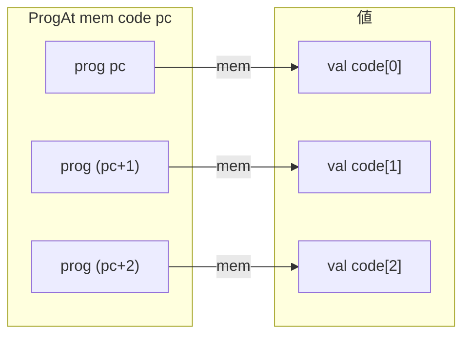
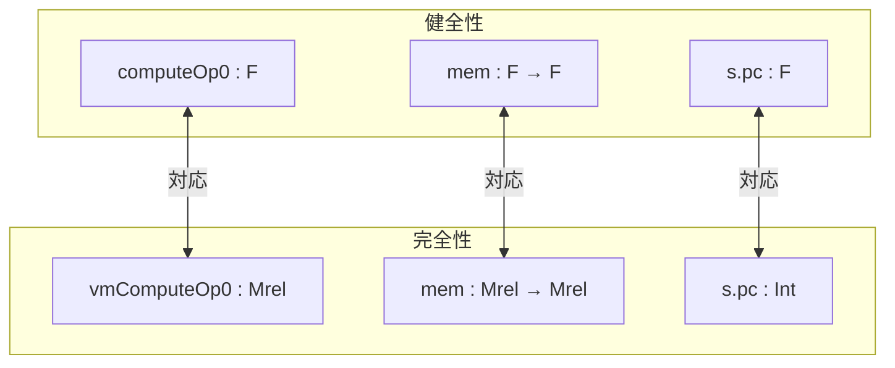
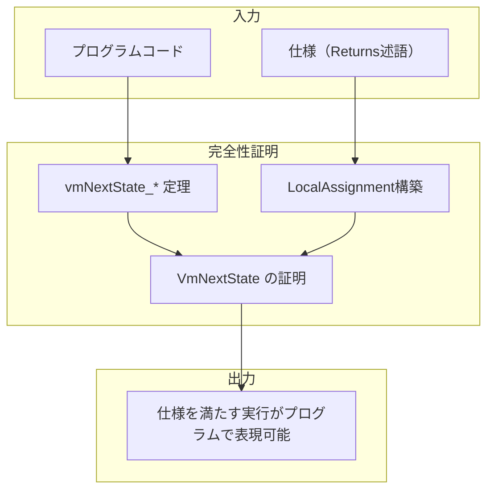

# 第12章: 完全性証明基盤 (Completeness/VmAssembly.lean)

## 12.1 概要

本章では、完全性証明のためのVM（仮想マシン）レベルのアセンブリ基盤を解説する。健全性証明（第9-11章）が「プログラムが仕様を満たす」ことを示すのに対し、完全性証明は「仕様を満たす全ての実行がプログラムで表現可能」であることを示す。

### 本章の目的

- `ProgAt`述語とVMレベルのメモリ表現を理解する
- 健全性証明との違いを把握する
- `vm_casm_code_def`マクロの役割を学ぶ

### 対象ファイル

- `Verification/Semantics/Completeness/VmAssembly.lean` (64行)
- `Verification/Semantics/Completeness/VmAssemblyStep.lean` (297行)

### 前提知識

- VM抽象セマンティクス（第7章）
- アセンブリ言語（第8章）
- 健全性のアセンブリステップ（第11章）

---

## 12.2 健全性と完全性の関係

### 12.2.1 二重の証明アプローチ


### 12.2.2 型の違い

| 側面         | 健全性            | 完全性                 |
| :----------- | :---------------- | :--------------------- |
| メモリ型     | `F → F`           | `Mrel → Mrel`          |
| レジスタ状態 | `RegisterState F` | `VmRegisterState`      |
| 値の型       | 体の要素 `F`      | `Mrel`（多重線形関係） |
| アドレス表現 | 体の要素          | `Mrel`セグメント       |

---

## 12.3 ProgAt述語

### 12.3.1 定義

```lean
def ProgAt (mem : Mrel → Mrel) : List Int → Int → Prop
  | [], _       => true
  | (v :: l), pc => mem (prog pc) = val v ∧ ProgAt mem l (pc + 1)
```

### 12.3.2 MemAtとの比較

健全性の`MemAt`:

```lean
def MemAt {F : Type*} [Field F] (mem : F → F) : List F → F → Prop
  | [], _       => True
  | v::l, pc    => mem pc = v ∧ MemAt mem l (pc + 1)
```

完全性の`ProgAt`:

```lean
def ProgAt (mem : Mrel → Mrel) : List Int → Int → Prop
  | [], _       => true
  | (v :: l), pc => mem (prog pc) = val v ∧ ProgAt mem l (pc + 1)
```

**主な違い**:

- `ProgAt`は`prog`セグメントを明示的に使用
- 値は`val`コンストラクタでラップ
- 整数型`Int`を使用（体の要素ではなく）

### 12.3.3 図解



---

## 12.4 vm_casm_code_defマクロ

### 12.4.1 定義

```lean
elab "vm_casm_code_def" e:ident " := " "{" instrs:casm_instr* "}" : command => do
  elabCommand <| <-
    `(command| def $e : List Int := casm_code!{ $instrs:casm_instr* })
  elabCommand <| <- `(command| namespace $e)
  -- 各命令に対してhmem定理を生成
  ...
  elabCommand <| <- `(command| end $e)
```

### 12.4.2 健全性版との比較

**健全性版** (`casm_code_def`):

```lean
casm_code_def my_code := { ... }
-- 生成: def my_code {F : Type*} [Field F] : List F := ...
```

**完全性版** (`vm_casm_code_def`):

```lean
vm_casm_code_def my_code := { ... }
-- 生成: def my_code : List Int := ...
```

### 12.4.3 生成される補題

```lean
-- vm_instr_def0: 最初の命令
theorem hmem0 {mem : Mrel → Mrel} {pos : Int}
    (hmem : ProgAt mem code pos) :
    mem (prog pos) = val instr := ...

-- vm_instr_def: 後続の命令
theorem hmemN {mem : Mrel → Mrel} {pos : Int}
    (hmem : ProgAt mem code pos) :
    mem (prog (pos + N)) = Mrel.val instr := ...
```

---

## 12.5 VmAssemblyStep.lean

### 12.5.1 Instr.VmNextState

```lean
def Instr.VmNextState (PRIME : Int) (i : Instr) (mem : Mrel → Mrel)
    (s t : VmRegisterState) :=
  i.toInstruction.VmNextState PRIME mem s t
```

これは健全性の`Instr.NextState`に対応するVM版である。

### 12.5.2 intClip'関数

```lean
def intClip' (x : Int) : Int := natClip x - 2 ^ 15
```

健全性版の`intClip`（体の要素を返す）とは異なり、整数を返す。

### 12.5.3 VM計算関数

```lean
@[simp] def vmComputeOp0 : Op0Spec → Mrel
  | Op0Spec.ap_plus i => mem (exec (s.ap + intClip' i))
  | Op0Spec.fp_plus i => mem (exec (s.fp + intClip' i))

@[simp] def vmComputeOp1 : Op1Spec → Mrel
  | Op1Spec.mem_op0_plus i => mem (vmComputeOp0 mem s op0 + val (intClip' i))
  | Op1Spec.mem_pc_plus i  => mem (prog (s.pc + intClip' i))
  | Op1Spec.mem_fp_plus i  => mem (exec (s.fp + intClip' i))
  | Op1Spec.mem_ap_plus i  => mem (exec (s.ap + intClip' i))

@[simp] def vmComputeDst : DstSpec → Mrel
  | DstSpec.mem_ap_plus i => mem (exec s.ap + intClip' i)
  | DstSpec.mem_fp_plus i => mem (exec s.fp + intClip' i)

@[simp] def vmComputeRes : ResSpec → Mrel
  | ResSpec.op1 o1         => vmComputeOp1 mem s op0 o1
  | ResSpec.op0_plus_op1 o1 => vmComputeOp0 mem s op0 + vmComputeOp1 mem s op0 o1
  | ResSpec.op0_times_op1 o1 => vmComputeOp0 mem s op0 * vmComputeOp1 mem s op0 o1
```

**健全性版との違い**:

- `exec`セグメントを使用してレジスタベースのアクセス
- `prog`セグメントを使用してPCベースのアクセス
- `val`を使用して即値をラップ

---

## 12.6 VMステップ定理

### 12.6.1 vmNextState_assert_eq

```lean
theorem vmNextState_assert_eq :
    (assertEqInstr op0 res dst ap_update).VmNextState PRIME mem s t ↔
      t.pc = vmBumpPc s res.toOp1.op1Imm ∧
      t.ap = vmBumpAp s ap_update ∧
      t.fp = s.fp ∧
      Mrel.Equiv PRIME (vmComputeDst mem s dst) (vmComputeRes mem s op0 res) := by
  ...
```

**注目点**: 健全性版では`=`で比較していたが、完全性版では`Mrel.Equiv PRIME`で比較。

### 12.6.2 vmNextState_jump

```lean
theorem vmNextState_jump (jump_abs : Bool) :
    (jumpInstr jump_abs op0 res ap_update).VmNextState PRIME mem s t ↔
      t.pc = vmJumpPc s jump_abs (vmComputeRes mem s op0 res) ∧
      t.ap = vmBumpAp s ap_update ∧
      t.fp = s.fp := by
  ...
```

### 12.6.3 vmNextState_call

```lean
theorem vmNextState_call (call_abs : Bool) :
    (callInstr call_abs res).VmNextState PRIME mem s t ↔
      t.pc = vmJumpPc s call_abs (vmComputeRes mem s (Op0Spec.ap_plus 1) res) ∧
      t.ap = s.ap + 2 ∧
      t.fp = s.ap + 2 ∧
      mem (exec (s.ap + 1)) = prog (vmBumpPc s res.toOp1.op1Imm) ∧
      mem (exec s.ap) = exec s.fp := by
  ...
```

### 12.6.4 vm_next_state_ret

```lean
theorem vm_next_state_ret :
    retInstr.VmNextState PRIME mem s t ↔
      t.pc = (mem (exec (s.fp + -1))).toInt ∧
      t.ap = s.ap ∧
      t.fp = (mem (exec (s.fp - 2))).toInt := by
  ...
```

---

## 12.7 健全性版と完全性版の対応

### 12.7.1 関数の対応表

| 健全性       | 完全性         | 説明                   |
| :----------- | :------------- | :--------------------- |
| `computeOp0` | `vmComputeOp0` | オペランド0計算        |
| `computeOp1` | `vmComputeOp1` | オペランド1計算        |
| `computeDst` | `vmComputeDst` | デスティネーション計算 |
| `computeRes` | `vmComputeRes` | 結果計算               |
| `bumpAp`     | `vmBumpAp`     | AP更新                 |
| `bumpPc`     | `vmBumpPc`     | PC更新                 |
| `jumpPc`     | `vmJumpPc`     | ジャンプ先計算         |
| `intClip`    | `intClip'`     | オフセットクリッピング |

### 12.7.2 構造の対応



---

## 12.8 Mrel.Equivの役割

### 12.8.1 定義（第7章より）

```lean
def Mrel.Equiv (PRIME : Int) (a b : Mrel) : Prop :=
  a.toInt % PRIME = b.toInt % PRIME
```

### 12.8.2 完全性証明での使用

完全性証明では、値の等価性を`Mrel.Equiv`で判定する：

```lean
-- 健全性: 直接等価
computeDst mem s dst = computeRes mem s op0 res

-- 完全性: モジュラ等価
Mrel.Equiv PRIME (vmComputeDst mem s dst) (vmComputeRes mem s op0 res)
```

これは、VMレベルでは値が整数として表現され、実際の体上での計算はPRIMEを法としたモジュラ算術であることを反映している。

---

## 12.9 完全性証明のワークフロー

### 12.9.1 全体の流れ



### 12.9.2 第13章との関係

第13章（VmHoare.lean）では、これらの基盤の上に完全性証明のためのHoare論理を構築する。`Returns`述語と`LocalAssignment`構造体が中心的な役割を果たす。

---

## 12.10 まとめ

### 本章で学んだこと

1. **ProgAt述語**: VMレベルでのメモリ上コード配置を表現
2. **vm_casm_code_def**: 完全性版のコード定義マクロ
3. **VM計算関数**: vmComputeOp0, vmComputeRes等
4. **VMステップ定理**: vmNextState_assert_eq等
5. **健全性との対応**: 関数名と型の対応関係

### 重要な違い

| 健全性          | 完全性                     |
| :-------------- | :------------------------- |
| 体 `F` 上で計算 | `Mrel`（整数ベース）で計算 |
| `=` で等価判定  | `Mrel.Equiv` で等価判定    |
| `MemAt` 述語    | `ProgAt` 述語              |
| `casm_code_def` | `vm_casm_code_def`         |

### 次章との関連

第13章では、`Returns`述語と完全性証明のためのHoare論理を解説し、これらの基盤を使用して実際のlibfunc完全性証明がどのように構成されるかを示す。

---

## 12.11 練習問題

1. **問題1**: `ProgAt`と`MemAt`の違いを、具体的なコード例を用いて説明せよ。

2. **問題2**: なぜ完全性証明では`Mrel.Equiv`が必要なのか、体の標数との関係で説明せよ。

3. **問題3**: `vmComputeOp1`で`Op1Spec.mem_pc_plus`の場合に`prog`セグメントを使用する理由を説明せよ。
