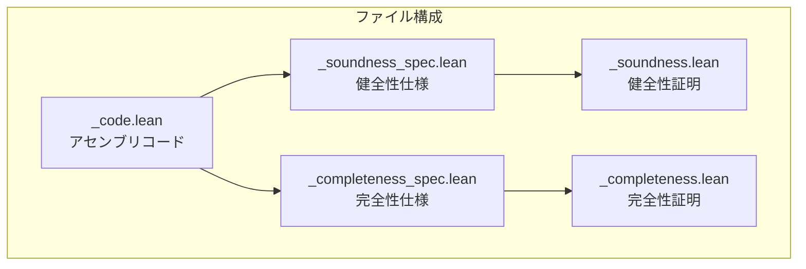
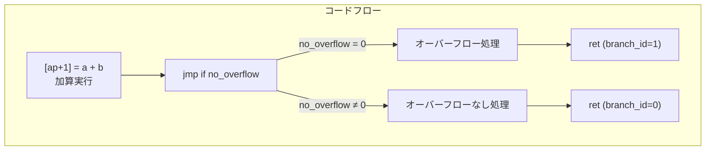
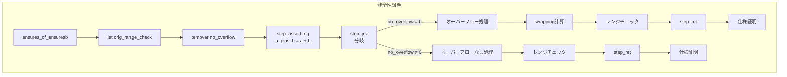

# 第18章: u128_overflowing_add（ケーススタディ）

## 18.1 概要

本章では、`u128_overflowing_add`ライブラリ関数の完全な検証を通じて、libfunc検証の実践的な手法を学びます。この関数は、2つの128ビット符号なし整数を加算し、オーバーフローの有無を報告します。

### 本章の目標

- 5ファイルパターンによるlibfunc検証の全体像を理解
- アセンブリコードから仕様を読み取る技術を習得
- 健全性証明のステップバイステップの進め方を学ぶ
- レンジチェックの扱い方を理解する

### 検証対象ファイル

```
Verification/Libfuncs/u128/
├── u128_overflowing_add_code.lean           # 実装コード
├── u128_overflowing_add_soundness_spec.lean # 健全性仕様
├── u128_overflowing_add_soundness.lean      # 健全性証明
├── u128_overflowing_add_completeness_spec.lean  # 完全性仕様
└── u128_overflowing_add_completeness.lean   # 完全性証明
```

## 18.2 検証パターンの全体像

### 18.2.1 5ファイルパターン



### 18.2.2 各ファイルの役割

| ファイル                  | 内容                   | 主な定義                |
| :------------------------ | :--------------------- | :---------------------- |
| `_code.lean`              | Cairoアセンブリコード  | `code`, `vm_code`       |
| `_soundness_spec.lean`    | 関数が満たすべき仕様   | `spec_*`, `auto_spec_*` |
| `_soundness.lean`         | 仕様を満たすことの証明 | `auto_sound_*`          |
| `_completeness_spec.lean` | 実行可能性の仕様       | `spec_*` (VM版)         |
| `_completeness.lean`      | 実行可能性の証明       | `auto_complete_*`       |

## 18.3 コードファイル (\_code.lean)

### 18.3.1 アセンブリコード

```lean
-- u128_overflowing_add_code.lean:7-24
open Casm in
casm_code_def u128_overflowing_add_code := {
  [ap + 1] = [fp + -4] + [fp + -3], ap++;
  -- %{ memory[ap + -1] = memory[ap + 0] < 340282366920938463463374607431768211456 %}
  jmp rel 7 if [ap + -1] != 0, ap++;
  [ap + -1] = [ap + 0] + 340282366920938463463374607431768211456, ap++;
  [ap + -1] = [[fp + -5] + 0];
  jmp rel 11;
  [ap + -1] = [[fp + -5] + 0];
  ap += 1;
  [ap + 0] = [fp + -5] + 1, ap++;
  [ap + 0] = 0, ap++;
  [ap + 0] = [ap + -4], ap++;
  ret;
  [ap + 0] = [fp + -5] + 1, ap++;
  [ap + 0] = 1, ap++;
  [ap + 0] = [ap + -3], ap++;
  ret;
}
```

### 18.3.2 コードの解説



### 18.3.3 メモリレイアウト

**入力引数（スタック）**:

- `[fp - 5]`: range_check ポインタ
- `[fp - 4]`: 引数 a
- `[fp - 3]`: 引数 b

**出力（戻り値）**:

- 新しいrange_checkポインタ
- branch_id（0=オーバーフローなし、1=あり）
- 結果値

### 18.3.4 u128_limit定数

```lean
-- u128_overflowing_add_soundness_spec.lean:15
def u128_limit : F := (340282366920938463463374607431768211456 : F)
-- = 2^128
```

## 18.4 健全性仕様 (\_soundness_spec.lean)

### 18.4.1 最終仕様 (spec)

```lean
-- u128_overflowing_add_soundness_spec.lean:17-18
def spec_u128_overflowing_add (κ : ℕ) (range_check a b ρ_branch_id ρ_a_plus_b : F) : Prop :=
  ∃ (n : ℕ), is_u128_of ρ_a_plus_b n ∧ (a + b = u128Limit + ρ_a_plus_b ∨ a + b = ρ_a_plus_b)
```

**仕様の意味**:

1. 結果`ρ_a_plus_b`はu128範囲内の自然数
2. 以下のいずれかが成立:
   - `a + b = u128Limit + ρ_a_plus_b`（オーバーフロー時）
   - `a + b = ρ_a_plus_b`（オーバーフローなし時）

### 18.4.2 自動生成仕様 (auto_spec)

```lean
-- u128_overflowing_add_soundness_spec.lean:25-40
def auto_spec_u128_overflowing_add (κ : ℕ) (range_check a b ρ_branch_id ρ_a_plus_b : F) : Prop :=
  ∃ orig_range_check : F, orig_range_check = range_check ∧
  ∃ no_overflow : F,
  ∃ a_plus_b : F, a_plus_b = a + b ∧
  (
    (no_overflow = 0 ∧
      ∃ wrapping_a_plus_b : F, wrapping_a_plus_b = a_plus_b - u128_limit ∧
      IsRangeChecked (rcBound F) wrapping_a_plus_b ∧
      ρ_branch_id = 1 ∧
      ρ_a_plus_b = wrapping_a_plus_b
    ) ∨
    (no_overflow ≠ 0 ∧
      ∃ (κ₁ : ℕ), auto_spec_u128_overflowing_add_NoOverflow κ₁
        range_check a_plus_b ρ_branch_id ρ_a_plus_b
    )
  )
```

**auto_specの構造**:

- コードの実行パスを直接反映
- 中間変数（no_overflow, a_plus_b等）を明示
- 分岐条件を論理和で表現

### 18.4.3 spec と auto_spec の関係

```lean
-- u128_overflowing_add_soundness_spec.lean:43-67
theorem sound_u128_overflowing_add
    (κ : ℕ)
    (range_check a b ρ_branch_id ρ_a_plus_b : F)
    (h_auto : auto_spec_u128_overflowing_add κ range_check a b ρ_branch_id ρ_a_plus_b) :
  spec_u128_overflowing_add κ range_check a b ρ_branch_id ρ_a_plus_b := by ...
```

**この定理の意味**: auto_specが成立すれば、specも成立

## 18.5 健全性証明 (\_soundness.lean)

### 18.5.1 全体構造

```lean
-- u128_overflowing_add_soundness.lean:64-162
theorem auto_sound_u128_overflowing_add
  (range_check a b : F)
  (hmem : MemAt mem u128_overflowing_add_code σ.pc)
  (htv_range_check : range_check = mem (σ.fp - 5))
  (htv_a : a = mem (σ.fp - 4))
  (htv_b : b = mem (σ.fp - 3))
  : EnsuresRet mem σ (fun κ τ =>
    1 ≤ κ ∧ RcEnsures mem (rcBound F) 1 (mem (σ.fp - 5)) (mem (τ.ap - 3))
      (spec_u128_overflowing_add κ range_check a b (mem (τ.ap - 2)) (mem (τ.ap - 1)))) :=
by ...
```

### 18.5.2 証明のステップ

```lean
-- 証明の主要部分
by
  apply ensures_of_ensuresb; intro νbound

  -- let orig_range_check = range_check
  mkdef hl_orig_range_check : orig_range_check = range_check

  -- tempvar no_overflow
  mkdef hl_no_overflow : no_overflow = mem σ.ap

  -- tempvar a_plus_b = a + b
  step_assert_eq hmem0 hmem with tv_a_plus_b
  mkdef hl_a_plus_b : a_plus_b = a + b

  -- jmp if no_overflow != 0
  step_jnz hmem1 hmem, hmem2 hmem with hcond1 hcond1
  · -- no_overflow = 0 (オーバーフローケース)
    ...
  · -- no_overflow ≠ 0 (オーバーフローなしケース)
    ...
```

### 18.5.3 オーバーフローケースの証明

```lean
· -- no_overflow = 0
  have a1 : no_overflow = 0 := by simp only [htv_no_overflow]; exact hcond1

  -- wrapping_a_plus_b = a_plus_b - u128_limit
  step_assert_eq hmem3 hmem, hmem4 hmem with tv_wrapping_a_plus_b
  mkdef hl_wrapping_a_plus_b : wrapping_a_plus_b = a_plus_b - u128_limit

  -- range check for wrapping_a_plus_b
  step_assert_eq hmem5 hmem with rc_wrapping_a_plus_b

  step_jump_imm hmem6 hmem, hmem7 hmem

  -- return values
  step_assert_eq hmem17 hmem, hmem18 hmem with ret_range_check₁
  step_assert_eq hmem19 hmem, hmem20 hmem with ret_branch_id
  step_assert_eq hmem21 hmem with ret_a_plus_b
  step_ret hmem22 hmem
  step_done

  -- 仕様の証明
  suffices auto_spec : auto_spec_u128_overflowing_add _ range_check a b _ _ by
    apply sound_u128_overflowing_add ; apply auto_spec
  use_only orig_range_check, hl_orig_range_check
  use_only no_overflow
  use_only a_plus_b, hl_a_plus_b
  left
  use_only a1
  use_only wrapping_a_plus_b, hl_wrapping_a_plus_b
  rc_app rc_h_range_check 0 htv_wrapping_a_plus_b rc_wrapping_a_plus_b
  ...
```

### 18.5.4 証明フロー図



## 18.6 NoOverflowサブルーチン

### 18.6.1 分離された証明

```lean
-- u128_overflowing_add_soundness.lean:21-62
theorem auto_sound_u128_overflowing_add_NoOverflow
  (range_check a_plus_b : F)
  (hmem : MemAt mem u128_overflowing_add_code σ.pc)
  (htv_range_check : range_check = mem (σ.fp - 5))
  (htv_a_plus_b : a_plus_b = mem (σ.ap + 1))
  (νbound : ℕ)
  : EnsuresbRet νbound mem
    { pc := σ.pc + 8, ap := σ.ap + 2, fp := σ.fp }
    (fun κ τ => ...) :=
by ...
```

**サブルーチン分離の利点**:

- コードの再利用性
- 証明の可読性向上
- 変更時の影響範囲の限定

## 18.7 レンジチェックの扱い

### 18.7.1 rc_appタクティック

```lean
-- Hoare.lean より
macro (name := rc_app) "rc_app" h_rc:ident x:num tv:ident rc:ident : tactic => ...
```

**使用例**:

```lean
rc_app rc_h_range_check 0 htv_wrapping_a_plus_b rc_wrapping_a_plus_b
```

**意味**:

- `rc_h_range_check`: レンジチェック済みの仮定
- `0`: オフセット
- `htv_wrapping_a_plus_b`: 値の定義
- `rc_wrapping_a_plus_b`: 実際のレンジチェック

### 18.7.2 RcEnsuresの追跡

```lean
RcEnsures mem (rcBound F) 1 (mem (σ.fp - 5)) (mem (τ.ap - 3)) (...)
```

**構成要素**:

- `rcBound F`: レンジチェック境界
- `1`: 使用したレンジチェックの数
- `mem (σ.fp - 5)`: 開始ポインタ
- `mem (τ.ap - 3)`: 終了ポインタ

## 18.8 使用されるタクティックのまとめ

### 18.8.1 ステップ系

| タクティック               | 用途                 |
| :------------------------- | :------------------- |
| `step_assert_eq h with hw` | assert_eq命令を処理  |
| `step_jnz h with h0 h1`    | 条件分岐を処理       |
| `step_jump h`              | 無条件ジャンプを処理 |
| `step_jump_imm h1, h2`     | 即値ジャンプを処理   |
| `step_ret h`               | ret命令を処理        |
| `step_done`                | 証明完了             |

### 18.8.2 補助系

| タクティック       | 用途                 |
| :----------------- | :------------------- |
| `mkdef h : x = t`  | 定義を導入           |
| `use_only x`       | 存在量化の証人を提供 |
| `rc_app h i tv rc` | レンジチェックを適用 |
| `arith_simps`      | 算術簡略化           |
| `ensures_simps`    | Ensures関連の簡略化  |

## 18.9 実装のポイント

### 18.9.1 オーバーフロー検出の仕組み

```
a + b が u128_limit 以上の場合:
1. a + b - u128_limit を計算
2. この値が u128 範囲内ならオーバーフロー

a + b が u128_limit 未満の場合:
1. a + b をそのまま使用
2. この値が u128 範囲内なら正常
```

### 18.9.2 branch_idの意味

- `branch_id = 0`: オーバーフローなし
- `branch_id = 1`: オーバーフローあり

呼び出し側はこの値で処理を分岐できます。

## 18.10 まとめ

### 検証の流れ

1. **コードを読む**: アセンブリの動作を理解
2. **仕様を定義**: specとauto_specを作成
3. **証明を構築**: step\_\*タクティックでコードをトレース
4. **仕様を証明**: auto_specからspecへの変換

### 重要なポイント

1. **5ファイルパターン**: 構造化された検証
2. **auto_spec**: コードの実行パスを反映
3. **spec**: 抽象的な仕様（利用者向け）
4. **レンジチェック**: RcEnsuresで追跡

### 次章との関連

第19章「他のlibfunc検証パターン」では、u128の他の関数や、u256、bounded_intなどの検証パターンを比較し、より複雑な関数への対応方法を学びます。

## 18.11 演習問題

### 問題1

`spec_u128_overflowing_add`で`a + b = u128Limit + ρ_a_plus_b`が成立するのはどのような場合ですか？

<details>
<summary>解答</summary>

オーバーフローが発生した場合です。例えば：

- `a = 2^127`, `b = 2^127`の場合
- `a + b = 2^128 = u128Limit`
- `ρ_a_plus_b = 0`（ラップアラウンド）
- `a + b = u128Limit + 0`が成立

</details>

### 問題2

なぜ`no_overflow`変数が必要なのですか？

<details>
<summary>解答</summary>

Cairoのヒント（`%{ ... %}`）は検証対象外ですが、その結果を使って分岐を決定します。`no_overflow`は：

1. ヒントの結果を格納
2. jnz命令の条件として使用
3. 証明では、この値による分岐を両方考慮

</details>

### 問題3

`step_jnz`タクティック使用後に2つの分岐が生成されますが、それぞれ何を証明する必要がありますか？

<details>
<summary>解答</summary>

1つ目の分岐（`no_overflow = 0`）:

- オーバーフローケース
- `wrapping_a_plus_b = a + b - u128_limit`がu128範囲内
- `branch_id = 1`

2つ目の分岐（`no_overflow ≠ 0`）:

- オーバーフローなしケース
- `a + b`がそのままu128範囲内
- `branch_id = 0`

両方のケースで仕様が満たされることを示します。

</details>
