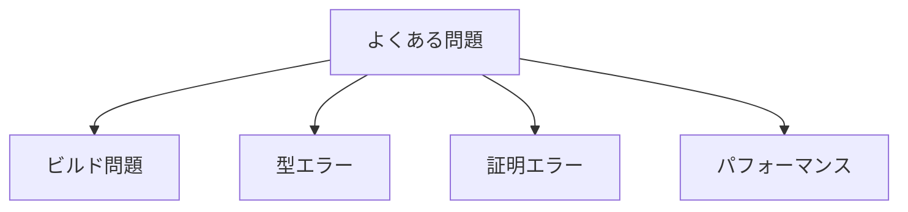

# 第21章: トラブルシューティング

本章では、Cairo形式検証プロジェクトで遭遇しやすい問題とその解決方法を解説する。

## 21.1 概要

問題のカテゴリ：



---

## 21.2 ビルド関連の問題

### 21.2.1 Mathlibキャッシュの問題

**症状**: ビルドが非常に遅い、または依存関係エラー

**解決策**:

```bash
# キャッシュを再取得
lake exe cache get

# クリーンビルド
lake clean
lake build
```

### 21.2.2 Lean バージョンの不一致

**症状**: `unknown identifier` や `invalid import`

**確認方法**:

```bash
# 使用中のLeanバージョン
lake env printenv LEAN

# lean-toolchain と比較
cat lean-toolchain
```

**解決策**: `lean-toolchain` のバージョンに合わせる

### 21.2.3 メモリ不足

**症状**: ビルド中にOOM、プロセスがキルされる

**解決策**:

```bash
# 並列度を下げる
lake build -j1

# 問題のあるファイルを特定
# 注: u256_guarantee_inv_mod_n_completeness.lean は既知の問題
```

---

## 21.3 型エラー

### 21.3.1 型の不一致

**症状**:

```
type mismatch
  h
has type
  a = b : Prop
but is expected to have type
  b = a : Prop
```

**解決策**:

```lean
-- 等式を反転
exact h.symm

-- または
rw [eq_comm]
```

### 21.3.2 暗黙の引数の問題

**症状**:

```
failed to synthesize instance
  Field ?m
```

**解決策**:

```lean
-- 明示的に型を指定
have h : (x : F) = y := ...

-- または @を使用
apply @theorem_name F _ _ args
```

### 21.3.3 型クラスインスタンスが見つからない

**症状**:

```
failed to synthesize instance
  PreludeHyps F
```

**解決策**:

```lean
-- 変数宣言を確認
variable {F : Type _} [Field F] [PreludeHyps F]

-- または証明内で取得
haveI : PreludeHyps F := inferInstance
```

---

## 21.4 証明エラー

### 21.4.1 タクティックが失敗

**症状**:

```
tactic 'simp' failed, nested error:
  failed to simplify
```

**解決策**:

```lean
-- simpに渡す補題を追加
simp [definition_name]

-- または段階的に進める
simp only [step1]
simp only [step2]
```

### 21.4.2 目標が一致しない

**症状**:

```
type mismatch
  exact h
has type
  P : Prop
but is expected to have type
  Q : Prop
```

**解決策**:

```lean
-- 目標を確認
show Q  -- Qが実際の目標であることを確認

-- 目標を書き換え
suffices P by ...
exact h
```

### 21.4.3 rcasesのパターン不一致

**症状**:

```
invalid pattern, constructor expected
```

**解決策**:

```lean
-- 正しい数の変数を使用
rcases h with ⟨a, b, c⟩  -- 3つ組

-- ネストに注意
rcases h with ⟨⟨a, b⟩, c⟩  -- ネストした構造
```

---

## 21.5 数値計算の問題

### 21.5.1 norm_numが失敗

**症状**:

```
norm_num failed to simplify
```

**解決策**:

```lean
-- norm_num1を試す（より制限的だが高速）
norm_num1

-- 手動で展開してから
unfold PRIME
norm_num1
```

### 21.5.2 大きな数値のリテラル

**症状**: 証明が極端に遅い

**解決策**:

```lean
-- 定義を使用（展開しない）
have h : x < PRIME := ...  -- PRIMEを数値で書かない

-- @[reducible]でない定義を使用
```

### 21.5.3 整数/自然数の変換

**症状**:

```
type mismatch
has type ℤ but expected ℕ
```

**解決策**:

```lean
-- Int.toNat を使用
have n : ℕ := z.toNat

-- 非負性を証明してから変換
have h_nonneg : 0 ≤ z := ...
rw [Int.toNat_of_nonneg h_nonneg]
```

---

## 21.6 レンジチェック関連

### 21.6.1 IsRangeCheckedの分解

**症状**: レンジチェック条件を使えない

**解決策**:

```lean
-- 正しい分解パターン
rcases h_rc with ⟨n, n_lt, h_eq⟩
-- n: 自然数値
-- n_lt: n < rcBound F
-- h_eq: x = ↑n
```

### 21.6.2 rcBound と u128Limit

**症状**: 境界条件が一致しない

**解決策**:

```lean
-- rcBound_hypを使用
have h := rcBound_hyp F
-- h : rcBound F ≤ 2^128

-- 推移律で結合
have n_lt_u128 : n < u128Limit := by
  apply lt_of_lt_of_le n_lt h
```

---

## 21.7 フィールド演算の問題

### 21.7.1 除算で非ゼロ条件

**症状**:

```
invalid argument
  ?a / ?b
```

**解決策**:

```lean
-- 分母が非ゼロであることを証明
have h_nz : (b : F) ≠ 0 := by
  apply PRIME.nat_cast_ne_zero
  · exact h_b_ne_zero
  · exact h_b_lt_PRIME
```

### 21.7.2 フィールドでの等式推論

**症状**: 等式が成り立つはずなのに証明できない

**解決策**:

```lean
-- PRIME.nat_coe_field_inj を使用
have h_eq : a = b := by
  apply PRIME.nat_coe_field_inj
  · exact a_lt_PRIME
  · exact b_lt_PRIME
  · exact field_eq
```

---

## 21.8 Hoare論理タクティック

### 21.8.1 step\_\*タクティックが失敗

**症状**: `step_assert_eq` などが動かない

**チェックリスト**:

```lean
-- 1. コードが正しく定義されているか
#check new_func_code

-- 2. Ensuresb/Ensures の形になっているか
show Ensuresb bound mem σ P

-- 3. 現在位置が正しいか（pc）
```

### 21.8.2 分岐後の証明

**症状**: `step_jnz` 後の証明が混乱

**解決策**:

```lean
step_jnz h_cond
· -- ケース1: 条件成立時
  -- h_cond : dst ≠ 0
  ...
· -- ケース2: 条件不成立時
  -- h_cond : dst = 0
  ...
```

---

## 21.9 パフォーマンス問題

### 21.9.1 証明が遅い

**原因と対策**:

| 原因               | 対策              |
| :----------------- | :---------------- |
| 大きな数値リテラル | 定義を使用        |
| 過度な`simp`       | `simp only`に変更 |
| 不要な計算         | `norm_num1`を使用 |
| 巨大なゴール       | 補題に分割        |

### 21.9.2 メモリ使用量

**対策**:

```lean
-- set_option でメモリを制御
set_option maxRecDepth 512  -- デフォルトより低く

-- 大きな証明を分割
theorem main_theorem : P := by
  have h1 := lemma1
  have h2 := lemma2
  exact final_step h1 h2
```

---

## 21.10 デバッグテクニック

### 21.10.1 型の確認

```lean
-- 式の型を表示
#check expression

-- ゴール内で
example : goal := by
  trace "{goalType}"
  sorry
```

### 21.10.2 仮定の確認

```lean
example : goal := by
  intro h
  trace "h = {h}"
  trace "h.type = {h.type}"
  sorry
```

### 21.10.3 段階的な証明

```lean
-- sorry で構造を確認
theorem test : P := by
  apply step1
  · sorry  -- サブゴール1
  · sorry  -- サブゴール2
  sorry    -- 残り

-- 一つずつ埋める
```

---

## 21.11 よくある間違い

### 21.11.1 変数スコープ

```lean
-- ❌ 悪い例
theorem bad : ∀ x, P x := by
  intro x
  have h : Q x := ...
  -- h は x に依存

-- ✓ 良い例
theorem good : ∀ x, P x := by
  intro x
  have h : Q x := ...
  exact use_h h
```

### 21.11.2 帰納法の適用

```lean
-- ❌ 悪い例（帰納法の仮定が使えない）
theorem bad (n : ℕ) : P n := by
  induction n
  · ...  -- 基底
  · ...  -- 帰納ステップ（n' が見えない）

-- ✓ 良い例
theorem good : ∀ n, P n := by
  intro n
  induction n with
  | zero => ...
  | succ n' ih => ...  -- ih : P n'
```

---

## 21.12 まとめ

問題解決のチェックリスト：

| カテゴリ       | 確認事項                       |
| :------------- | :----------------------------- |
| ビルド         | キャッシュ、バージョン、メモリ |
| 型             | 暗黙引数、型クラス             |
| 証明           | ゴール確認、分解パターン       |
| 数値           | norm_num、境界条件             |
| パフォーマンス | simp制限、分割                 |

---

## 演習問題

1. 以下のエラーの原因と解決策を述べよ：

   ```
   failed to synthesize instance
     DecidableEq F
   ```

2. `PRIME.nat_coe_field_inj` が失敗する場合の考えられる原因を3つ挙げよ。

3. 証明が遅い場合のデバッグ手順を説明せよ。

---

## 参考

- Lean 4 ドキュメント: https://lean-lang.org/lean4/doc/
- Mathlib4 タクティック: https://leanprover-community.github.io/mathlib4_docs/Mathlib/Tactic.html
- GitHub Issues: https://github.com/anthropics/claude-code/issues（フィードバック用）
